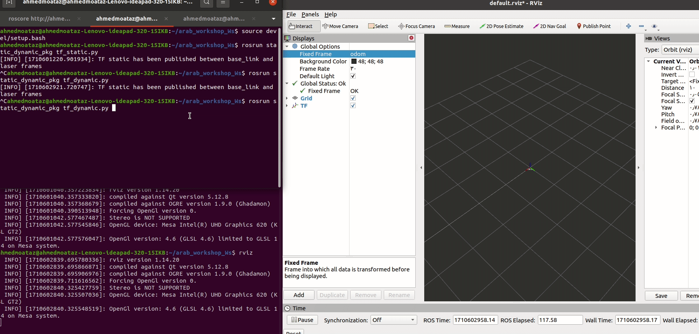

# Proadcaster Node: First Static Broadcaster
 author: Mo3taz
 
In this example, we create a static broadcaster node that publishes two frames with a static transform between them.

## Steps And Code Explination
1. Import the necessary classes:
   - **StaticTransformBroadcaster**: This class publishes coordinate frame transform information.
   - **TransformStamped**: This message type is used in static transforms.


```python
#!/usr/bin/env python3

import rospy

from tf2_ros import StaticTransformBroadcaster
# massage that used in tf static 
from geometry_msgs.msg import TransformStamped
```

2. need to make object from StaticTransformBroadcaster and create msg from TransformStamped

```python
 # instance from static transform broadcaster class 
        # need this object to publish static transform in TF static topic
        self.static_broadcaster = StaticTransformBroadcaster()
        
        # create a static transform message
        self.static_transform_stamped = TransformStamped()
```
### 3. Setting Information in TransformStamped Message


To define the information in a `TransformStamped` message for the static transform between two frames, follow these steps:

1. **header.stamp**: This indicates the time when the static transform was generated.

2. **header.frame_id**: This specifies the parent frame.

3. **child_frame_id**: This specifies the child frame.

4. **transform.translation**: These values represent the distance between the parent frame and the child frame in meters along the x, y, and z axes.

5. **transform.rotation**: This specifies the rotation in quaternion format (x, y, z, w).
[Quaternion Explanation Video](https://www.youtube.com/watch?v=zjMuIxRvygQ)

```python
  # add information about time when this static transform has been generated
        self.static_transform_stamped.header.stamp = rospy.Time.now()
        
        # as we learn that tf connect two frames together
        # let's define the parent frame and the child frame 
        
        # parent frame
        self.static_transform_stamped.header.frame_id = "base_link"
        # child frame any frame like laser of camera or any other frame
        # important to note that the child frame should be static frame
        self.static_transform_stamped.child_frame_id = "laser" 
        
        # we know that child frame is connected to parent frame by translation and rotation vectors
        # let's define translation vectors
        self.static_transform_stamped.transform.translation.x = 0.0
        self.static_transform_stamped.transform.translation.y = 0.0
        # in z axes 10 cm above the base_link frame
        self.static_transform_stamped.transform.translation.z = 0.1
        
        # let's define rotation vectors 
        self.static_transform_stamped.transform.rotation.x = 0.0
        self.static_transform_stamped.transform.rotation.y = 0.0
        self.static_transform_stamped.transform.rotation.z = 0.0
        self.static_transform_stamped.transform.rotation.w = 1.0
```


4- last thing puplish this transform and print in terminal if you want 

```python
   self.static_broadcaster.sendTransform(self.static_transform_stamped)
        rospy.loginfo("TF static has been published between %s and %s frames" % (self.static_transform_stamped.header.frame_id, self.static_transform_stamped.child_frame_id))
        
```
### for full code :
[Full Code](static_dynamic_pkg/scripts/tf_static.py)

### recap to run this node :


#### output:


# Second Dynamic Broadcaster

In this section, we will extend the previous example by adding dynamic transformation between the `base_link` and another link called `odom`. 

#### Description

We use the same example as above but introduce dynamic transformation between the `base_link` and `odom`. The `base_link` represents the car with a lidar (static for the base link), and `odom` is the starting point from which the car moves. We expect that the `base_link` and lidar move away from `odom`.

#### Steps

1. Import the `TransformBroadcaster` class for publishing dynamic transform.

#### Python Code

```python
from tf2_ros import StaticTransformBroadcaster, TransformBroadcaster
```

2. like above need object from dynamic broadcaster and create msg from same type msg static 

```python
 self.dynamic_broadcaster = TransformBroadcaster()
        self.dynamic_transform_stamped = TransformStamped()
```
3. now we make timer that after 0.1s change transform 

    **rospy.Timer** : take two parameters 
    1. the duration here 0.1
    2. the function that executed every this duration 0.1 second
```python

        self.timer = rospy.Timer(rospy.Duration(0.1), self.timer_callback)
```

4. every 0.1s i will make translation in x direction by 5mm
```python
self.x_increment= 0.05
        self.last_x = 0.0 #this for save last x value to add the increment to it
```
5. make call back function that make transformation and rotation between odom and base link

```py
 # publish new transform every 0.1 second
    def timer_callback(self, event):
        # add information about time 
        self.dynamic_transform_stamped.header.stamp = rospy.Time.now()
        self.dynamic_transform_stamped.header.frame_id = "odom"
        self.dynamic_transform_stamped.child_frame_id = "base_link"
        # add translation and rotation vectors same static transform
        # but here we will change the translation vector every 0.1 second
        self.dynamic_transform_stamped.transform.translation.x = self.x_increment + self.last_x
        self.dynamic_transform_stamped.transform.translation.y = 0.0
        self.dynamic_transform_stamped.transform.translation.z = 0.0
        
        self.dynamic_transform_stamped.transform.rotation.x = 0.0
        self.dynamic_transform_stamped.transform.rotation.y = 0.0
        self.dynamic_transform_stamped.transform.rotation.z = 0.0
        self.dynamic_transform_stamped.transform.rotation.w = 1.0
        # now publish transform
        self.dynamic_broadcaster.sendTransform(self.dynamic_transform_stamped)
        # update last x value
        self.last_x = self.dynamic_transform_stamped.transform.translation.x
```
output


#### tf tree should be like this :

```bash
rosrun rqt_tf_tree rqt_tf_tree 
```
##### note:
if line not work make sure you install the package

```bash
sudo apt-get install ros-noetic-rqt-tf-tree
```
output:


