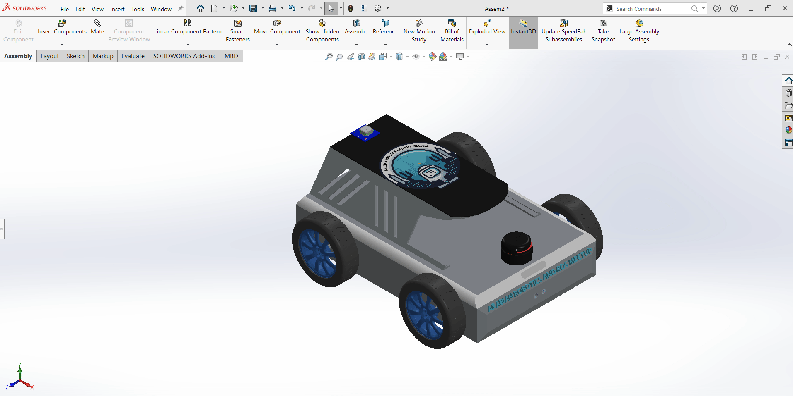

Author: Sherif Fathey, Toqa Essam

Review: KG

# **Guide: Exporting SolidWorks Design as URDF for ROS**

### **"Meet Our Arabian Robotics and ROS Meetup Robot!"**

<p align="center">


Here’s a clear list of the sensors on your robot:

- **2D Lidar (A2 RPLIDAR)**: Provides 360-degree distance measurements to create a 2D map of the robot’s surroundings, essential for obstacle detection and mapping.
- **Camera (RealSense D435)**: Captures depth and color images for advanced perception tasks, including object recognition and spatial understanding.
- **IMU (MPU 6050)**: Measures acceleration and angular velocity to provide orientation and movement data, crucial for stabilization and navigation.
- **Ultrasonic Sensor (HC-SR04)**: Uses sound waves to measure distance to nearby objects, useful for collision avoidance and distance sensing.
- **GPS (NEO-6)**: Provides location data by connecting to global satellite networks, enabling accurate position tracking and navigation.

---

## **Step 1: Install the SolidWorks to URDF Exporter Plugin**

To export your SolidWorks model as a URDF file for use in ROS, you need to install the appropriate URDF Exporter Plugin. Follow these steps to install the correct plugin based on your version of SolidWorks.

#### **Identify Your SolidWorks Version:**

- Check your version of SolidWorks (2019, 2020, 2021, or later). The URDF Exporter has different releases based on your version, so it's important to select the correct one.

#### **Download the Correct URDF Exporter Plugin:**

- **For SolidWorks 2021 and Higher Versions (2022 and later):**
  - Download version [1.6.1 of the URDF Exporter](https://github.com/ros/solidworks_urdf_exporter/releases/tag/1.6.1).
  - This version is compatible with **SolidWorks 2021** and can be used with higher versions of SolidWorks as well (e.g., 2022).
- **For SolidWorks 2020:**
  - Download version [1.6.0 of the URDF Exporter](https://github.com/ros/solidworks_urdf_exporter/releases/tag/1.6.0).
- **For SolidWorks 2019 (on 2018 SP 5):**
  - Download version [1.5.1 of the URDF Exporter](https://github.com/ros/solidworks_urdf_exporter/releases/tag/1.5.1).

#### **Run the Installer:**

- After downloading the correct version, extract the files and locate the `setup.exe` installer.
- Right-click on the installer and select **Run as administrator** .
- Follow the on-screen prompts to complete the installation

#### **Enable the Plugin in SolidWorks:**

- Launch **SolidWorks** .
- Navigate to **Tools** > **Add-ins** .
- In the Add-ins menu, find the **URDF Exporter Plugin** and enable it by checking both **Active Add-ins** and **Start-Up** .

  <p align="center">
  

#### **Verify Installation:**

- Once activated, you should see a new tab labeled **URDF Exporter** in the SolidWorks toolbar.
- If the tab is visible, the plugin is installed and ready for us

  <p align="center">
  

## Step 2: Create Coordinate Systems for URDF Export

Creating accurate coordinate systems for each part of your robot is critical for proper URDF export. The coordinate systems should follow the **standard ROS conventions** as defined in **REP 103** , ensuring correct transformations and behavior in simulation environments like RViz and Gazebo.

### **REP 103: Standard Units and Coordinate Conventions**

According to [REP 103](https://www.ros.org/reps/rep-0103.html)**:** Standard Units of Measure and Coordinate Conventions, the standard coordinate frame conventions in ROS are:

- **Define the origin** : Establish a reference point at the center of the part.
- **Align axes per REP 103** :

  - **X-axis** : Points **forward** (the robot's forward direction, or "front").
  - **Y-axis** : Points **to the left** of the robot.
  - **Z-axis** : Points **upward** (towards the sky).

- **Test in simulation** : Load your URDF model in RViz or Gazebo to verify that the transformations and orientations are correct according to REP 103.

  <p align="center">
  

# Steps to Create and Align Coordinate Systems:

### To Create Base Link Coordinate System (Center of Mass)

- ### 1. Open **Reference Geometry** > **Center of Mass** to locate the CoM.

  Start by selecting the **Center of Mass (COM)** of the base link as the origin point for the coordinate system. This ensures that the coordinate system is centered at the most balanced point of the robot base.

    <p align="center">
    

- ### 2- Create **Coordinate System**

  Navigate to the **Reference Geometry** tool and select **Coordinate System** . This tool will allow us to define a new coordinate system at the base link.

  #### **Set Axis Alignment** :

  Now, we need to ensure that the axes of the coordinate system follow the **ROS conventions** . For this:

  - **Z-axis** should point **upwards** . Click on the upper surface of the base link or any part of the robot that faces upward to ensure that the **Z-axis** points in the correct direction.
  - **X-axis** should point **forward** . Click on the front surface of the base link to align the **X-axis** in the forward direction (robot’s forward movement direction).
  - **Y-axis** should point **to the left** . The Y-axis should automatically adjust to be perpendicular to the X and Z axes, pointing left.

  #### **Verify the Coordinate System** :

  After assigning the axes, make sure to **review the coordinate system** visually. You should see:

  - The **Z-axis** pointing **upwards** (toward the sky or top of the robot).
  - The **X-axis** pointing **forward** (robot’s movement direction).
  - The **Y-axis** pointing **to the left** .

    <p align="center">
    

### Steps to Create the Wheel's Coordinate System

- ### 1. Create a Point at the Wheel’s Center:

  Navigate to the **Reference Geometry** > **Point** tab to create a reference **point** at the wheel’s center. This point will serve as the origin for the wheel’s coordinate system.

  <p align="center">
  

- ### 2. Create the Coordinate System Using the Center Point:

  Once the point is defined, you can create the coordinate system aligned with the wheel’s intended motion.

  - Go to the **Reference Geometry** tab and select **Coordinate System** .
  - Set the origin of the coordinate system to the **center point** you just created.

  <p align="center">
      

### Set Axis Alignment :

Now, we need to ensure that the axes of the coordinate system follow the **ROS conventions** . For this:

- **Z-axis** should point **upwards** . Click on the upper surface of the base link or any part of the robot that faces upward to ensure that the **Z-axis** points in the correct direction.
- **X-axis** should point **forward** . Click on the front surface of the base link to align the **X-axis** in the forward direction (robot’s forward movement direction).
- **Y-axis** should point **to the left** . This axis is critical because it serves as the **axis of rotation** for the robot’s yaw. The Y-axis will automatically adjust to be perpendicular to the X and Z axes, ensuring that it points to the left of the robot and supports proper rotational behavior in simulation.

## **Setting the Axis of Rotation for Wheels**

In this step, we will create the **axis of rotation** for the robot. The Y-axis in ROS conventions represents the axis about which yaw (rotation around the vertical axis) occurs. Here’s how you can set the axis of rotation:

### **Steps to Create the Axis of Rotation**

#### **1-Hide Wheel Components** :

- Start by **hiding the wheels** of the robot in the CAD model to allow better visibility of the base link and the coordinate system. This will make it easier to define the rotation axis without interference from other parts.

#### **2-Use Reference Geometry** :

- Navigate to the **Reference Geometry** tool and choose **Axis** . This tool allows you to define an axis for rotation based on the geometry of your robot's base link.

#### **3-Select the Axle of the Wheel for Rotation:**

In this step, rather than selecting just the Y-axis of the robot's base link, you will **select the axle of the wheel** to define the **axis of rotation** for the wheel. This axle serves as the axis around which the wheel will rotate.

- select the cylindrical surface of the axle or the circular edge of the wheel’s mounting point. This ensures that the axis of rotation aligns correctly with the actual wheel's movement .
- The axis should point along the Y-axis of the wheel as this is the direction the wheel will rotate around.

    <p align="center">
    

### **Steps to Create Coordinate Systems for Sensors**

Sensors are essential components of a robot for perception and navigation, and it’s crucial to properly define their coordinate systems. Proper sensor alignment ensures that sensor data (such as camera or LiDAR scans) is correctly oriented in ROS and Gazebo simulations. In this step, you’ll learn how to create coordinate systems for sensors, such as cameras or LiDAR, ensuring they follow the correct conventions.

##### **Why Sensor Coordinate Systems Are Important:**

- Sensors provide data to the robot, and the accuracy of this data depends on the correct orientation of the sensor in the robot's frame.
- The sensor’s coordinate system defines where the sensor is mounted and how its data (e.g., camera images or laser scans) will be interpreted by ROS.
- Properly aligned coordinate systems are crucial for tasks like mapping, localization, and object detection.

#### **Create the LiDARs Coordinate System** :

##### **Create a Point at the LiDAR’s Aperture** :

The **aperture** is where the LiDAR beam originates. You will need to create a **reference point** at this location, which will serve as the origin for the LiDAR’s coordinate system.

#### **Steps** :

- Use the **Reference Geometry** > **Poin**t tab to create a reference **point** at the LiDAR’s aperture (typically the center of the scanning plane or the origin of the emitted beams).
- Make sure the point is placed at the exact center of the LiDAR’s scanning area, as this will be the reference for the LiDAR’s coordinate system.

    <p align="center">
    

#### **Create the Coordinate System Using the LiDAR's Aperture** :

After creating the point, you can now define the coordinate system using the aperture as the origin.Go to **Reference Geometry** > **Coordinate System** .

then ,Set the **origin** to the point you just created at the LiDAR's aperture

<p align="center">


### **Step 3: Export the Design to URDF**

After setting up all coordinate systems and rotation axes, follow these steps to export your SolidWorks model as a URDF file for integration with ROS and Gazebo

##### **Open the URDF Exporter** :

- In SolidWorks, go to the **tools** tab.
- Locate the **URDF Exporter** extension

##### **Starting with Base Link**

<p align="center">


- **Choose the Coordinate System** : Start by selecting the coordinate system you created for the base link.
- **Set Up the Base Link**
- **Add Child Links**

##### **Add Wheel Links**

- For each wheel, choose the coordinate system you created at the wheel’s axle.
- Add the wheels as child links to the base link.
- Ensure each wheel is properly positioned and oriented according to its coordinate system and rotation axis

  <p align="center">
  

##### **Add Sensor Links**

- **Choose the Coordinate System**
- **Specify Joint Type** :Use a fixed joint for the sensor links.

  <p align="center">
  

### **Export the Complete URDF**

**Preview and Export**

Click the **Preview and Export** button in the URDF Exporter to review the generated URDF file.

<p align="center">


- Ensure everything appears as expected in the preview.
- If satisfied, click the **Preview and** **Export** button to generate the final URDF file.

#### **Save Your Files** :

Choose a location to save your exported URDF file, along with any associated files (e.g., meshes, textures).

## The export process will create a folder containing the URDF file, meshes, and any launch files.

### When you open this package after exporting it from SolidWorks, you'll be greeted by a collection of essential files and directories that form the backbone of your robotic project. Here's what you’ll find:

```
├── CMakeLists.txt          # Build configuration for the project
├── config
│   └── joint_names_arabian_robot.yaml  # Configuration for joint names
├── export.log              # Export log from SolidWorks
├── launch                  # Launch files for various purposes
│   ├── display.launch      # Visualization launch file
│   └── gazebo.launch       # Gazebo simulation launch file
├── meshes                  # 3D models for robot components
│   ├── 2d_lidar.STL        # Lidar sensor mesh
│   ├── arabian_link.STL    # Main robot body mesh
│   ├── base_link.STL       # Base link of the robot
│   ├── camera_link.STL     # Camera attachment mesh
│   ├── front_left_wheel.STL  # Front left wheel mesh
│   ├── front_right_wheel.STL  # Front right wheel mesh
│   ├── gps_Link.STL        # GPS module attachment mesh
│   ├── imu_Link.STL        # IMU sensor link mesh
│   ├── lidar_link.STL      # Lidar sensor link mesh
│   ├── plug_collision.stl  # Collision geometry for plug
│   ├── plug.stl            # Charging plug mesh
│   ├── realsenseD435.dae   # RealSense camera model
│   ├── rear_left_wheel.STL   # Rear left wheel mesh
│   ├── rear_right_wheel.STL  # Rear right wheel mesh
│   ├── rear_ultrasonic_link.STL  # Rear ultrasonic sensor link mesh
│   ├── rear_ultrasonic.STL  # Rear ultrasonic sensor mesh
│   ├── ultrasonic_link.STL  # Ultrasonic sensor link mesh
│   └── upper_Link.STL      # Upper robot body part mesh
├── package.xml             # ROS package manifest
├── readme.md               # Documentation for this package
├── textures                # Placeholder for any textures used in the models
└── urdf                    # Robot description files in URDF/Xacro format
    ├── arabian_robot.csv    # CSV data related to robot configuration
    └── arabian_robot.urdf   # Main URDF file in Xacro format
```

Note: This structure provides everything you need to bring your robot to life—from the physical models to launch files for simulations and real-world interactions!

---

### Editing URDF Structure and Launch Files

1. **URDF Files:**
   We will divide this file **`arabian_robot.urdf`** into two separate files **`arabian_robot.urdf.xacro`** , **`sensor.xacro`**

   - **Create `arabian_robot.urdf.xacro`**: Edit this file to define the body of your robot. This includes specifying the robot's physical structure and components.
   - **Create `sensor.xacro`**: Define the sensors on your robot in this file. It should describe the placement and properties of each sensor.
   - **Create `plugin.gazebo`**: Add this file to specify any Gazebo plugins required for your robot. This could include plugins for simulation purposes like camera sensors or controllers.

     > For more details, you can refer to our explanation in the plugin section [arab meet/plugins.md ](<../C. Plugins/plugins.md>).

     **Add the GPS Plugin**

     1. **Install the necessary ROS package**:Open your terminal and run the following command to install the required Gazebo plugin for GPS:

        ```bash
        sudo apt-get install ros-noetic-hector-gazebo-plugins
        ```

     2. **Add the GPS plugin to your Gazebo model**:
        Next, include the following plugin configuration in your robot's URDF file to integrate GPS functionality:

        ```xml
        <gazebo>
            <plugin name="gazebo_ros_gps" filename="libhector_gazebo_ros_gps.so">
                <updateRate>4.0</updateRate>
                <bodyName>gps_Link</bodyName>
                <frameId>gps_Link</frameId>
                <topicName>/gps/fix</topicName>
                <velocityTopicName>/gps/fix_velocity</velocityTopicName>
                <referenceLatitude>-30.06022459407145675</referenceLatitude>
                <referenceLongitude>-51.173913575780311191</referenceLongitude>
                <referenceHeading>90</referenceHeading>
                <referenceAltitude>10</referenceAltitude>
                <offset>0 0 0</offset>
                <drift>0.001 0.001 0.001</drift>
                <gaussianNoise>0.05 0.05 0.05</gaussianNoise>
                <velocityDrift>0.001 0.001 0.001</velocityDrift>
                <velocityGaussianNoise>0.5 0.5 0.5</velocityGaussianNoise>
            </plugin>
        </gazebo>
        ```

        To find your location's latitude and longitude, visit this website: [GPS Coordinates](https://gps-coordinates.org/). Simply enter your location, and the website will provide you with the corresponding latitude and longitude values.

2. **Launch Files:**

   We have two launch files: `display.launch` for launching the robot in RViz for visualization, and `gazebo.launch` for launching the robot in the Gazebo simulation. Next, we will: **Create `robot_description.launch`**, to run both Gazebo and RViz.

---

## Custom Materials and Textures for Your Robot in Gazebo

To create a part with a white color in Gazebo, follow these steps:

1. Create the Material File:

   > Open your terminal and create a new material file:

   ```sh
   nano white_material.material
   ```

   > Then, paste this content into the file:

   ```xml
   material WhiteMaterial
   {
       technique
       {
           pass
           {
               ambient 1 1 1 1
               diffuse 1 1 1 1
               specular 1 1 1 1
               emissive 1 1 1 1
           }
       }
   }
   ```

   This file defines a WhiteMaterial for a robot model, specifying how it reacts to light:

   - Ambient: Reflects environment light (white).
   - Diffuse: Reflects direct light (white).
   - Specular: Adds shiny highlights (white).
   - Emissive: Makes the surface glow (white).
     This creates a bright, white, glowing effect for the robot in the simulation.

2. Copy the Material File to gazebo matrial:
   copy the [white_material.material](arabian_robot_pkg/material/white_material.material) file to Gazebo’s materials scripts directory:
   using this command

   ```sh
   cp white_material.material /usr/share/gazebo-11/media/materials/scripts/
   ```

   > If you encounter a Permission denied error, use sudo to gain the necessary permissions:

   ```sh
   sudo cp white_material.material /usr/share/gazebo-11/media/materials/scripts/
   ```

3. Apply the White Material in Your URDF:
   To apply the material to your robot, add this to your URDF file:

   ```xml
   <gazebo reference="upper_Link">
       <material>WhiteMaterial</material>
   </gazebo>
   ```

---

## Adding a Custom Logo to Your Robot

Follow these steps to apply a custom logo texture:

1. Create the Logo Material File:

   > Open your terminal and create a material file for the logo:

   ```sh
   nano logo.material
   ```

   > Then, paste this content into the file:

   ```xml
   material testing/material
   {
       technique
       {
           pass
           {
               ambient 1 1 1 1
               diffuse 1 1 1 1
               specular 1 1 1 1
               emissive 1 1 1 1

               texture_unit
               {
                   texture logo.png
               }
           }
       }
   }
   ```

   This material script defines how a surface looks in a 3D environment:

   - Material name: testing/material
   - Color properties:
     ambient, diffuse, specular, and emissive are all set to white (1 1 1 1), meaning the material appears fully lit in white.
   - Texture: A texture image logo.png is applied to the surface.

2. Copy the Material File to gazebo matrial:

   Copy the [logo.material](arabian_robot_pkg/material/logo.material) file to Gazebo’s materials scripts directory:

   ```sh
   sudo cp logo.material /usr/share/gazebo-11/media/materials/scripts/
   ```

3. Copy the [Logo_Image](arabian_robot_pkg/material/logo.png):

   Copy the logo image to Gazebo’s materials textures directory:

   ```sh
   sudo cp logo.png /usr/share/gazebo-11/media/
   ```

4. Apply the Logo in Your URDF:
   Update your URDF file to reference the new material for the robot component where you want the logo:

   ```xml
   <gazebo reference="logo">
       <material>testing/material</material>
   </gazebo>
   ```

   Replace "logo" with the appropriate reference to the part of your robot where the logo should be applied.

---

By following these steps, you can add custom materials and textures, including logos, to your robot in Gazebo.

## Steps to Set Up and Run the Robot

1. Create and Build the Workspace

   First, create your ROS workspace and clone the robot package:

   ```sh
   mkdir -p  catkin_ws/src
   cd ~/catkin_ws/src
   catkin_init_workspace
   cd ..
   catkin_make
   ```

2. Running Both Gazebo and RViz Together

   to launch both the Gazebo simulation and the RViz visualization simultaneously, use this:

   ```sh
   roslaunch arabian_robot robot_description.launch
   ```

<p align="center">


---

<div align="center">
  <a href="https://www.youtube.com/@ArabianROSMeetup/" target="_blank">
    
  </a>
  <p>
    <h3>You can watch our session on YouTube by clicking the 
      <a href="https://www.youtube.com/live/euiqZBUEY1U?si=fXli3wQAhTSiExv9" target="_blank">Link (Starts at 1:00:00)</a> ,
    </h3>
  </p>
</div>

## [Next Topic →](<../../C. TF/README.md>)

## [↩Back to main](../README.md)
