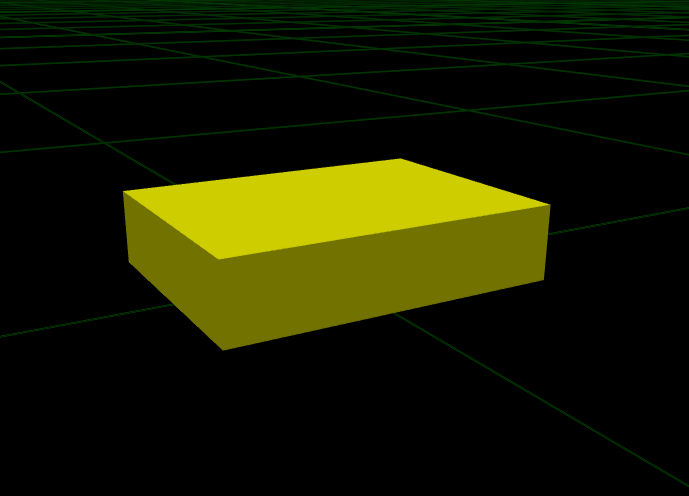
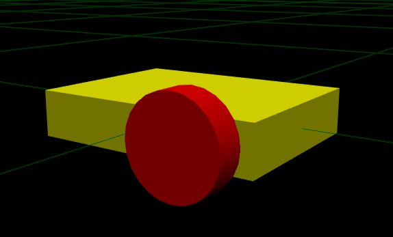
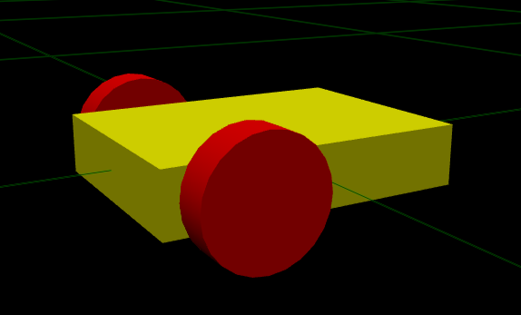
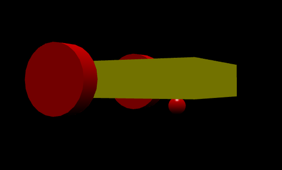
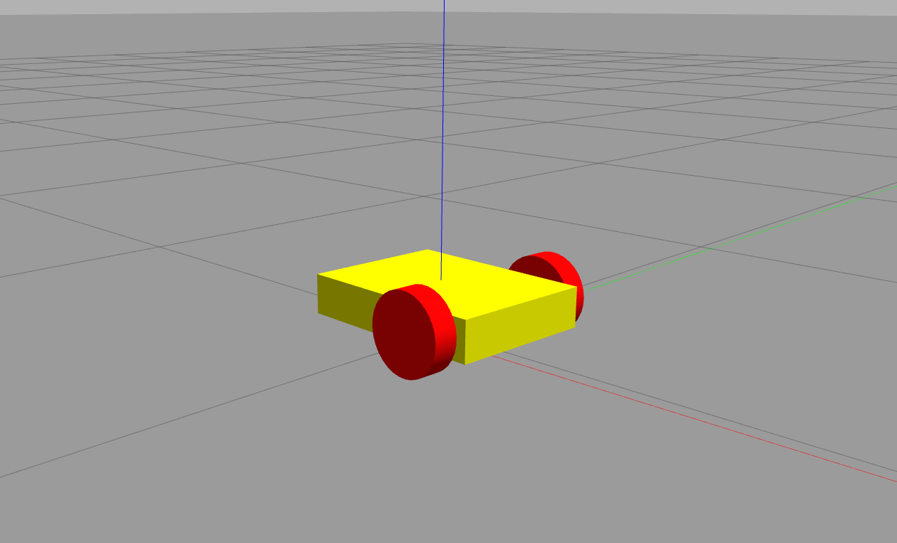
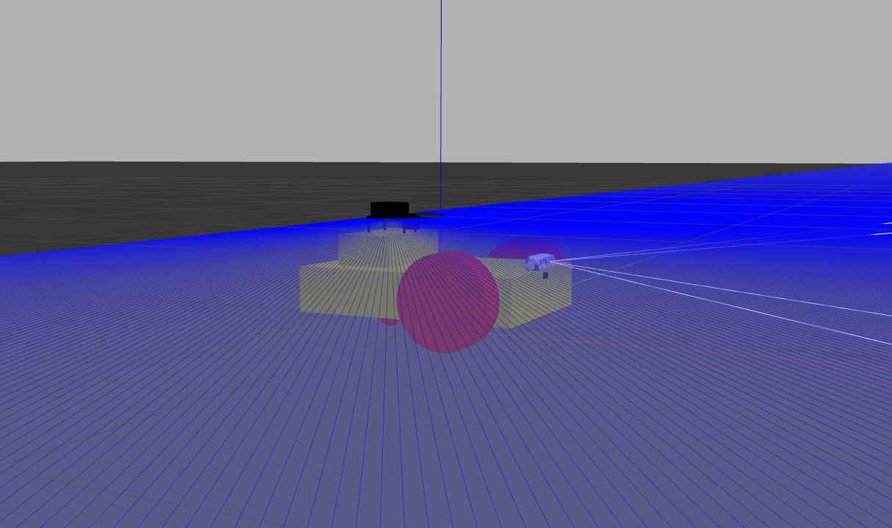

# Differential_drive Robot Tutorial

Welcome to the comprehensive tutorial on building a differential drive robot! In this guide, we will take you through the entire process of constructing a robot with a differential drive system, a popular choice for many autonomous robots due to its simplicity and effectiveness in navigating various terrains.This tutorial is designed for those who are new to robotics as well as those who want to refine their skills in building and configuring differential drive robots.

## Step-by-Step Instructions

### **First we need to Create a New Catkin Package**

Navigate to the `src` directory and create a new Catkin package

```bash
cd ~/catkin_ws/src
catkin_create_pkg differential_drive_robot
```

**Create URDF Directory**

Navigate into your package and create a directory for [URDF](differential_drive_robot/urdf) files

```bash
cd ~/catkin_ws/src/differential_drive_robot
mkdir urdf
```

**Add URDF File**

Create a new URDF file inside the [URDF](../example/differential_drive_robot/urdf) directory

```bash
touch urdf/differential_drive_robot.urdf
```

**Visualize URDF File** : Open your [differential_robot.urdf.xacro](differential_drive_robot/urdf/differential_robot.urdf.xacro) file in VSCode. The URDF Preview extension will allow you to view and interact with your robot model directly within the editor.

**Install URDF Preview Extension** : Go to the Extensions view by clicking on the Extensions icon in the Activity Bar on the side of the window or by pressing `Ctrl+Shift+X`. Search for “URDF Preview” and install it.

### Robot Description

- ### 1. Declaration tag

  The declaration tag defines the XML version that we are using. This line usually found in the first line in a URDF file.

  ```xml
  <?xml version="1.0"?>
  ```

- ### 2. Robot frame

  ```xml
  <robot name="differential_robot">

  </robot>
  ```

- ### **3. Base Link**

  Inside our robot frame the `base_link` will be added as it is the primary reference frame for the robot. It’s essentially the central part of the robot to which other components (like wheels and sensors) are attached. Below is the XML snippet that defines the `base_link`

  ```xml
  <link name="base_link">
          <inertial>
              <origin xyz="0.0 0.0 0.0" rpy="0.0 0.0 0.0"/>
              <mass value="2.0"/>
              <inertia ixx="0.0" ixy="0.0" ixz="0.0" iyy="0.0" iyz="0.0" izz="0.0"/>
          </inertial>
          <visual>
              <geometry>
                  <box size="0.4 0.3 0.08"/>
              </geometry>
              <origin xyz="0.0 0.0 0.0" rpy="0.0 0.0 0.0"/>
              <material name="base_link_material">
                  <color rgba="1.0 1.0 0.0 1.0"/>
              </material>
          </visual>
          <collision>
              <geometry>
                  <box size="0.4 0.3 0.08"/>
              </geometry>
              <origin xyz="0.0 0.0 0.0" rpy="0.0 0.0 0.0"/>
          </collision>
  </link>
  ```

  <p align="center">
  

- ### 4. Right Wheel Link

  Next, we'll create the link for the right wheel. This link represents the physical properties of the wheel, including its visual appearance, collision model, and inertial properties.

  ```xml
  <link name="right_wheel">
          <inertial>
            <mass value="1.0"/>
            <origin xyz="0.0 0.0 0.0" rpy="0.0 0.0 0.0"/>
            <inertia ixx="0.001" ixy="0.0" ixz="0.0" iyy="0.001" iyz="0.0" izz="0.001"/>
          </inertial>

          <visual>
            <geometry>
                <cylinder radius="0.08" length="0.05"/>
            </geometry>
            <origin xyz="0.0 0.0 0.0" rpy="0.0 0.0 0.0"/>
            <material name="">
              <color rgba="1.0 0.0 0.0 1.0"/>
            </material>
          </visual>

          <collision>
            <geometry>
                <cylinder radius="0.08" length="0.05"/>
            </geometry>
            <origin rpy="0 0 0"/>
          </collision>

  </link>
  ```

  Continuous Joint for Right Wheel

  ```xml
      <joint name="right_wheel_joint" type="continuous">
          <parent link="base_link"/>
          <child link="right_wheel"/>
          <origin xyz="0.1 -0.175 0.00" rpy="0 1.5708 1.5708"/>
          <axis xyz="0 0 1"/>
      </joint>
  ```

  <p align="center">
  

- ### 5. Left Wheel Link

  The front left wheel is another critical part of the robot. It is attached to the base link via a continuous joint.

  ```xml
      <link name="left_wheel">
          <visual>
              <geometry>
                      <cylinder radius="0.08" length="0.05"/>
              </geometry>
              <origin xyz="0.0 0.0 0.0" rpy="0.0 0.0 0.0"/>
              <material name="">
                  <color rgba="1.0 0.0 0.0 1.0"/>
              </material>
          </visual>
          <collision>
              <geometry>
                  <cylinder radius="0.08" length="0.05"/>
              </geometry>
              <origin xyz="0.0 0.0 0.0" rpy="0.0 0.0 0.0"/>
              </collision>
          <inertial>
                  <origin xyz="0.0 0.0 0.0" rpy="0.0 0.0 0.0"/>
                  <mass value="1.0"/>
                  <inertia ixx="0.001" ixy="0.0" ixz="0.0" iyy="0.001" iyz="0.0" izz="0.001"/>
          </inertial>
      </link>
  ```

  **Continuous Joint for Left Wheel**

  ```xml
      <joint name="left_wheel_joint" type="continuous">
          <parent link="base_link"/>
          <child link="left_wheel"/>
          <origin xyz="0.1 0.175 0.0" rpy="0 1.5708 1.5708"/>
          <axis xyz="0 0 1"/>
      </joint>
  ```

  <p align="center">
  

- ### 6. Caster Wheel Link

  ```xml
      <link name="caster_wheel_link">
          <inertial>
              <origin xyz="0.0 0.0 0.0" rpy="0.0 0.0 0.0"/>
              <mass value="0.5"/>
              <inertia ixx="0.0" ixy="0.0" ixz="0.0" iyy="0.0" iyz="0.0" izz="0.0"/>
          </inertial>
          <visual name="">
              <origin xyz="0.0 0.0 0.0" rpy="0.0 0.0 0.0"/>
              <geometry>
                  <sphere radius="0.02"/>
              </geometry>
              <material name="">
                  <color rgba="1.0 0.0 0.0 1.0"/>
                  <texture filename=""/>
              </material>
          </visual>
          <collision>
              <origin xyz="0.0 0.0 0.0" rpy="0.0 0.0 0.0"/>
              <geometry>
                  <sphere radius="0.02"/>
              </geometry>
          </collision>
      </link>
  ```

  **Continuous Joint for Caster Wheel**

  ```xml
      <joint name="caster_wheel_joint" type="continuous">
          <origin xyz="-0.1 0.0 -0.06" rpy="0.0 0.0 0.0"/>
          <parent link="base_link"/>
          <child link="caster_wheel_link"/>
          <axis xyz="1.0 1.0 1.0"/>
      </joint>
  ```

  <p align="center">
  

- ### 7. Adding A Dummy Link

  I will add a dummy link named `base_footprint` to the XACRO file. This link will act as a reference frame for the robot's base and provide a clear point of origin for the robot's coordinate system.By introducing a `base_footprint` link, you can create a more organized hierarchy of transforms. This makes it easier to manage and visualize the robot's pose and movement within the simulation environment.

  ```xml
  <link name="base_footprint">
  </link>

  <joint name="base_footprint_joint" type="fixed">
        <origin
          xyz="0.0 0.0 0.0"
          rpy="0 0 0" />
      <parent link ="base_footprint"/>
      <child link ="base_link"/>
  </joint>
  ```

- ### 8. Adding `Differential_drive` plugin

  modify your XACRO file to include the `Differential_drive` plugin

  ```xml
  <gazebo>
        <plugin name="differential_drive_controller" filename="libgazebo_ros_diff_drive.so">

          <!-- Plugin update rate in Hz -->
          <updateRate>100</updateRate>

          <!-- Name of left joint, defaults to `left_joint` -->
          <leftJoint>left_wheel_joint</leftJoint>

          <!-- Name of right joint, defaults to `right_joint` -->
          <rightJoint>right_wheel_joint</rightJoint>

          <!-- The distance from the center of one wheel to the other, in meters, defaults to 0.34 m -->
          <wheelSeparation>0.4</wheelSeparation>

          <!-- Diameter of the wheels, in meters, defaults to 0.15 m -->
          <wheelDiameter>0.16</wheelDiameter>

          <!-- Wheel acceleration, in rad/s^2, defaults to 0.0 rad/s^2 -->
          <wheelAcceleration>0.5</wheelAcceleration>

          <!-- Maximum torque which the wheels can produce, in Nm, defaults to 5 Nm -->
          <wheelTorque>5</wheelTorque>

          <!-- Topic to receive geometry_msgs/Twist message commands, defaults to `cmd_vel` -->
          <commandTopic>cmd_vel</commandTopic>

          <!-- Topic to publish nav_msgs/Odometry messages, defaults to `odom` -->
          <odometryTopic>odom</odometryTopic>

          <!-- Odometry frame, defaults to `odom` -->
          <odometryFrame>odom</odometryFrame>

          <!-- Robot frame to calculate odometry from, defaults to `base_footprint` -->
          <robotBaseFrame>base_footprint</robotBaseFrame>

          <!-- Odometry source, 0 for ENCODER, 1 for WORLD, defaults to WORLD -->
          <odometrySource>1</odometrySource>

          <!-- Set to true to publish transforms for the wheel links, defaults to false -->
          <publishWheelTF>false</publishWheelTF>

          <!-- Set to true to publish transforms for the odometry, defaults to true -->
          <publishOdom>true</publishOdom>

          <!-- Set to true to publish sensor_msgs/JointState on /joint_states for the wheel joints, defaults to false -->
          <publishWheelJointState>false</publishWheelJointState>

          <!-- Set to true to swap right and left wheels, defaults to true -->
          <legacyMode>false</legacyMode>
        </plugin>
      </gazebo>
  ```


- ### 9. Add links color in gazebo

  In Gazebo it requires to define your links color inside the robot frame as shown

  ```xml
    <gazebo reference="left_wheel">
      <material>Gazebo/Red</material>
    </gazebo>
    <gazebo reference="right_wheel">
      <material>Gazebo/Red</material>
    </gazebo>
    <gazebo reference="caster_wheel">
      <material>Gazebo/Red</material>
    </gazebo>
    <gazebo reference="base_link">
      <material>Gazebo/Yellow</material>
    </gazebo>
  ```

- ### 10. Launching the Robot in Gazebo

  - A. Create a Launch File:

    Create a [robot_description.launch](../example/differential_drive_robot/launch/robot_description.launch) file in your [launch_directory](../example/differential_drive_robot/launch/)

    ```bash
    mkdir launch
    touch launch/robot_description.launch
    ```

    ```xml
    <?xml version="1.0" encoding="UTF-8"?>

    <launch>
        <!-- Start Gazebo with an empty world -->
        <include file="$(find gazebo_ros)/launch/empty_world.launch">
        <arg name="paused" value="false"/>
        <arg name="use_sim_time" value="true"/>
        <arg name="debug" value="false"/>
        <arg name="gui" value="true" />
        </include>
        <!-- Robot pose -->
        <arg name="x" default="0"/>
        <arg name="y" default="0"/>
        <arg name="z" default="0"/>
        <arg name="roll" default="0"/>
        <arg name="pitch" default="0"/>
        <arg name="yaw" default="0"/>

        <!-- Load the URDF model into Gazebo -->
        <param name="robot_description" command="$(find xacro)/xacro --inorder '$(find differential_drive_robot)/urdf/differential_robot.urdf.xacro'" />


        <!-- Send robot states to tf -->
        <node name="robot_state_publisher" pkg="robot_state_publisher" type="robot_state_publisher" respawn="false" output="screen"/>

        <!-- Send fake joint values-->
        <node name="joint_state_publisher" pkg="joint_state_publisher" type="joint_state_publisher">
        <param name="use_gui" value="true"/>
        </node>


        <!-- Spawn My Robot -->
        <node name="urdf_spawner" pkg="gazebo_ros" type="spawn_model" respawn="false" output="screen"
            args="-urdf -param robot_description -model differential_robot
                    -x $(arg x) -y $(arg y) -z $(arg z)
                    -R $(arg roll) -P $(arg pitch) -Y $(arg yaw) "/>
    </launch>
    ```

  - B. Launch the Model:

    Run the [launch](../example/differential_drive_robot/launch/robot_description.launch) file to start Gazebo and spawn your robot model. Use the following command:

    ```bash
    cd ~/catkin_ws
    catkin_make
    source devel/setup.bash
    roslaunch differential_drive_robot robot_description.launch
    ```

    <p align="center">
    


- ### 11. Adding Lidar sensor

The lidar link and its plugin can be placed in the robot frame in the main urdf file ([differential_robot.urdf.xacro](../example/differential_drive_robot/urdf/differential_robot.urdf.xacro)) file. But, to be more orgnized we can create a new file for each sensor with its plugins and links and joints. then include this file in the main robot urdf file robot frame. So, first create a new file in the urdf folder as shown in the following commands.

```bash
cd ~/catkin_ws/src/differential_drive_robot/urdf
touch lidar_2d.xacro
```

Then in inside the [lidar_2d.xacro](../example/differential_drive_robot/urdf/lidar_2d.xacro) file create the base link and a add the lidar link and its plugin.

```xml
<?xml version="1.0" ?>
<robot xmlns:xacro="http://www.ros.org/wiki/xacro">

  <!-- LIDAR BASE Link -->

  <link name="lidar_base_link">
    <inertial>
        <origin xyz="0.0 0.0 0.0" rpy="0.0 0.0 0.0"/>
        <mass value="0.5"/>
        <inertia ixx="0.0008667" ixy="0.0" ixz="0.0" iyy="0.0016000" iyz="0.0" izz="0.0017333"/>
    </inertial>
    <visual>
      <geometry>
        <box size="0.1 0.2 0.07"/>
      </geometry>
      <origin xyz="0 0 0.0"/>
      <material name="">
        <color rgba="1.0 1.0 0.0 1.0"/>
      </material>
    </visual>
    <collision>
      <geometry>
        <box size="0.2 0.2 0.07"/>
      </geometry>
      <origin xyz="0 0 0.0"/> </collision>
  </link>

  <joint name="lidar_base_joint" type="fixed">
    <parent link="base_link"/>
    <child link="lidar_base_link"/>
    <origin xyz="-0.1 0 0.06" rpy="0 0 0"/> <!-- Adjust height as needed -->
  </joint>

  <!-- LIDAR Link -->

    <link name="lidar_link">
      <inertial>
          <origin xyz="0.0 0.0 0.0" rpy="0.0 0.0 0.0"/>
          <mass value="0.0"/>
          <inertia ixx="1.0" ixy="0.0" ixz="0.0" iyy="1.0" iyz="0.0" izz="1.0"/>
      </inertial>
      <visual name="lidar_link_visual">
          <origin xyz="0.0 0.0 0.0" rpy="0.0 0.0 0"/>
          <geometry>
         <mesh filename="package://differential_drive_robot/meshes/2d_lidar.STL"/>
            </geometry>
          <material name="">
              <color rgba="0.0 0.0 0.0 1.0"/>
              <texture filename=""/>
          </material>
      </visual>
      <collision>
          <origin xyz="0.0 0.0 0.0" rpy="0.0 0.0 0.0"/>
          <geometry>
         <mesh filename="package://differential_drive_robot/meshes/2d_lidar.STL"/>
          </geometry>
      </collision>
  </link>


  <joint name="lidar_joint" type="fixed">
    <origin xyz="0 0 0.065" rpy="0 0 0"/>
    <parent link="lidar_base_link"/>
    <child link="lidar_link"/>
  </joint>


  <!-- LIDAR Sensor -->
  <gazebo reference="lidar_link">
    <!-- Define a sensor of type "ray" (commonly used for LiDAR sensors) -->
    <sensor type="ray" name="lidar_sensor">
        <!-- Set the pose of the sensor relative to the link it's attached to (x, y, z, roll, pitch, yaw) -->
        <pose>0 0 0 0 0 0</pose>

        <!-- Enable or disable visualization of the sensor in Gazebo -->
        <visualize>true</visualize>

        <!-- Set the update rate for the sensor in Hz (how often it produces data) -->
        <update_rate>40</update_rate>

        <!-- Define the ray properties of the sensor (LiDAR emits rays to measure distances) -->
        <ray>
            <scan>
                <horizontal>
                    <!-- Number of samples (rays) per scan -->
                    <samples>720</samples>

                    <!-- Resolution of the scan (typically 1 means 1 ray per angle unit) -->
                    <resolution>1</resolution>

                    <!-- Minimum angle of the scan (in radians, -π/2 for a 180-degree scan) -->
                    <min_angle>-1.570796</min_angle>

                    <!-- Maximum angle of the scan (in radians, π/2 for a 180-degree scan) -->
                    <max_angle>1.570796</max_angle>
                </horizontal>
            </scan>

            <range>
                <!-- Minimum range (distance) the sensor can detect -->
                <min>0.10</min>

                <!-- Maximum range (distance) the sensor can detect -->
                <max>30.0</max>

                <!-- Resolution of the distance measurements (smallest measurable distance change) -->
                <resolution>0.01</resolution>
            </range>

            <!-- Define noise characteristics for the sensor -->
            <noise>
                <!-- Type of noise (Gaussian noise is commonly used for sensors) -->
                <type>gaussian</type>

                <!-- Mean value of the noise (0.0 means no bias) -->
                <mean>0.0</mean>

                <!-- Standard deviation of the noise (how much variation there is) -->
                <stddev>0.01</stddev>
            </noise>
        </ray>

        <!-- Attach a Gazebo plugin to simulate the LiDAR sensor in ROS -->
        <plugin name="gazebo_ros_head_hokuyo_controller" filename="libgazebo_ros_laser.so">
            <!-- Define the ROS topic name where the LiDAR data will be published -->
            <topicName>/scan</topicName>

            <!-- Specify the frame name associated with the LiDAR link (used for transformations) -->
            <frameName>lidar_link</frameName>
        </plugin>
    </sensor>
  </gazebo>
  <gazebo reference="lidar_base_link">
    <material>Gazebo/Yellow</material>
  </gazebo>
  <gazebo reference="lidar_link">
    <material>Gazebo/Black</material>
  </gazebo>

</robot>
```

Then Link the [lidar_2d.xacro](../example/differential_drive_robot/urdf/lidar_2d.xacro) file in the main robot urdf file ([differential_robot.urdf.xacro](../example/differential_drive_robot/urdf/differential_robot.urdf.xacro)) by adding the following command inside your robot frame

```xml
  <xacro:include filename="$(find differential_drive_robot)/urdf/lidar_2d.xacro"/>
```

**For detailed instructions on adding and configuring sensors, including URDF and plugin setup, [click here](../Plugins/plugins.md).**

### After adding sensors, your robot is now ready!

<p align="center">


## To control the robot, use the following command

```bash
rosrun teleop_twist_keyboard teleop_twist_keyboard.py
```

This will allow you to move the robot using your keyboard in the Gazebo simulation.

##### Check out the GIF below to see the full robot in action with the sensors integrated.


## [↩Back to Plugin](../Plugins/plugins.md)

## [↩Back to main](../README.md)
