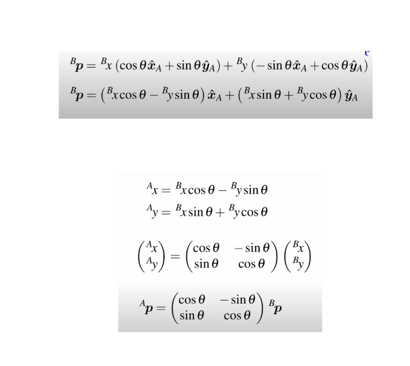
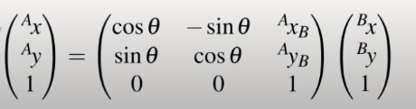
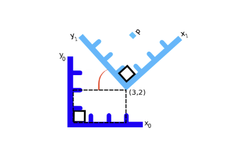
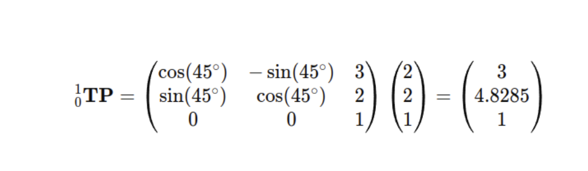

# Transformation_And_Frames(TF)

**Author: Wafaa Mohamed**

**Review : KG**

- # 1. Coordinate frame and transformation

  #### 1.1. coordinate frame

  - A coordinate frame is a reference system that defines how spatial locations are measured. It consists of a set of axes (e.g., x, y, z) that intersect at an origin point.
  - Each frame has its own origin and orientation.
  - In the robot ,its different parts, sensors, and environments can have their own coordinate frames.
  <p align="center">
  

  #### 1.2. Transoformation

  - A transformation is a mathematical operation that converts coordinates from one frame to another. Transformations include translations (moving along axes), rotations (rotating around axes), and sometimes scaling. In robotics, transformations are used to relate the positions and orientations of different frames to one another.

    <p align="center">
    

  - Example :
    To Transform object's location from camera frame to the world frame

       <p align="center">
       

       <p align="center">
       

- # 2 - Why do needed frame transformation in AMR

    <p align="center">
    

    <p align="center">
    

  There are multiple reasons for example :

  - compact representation of points and orientations
  - To etermine the robot's position within a global map
  - To assign the relations between static robot components in terms of translation and rotation
  - To transform objects' poses from camera to the world
  - To transform enviroment points from lidar prespective into the world

      <p align="center">
      

    Measurement in map frame

  ### Multiple Frames in robot

  as mentioned there are multiple frames in the robot and the environment and they are common and important :

    <p align="center">
    

    <p align="center">
    

  - ### **Reference Frames**

    **1. Map:** it's fixed frame representing the global map of the environment.

    **2. World :**
    Similar to the map frame but may include more global context.

  - ### **Other Common Frames in the robot**

    **1. Base Link**

    - The frame attached to the robot's base. It serves as the primary reference for the robot's body
    - it moves with the robot sure

    **2. Laser(Lidar)**

    - it's attached to the laser sensor, used to convert laser readings is taken into it relevant frames

    **3. camer frame**

    - Attached to the camera sensor, used to convert image data to the robot's base frame or other relevant frames.

    **4. Odom**

    - frame that represents the robot's position based on its wheel encoders or other motion sensors.
    - Fixed relative to the map, origin is wherethe robot starte

- # 3. Rigid Body Transformation in 2D

  - Rigid body transformation in 2D involves changing the position and orientation of a shape or object while preserving its size and shape. This typically includes translation (shifting position) and rotation (changing orientation).

      <p align="center">
      

  ### 3.1. Translation

  Just shifting with the same orientation , if the robot origin was in posion A and move to position B

    <p align="center">
    

  so the robot new position with respect to the world will be it's tf from position A WRT World plus the shift between old and new position

  or object wih respect to a camera

    <p align="center">
    

    <p style="text-align:left;  font-size:30px;">
        pA  = [3, 6] <br>
        BTA = [6, -3] <br>
        PB  = [9, 3]
    </p>

  ***

  ### 3.2. Rotation:

  if we have a point in a frame A so it's position WRT frame A will be as following

  <p align="center">
  

  ### What if frame A rotated with angle theta ?

  Let's Calculate this step by step :

  1. We agreed that tf of the point in B will equal it's projection in B frame in x and y --> (1)

        <p align="center">
        

  2. let's expand the vector(projection ) X^B and Y^B

     <p align="center">
     

     - [Reference for the proof ](images/tf18.png)
     - [For more about the proof watch this](https://www.youtube.com/watch?v=-HcDl_gyeMs)

  3. so by comensation in (1) we will get the tf of the point in the frame B

      <p align="center">
      

      rotation from B to A

      <p align="center">
      

  ***

  ### 3.3. Transformation ( Rotation and Translation ):

  - the frame B is both translated and oriented

  <p align="center">
  

Let's Calculate this step by step :

1. Make the rotation calculation at first , let's say we have a frame V that represents the orientation of B to be parallel to A

    <p align="center">
    

2. So the tf of the point p in the frame A will be represented by the vector Ap which is the summition of Atv + Vp

    <p align="center">
    

3. Let's Expand and compenste

     <p align="center">
     

   So this is the final Transformation matrix to transform a point from a frame into another

     <p align="center">
     

   so the finaal transformation from frame B to A is as The following

     <p align="center">
     

   ***

   ### 3.4. Practical Example:

    <p align="center">
    

   Let’s look at the the reference frames 1 and 0 shown in the above figure, where point {p} = (2,2) in reference frame 1.

   And reference frame 1 is rotated 45 degrees from and located at (3, 2) in reference frame 0.

   To Calculate for this translation and rotation a new matrix will be created that includes both rotation and translation

    <p align="center">
    

    <p align="center">
    

   This solusion says he coordinates of {p} in reference frame 0 is represented by the first two elements of the resulting vector {p} = (3, 4.8285).

- # 4. TF in ROS

  ### 4.1. Concept

  - In ROS TF is a package that provides a way to keep track of multiple coordinate frames in the robot over time. It allows the user to transform data between these frames and maintain the relationships between them.
  - **TF tree** is a conceptual representation of all the coordinate frames in a system and the transformations (transforms) between them. It's organized as a directed graph, where each node represents a coordinate frame, and each edge represents a transform between two frames.
  - **tf2** : This is the newer version of `tf` and is used in ROS 2 and the later versions of ROS 1. `tf2` provides better performance, thread safety, and new features while maintaining backward compatibility with `tf`.

    <p align="center">
    

  ### 4.2. Package nodes

  **Broadcasters and Listeners**:

  1. **Broadcasters**: Nodes that publish the transforms between frames. For example, a robot's base link to its odom frame. "on topic /tf"
  2. **Listeners**: Nodes that subscribe to transforms and use them to compute the relative position and orientation of different frames.

  ### 4.3. TF tools in ROS

  ### **`tf_echo`**

  - **Purpose** : Displays the transform between two frames in real-time.
  - **`tf2_echo`** : Similar to `tf_echo`
  - **Usage :**

    ```
    rosrun tf tf_echo [source_frame] [target_frame]
    rosrun tf tf_echo /base_link /map
    ```

  ### **`rqt_tf_tree`**

  - **Purpose** : Provides a graphical visualization of the `tf` tree.
  - **Usage :**

    ```
    rosrun rqt_tf_tree rqt_tf_tree
    ```

    <p align="center">
    

  ### **`view_frames`**

  - **Purpose** : Generates a graphical representation of the `tf` tree as a PDF.
  - **Usage** :

    ```
    rosrun tf view_frames
    ```

  ### **`tf_monitor`**

  - **Purpose** : Monitors the status of transforms between frames and checks if they are being published regularly.
  - tf2_monitor: Monitors transforms in tf2.
  - **Usage** :

    ```
    rosrun tf tf_monitor [frame1] [frame2]
    rosrun tf tf_monitor /base_link /odom
    ```

  ### **`static_transform_publisher`**

  - **Purpose** : Publishes a static transform between two frames.
  - **Usage** :

    ```
    rosrun tf static_transform_publisher x y z yaw pitch roll frame_id child_frame_id period_in_ms
    rosrun tf static_transform_publisher 1 0 0 0 0 0 /base_link /laser 100
    ```

    <p align="center">
    

# 5. Practical Example: [April Tag](<../B. Static and Dynamic  transformations/static_dynamic_pkg/README.md>)

# Acnolegment

1. [Ros Wiki Transformations](http://wiki.ros.org/tf/Overview/Transformations)
2. [The ROS Transform System (TF)](https://www.youtube.com/watch?v=QyvHhY4Y_Y8)
3. [robotacademy 2d-geometry](https://robotacademy.net.au/masterclass/2d-geometry/)
4. [studywolf Transformations](https://studywolf.wordpress.com/2013/08/21/robot-control-forward-transformation-matrices/)

## [Next Topic →](<../B. Static and Dynamic  transformations/Static.md>)

## [↩Back to main](../README.md)

