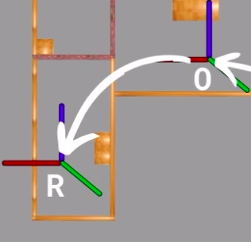
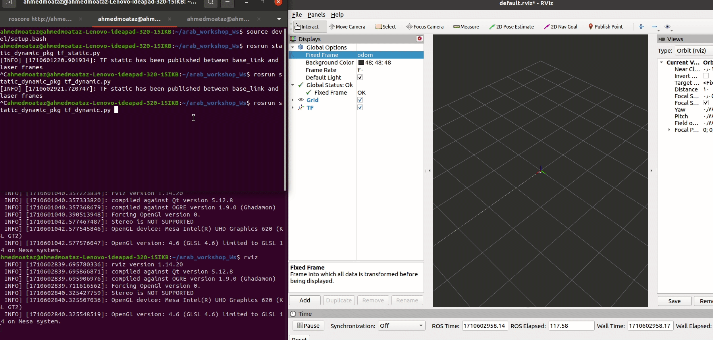
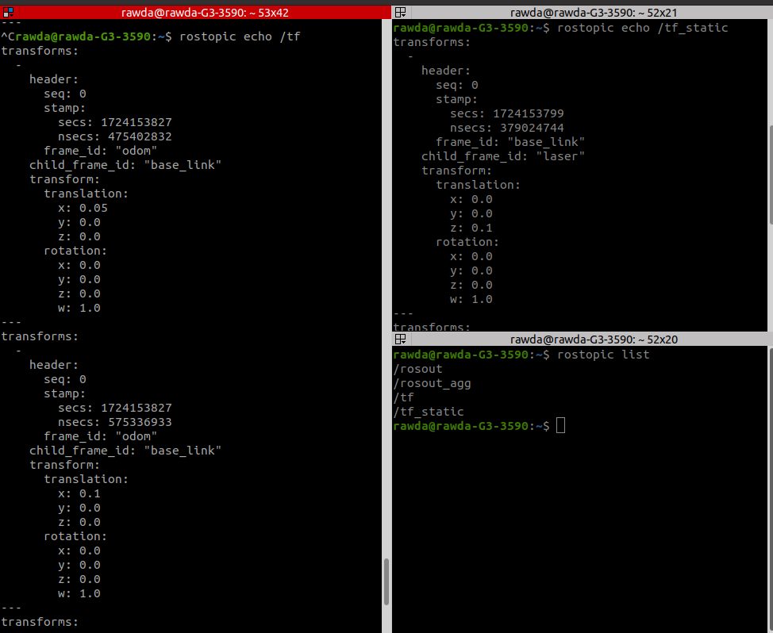

author: Mo3taz & Rawda

# Dynamic Transformations:

To understand dynamic transformations we need to understand dynamic frames like `map` and `odom`

this TF structure for most autonomous robots:


1. **World Frame:** This frame represents the world environment in simulation. It could be a Gazebo world or, in reality, the world that the robot operates in, such as a home environment.

2. **Map Frame:** To understand the map and odom frames, we must grasp the concept of localization.

   Localization essentially means that the robot knows its position within the environment it is navigating (the environment being represented by the map). This is achieved in two steps:
   
   **1. Knowing the Initial Position**: The robot knows where it started its movement in relation to the map.

      - **O**: Represent `Odom frame` and it is initial position

      - **M**: Represent `Map frame` represent map for the environment

    

   **2. Current Position**: Determining where the robot is located now in relation to where it started its movement.

   
   

## Summary:

   **Map Frame:** It's about the place that robot can move.

   **Odom Frame:** The odom frame is crucial for calculating the robot's location. It marks the starting point of the robot's movement.
   

- Now I hope we understand dynamic transformation concept,and we will talk about this consept again in localization part.
- We need to learn how we publish this transformation
  

#  Dynamic Broadcaster

- In this section, we will extend the previous example by adding dynamic transformation between the `base_link` and another link called `odom`. 

#### Description

We use the same example as above but introduce dynamic transformation between the `base_link` and `odom`. The `base_link` represents the car with a lidar (static for the base link), and `odom` is the starting point from which the car moves. We expect that the `base_link` and lidar move away from `odom`.

#### Steps

1. Import the `TransformBroadcaster` class for publishing dynamic transform.

#### Python Code

```python
from tf2_ros import StaticTransformBroadcaster, TransformBroadcaster
```

2. like above need object from dynamic broadcaster and create msg from same type msg static 

```python
 self.dynamic_broadcaster = TransformBroadcaster()
        self.dynamic_transform_stamped = TransformStamped()
```
3. now we make timer that after 0.1s change transform 

    **rospy.Timer** : take two parameters 
    1. the duration here 0.1
    2. the function that executed every this duration 0.1 second
```python

        self.timer = rospy.Timer(rospy.Duration(0.1), self.timer_callback)
```

4. every 0.1s i will make translation in x direction by 5mm
```python
self.x_increment= 0.05
        self.last_x = 0.0 #this for save last x value to add the increment to it
```
5. make call back function that make transformation and rotation between odom and base link

```py
 # publish new transform every 0.1 second
    def timer_callback(self, event):
        # add information about time 
        self.dynamic_transform_stamped.header.stamp = rospy.Time.now()
        self.dynamic_transform_stamped.header.frame_id = "odom"
        self.dynamic_transform_stamped.child_frame_id = "base_link"
        # add translation and rotation vectors same static transform
        # but here we will change the translation vector every 0.1 second
        self.dynamic_transform_stamped.transform.translation.x = self.x_increment + self.last_x
        self.dynamic_transform_stamped.transform.translation.y = 0.0
        self.dynamic_transform_stamped.transform.translation.z = 0.0
        
        self.dynamic_transform_stamped.transform.rotation.x = 0.0
        self.dynamic_transform_stamped.transform.rotation.y = 0.0
        self.dynamic_transform_stamped.transform.rotation.z = 0.0
        self.dynamic_transform_stamped.transform.rotation.w = 1.0
        # now publish transform
        self.dynamic_broadcaster.sendTransform(self.dynamic_transform_stamped)
        # update last x value
        self.last_x = self.dynamic_transform_stamped.transform.translation.x
```
output


#### dynamic transform messages are broadcast on `/tf`  topic :




#### tf tree should be like this :

```bash
rosrun rqt_tf_tree rqt_tf_tree 
```
##### note:
- If line not work make sure you install the package

```bash
sudo apt-get install ros-noetic-rqt-tf-tree
```
output:


## Tf Listener:
Dynamic and static listener [1.](/3.URDF_Simulation_Workshop/B.%20Static%20and%20Dynamic%20%20transformations/Static.md) code share a similar structure, with the primary difference being the inclusion of the line 
`(trans_dy, rot_dy) = listener.lookupTransform('/odom', '/base_link', rospy.Time(0))` in dynamic listener code . this function call is asking the TransformListener to provide the transformation (translation and rotation) between the two coordinate frames, `/odom` and `/base_link`.

### for full code :
[Full Code](../static_dynamic_pkg/scripts/tf_dynamic_listener.py)

## Output is :


