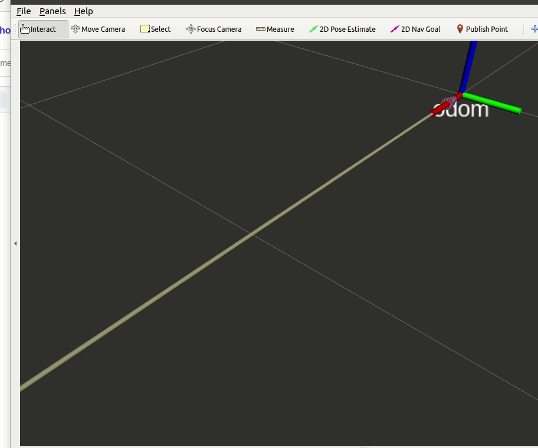
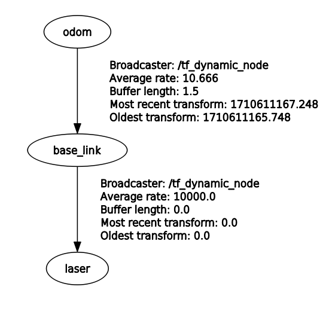
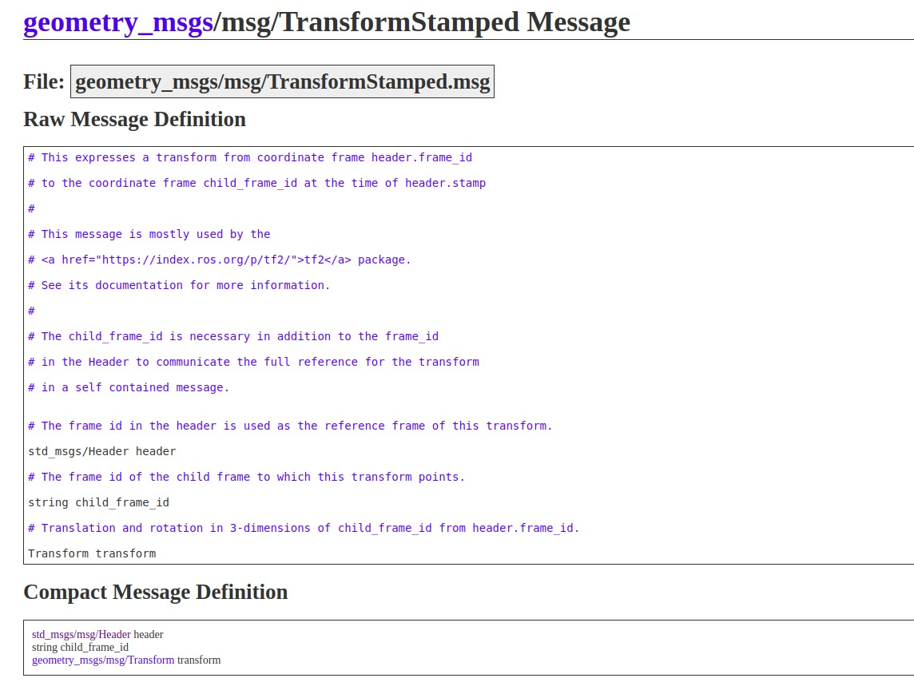
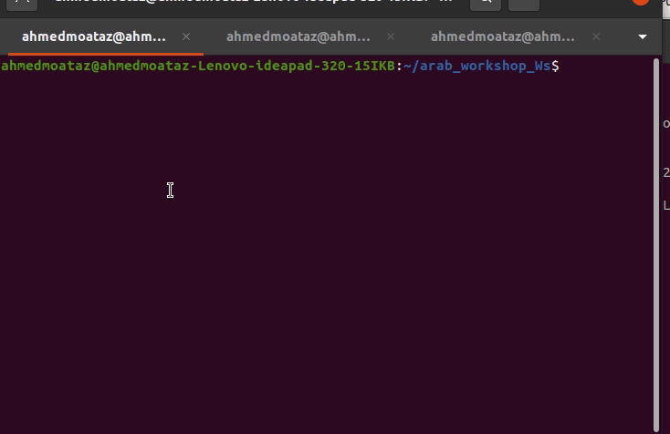
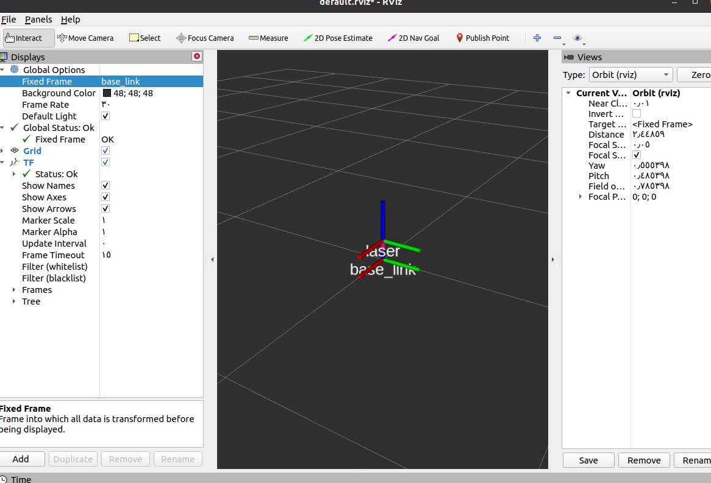

authors : Mo3taz & Rawda

# Transformations

any robot consist of frames linked together and **TF** consist of two main parts **Static** and **Dynamic**  transformaitons,

`<span style="color: red;">`See this first and then we will talk



as you can see this gif explain two types of transformations

- **static transformation** like transfromation between `base_link` and `laser_link`
- **dynamic transformation** like transfromation between `odom` and `base_link`

Frist let's talk more about static

## Static Transformation

static transformation it is about componants or sensors at **certain distance** relative to **base link**

this distance won't change relative to time.



#### in this case `laser ` link is  fixed (static) frame because laser link cann't move with respect to `base_link`

Now I hope we understand static transformation concept, We need to learn how we publish this transformation
we use **tf broadcaster** to publish this transformation.

## Static Broadcaster:

In this example, we create a static broadcaster node that publishes two frames with a static transform between them.

## Steps And Code Explination

1. Import the necessary classes:
   - **StaticTransformBroadcaster**: This class publishes coordinate frame transform information.
   - **TransformStamped**: This message type is used in static transforms.

```python
#!/usr/bin/env python3

import rospy

from tf2_ros import StaticTransformBroadcaster
# massage that used in tf static 
from geometry_msgs.msg import TransformStamped
```

2. need to make object from StaticTransformBroadcaster and create msg from TransformStamped

```python
 # instance from static transform broadcaster class 
        # need this object to publish static transform in TF static topic
        self.static_broadcaster = StaticTransformBroadcaster()
      
        # create a static transform message
        self.static_transform_stamped = TransformStamped()
```

### 3. Setting Information in TransformStamped Message



To define the information in a `TransformStamped` message for the static transform between two frames, follow these steps:

1. **header.stamp**: This indicates the time when the static transform was generated.
2. **header.frame_id**: This specifies the parent frame.
3. **child_frame_id**: This specifies the child frame.
4. **transform.translation**: These values represent the distance between the parent frame and the child frame in meters along the x, y, and z axes.
5. **transform.rotation**: This specifies the rotation in quaternion format (x, y, z, w).
   [Quaternion Explanation Video](https://www.youtube.com/watch?v=zjMuIxRvygQ)

```python
  # add information about time when this static transform has been generated
        self.static_transform_stamped.header.stamp = rospy.Time.now()
      
        # as we learn that tf connect two frames together
        # let's define the parent frame and the child frame 
      
        # parent frame
        self.static_transform_stamped.header.frame_id = "base_link"
        # child frame any frame like laser of camera or any other frame
        # important to note that the child frame should be static frame
        self.static_transform_stamped.child_frame_id = "laser" 
      
        # we know that child frame is connected to parent frame by translation and rotation vectors
        # let's define translation vectors
        self.static_transform_stamped.transform.translation.x = 0.0
        self.static_transform_stamped.transform.translation.y = 0.0
        # in z axes 10 cm above the base_link frame
        self.static_transform_stamped.transform.translation.z = 0.1
      
        # let's define rotation vectors 
        self.static_transform_stamped.transform.rotation.x = 0.0
        self.static_transform_stamped.transform.rotation.y = 0.0
        self.static_transform_stamped.transform.rotation.z = 0.0
        self.static_transform_stamped.transform.rotation.w = 1.0
```

4- last thing puplish this transform and print in terminal if you want

```python
   self.static_broadcaster.sendTransform(self.static_transform_stamped)
        rospy.loginfo("TF static has been published between %s and %s frames" % (self.static_transform_stamped.header.frame_id, self.static_transform_stamped.child_frame_id))
      
```

- #### static transform messages are broadcast on `/tf_static`  topic

### for full code :

[Full Code](../static_dynamic_pkg/scripts/tf_static.py)

### recap to run this node :



#### output:



After we understand broadcaster node, we need to learn how we listen this transformation

## Tf Listener:

listener is simpler than broadcaster

In this example, we will create listener node  to listen above broadcaster node

### New lines in the code :

`listener = tf.TransformListener()`: Creates a TransformListener object, which listens to transformations being broadcasted between coordinate frames.

`(trans, rot) = listener.lookupTransform('/base_link', '/laser', rospy.Time(0))`: this function call is asking the TransformListener to provide the transformation (translation and rotation) between the two coordinate frames, `/base_link` and `/laser`.

`rospy.Time(0)`: This argument specifies the time at which you want to know the transformation. By passing `rospy.Time(0)`, you're telling the TransformListener to give you the transformation at the latest available time. In other words, it will return the most recent transformation that it has recorded, If you were to pass a different time, like `rospy.Time(5)`, it would attempt to give you the transformation as it was at 5 seconds into the ROS system’s start time, which might be outdated if you’re looking for real-time data.

### full code :

```python
#!/usr/bin/env python3
import rospy
import tf


if __name__ == '__main__':
    rospy.init_node('static_tf_listener')

    listener = tf.TransformListener()

    rate = rospy.Rate(1.0)
    while not rospy.is_shutdown():
        try:
            (trans,rot) = listener.lookupTransform('/base_link', '/laser', rospy.Time(0))

            print(f"translation is {trans} and rotation is {rot}")
        except:
            continue


        rate.sleep()
```

[Full Code](../static_dynamic_pkg/scripts/tf_static_listener.py)

## Output is :


