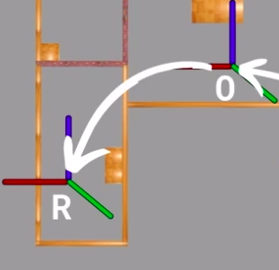
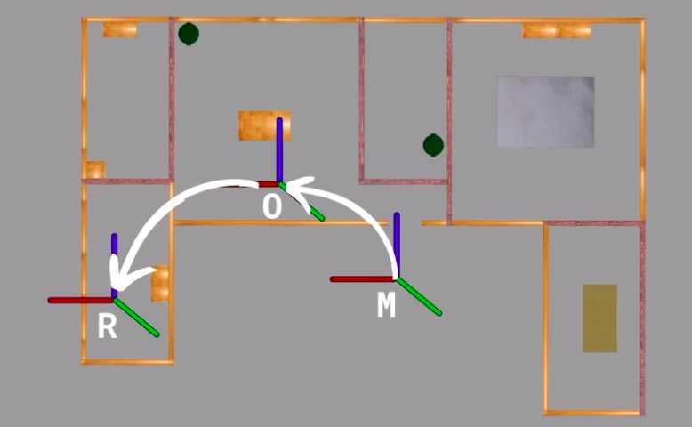

# Explanation of Dynamic Frames (odom, map)
Author: Mo3taz

Most autonomous robots should have this TF structure:

1. **World Frame:** This frame represents the world environment in simulation. It could be a Gazebo world or, in reality, the world that the robot operates in, such as a home environment.

2. **Map Frame:** To understand the map and odom frames, we must grasp the concept of localization.

   Localization essentially means that the robot knows its position within the environment it is navigating (the environment being represented by the map). This is achieved in two steps:
   
   - *Knowing the Initial Position:* The robot knows where it started its movement in relation to the map.

    

   - *Current Position:* Determining where the robot is located now in relation to where it started its movement.

   
## Summary:

   **Map Frame:** It's about the place that robot can move.

   **Odom Frame:** The odom frame is crucial for calculating the robot's location. It marks the starting point of the robot's movement.
   

   
