# Robotic simulation

Robotic simulation involves creating a virtual model that mimics real-world processes. By using simulation, we can design a virtual representation of a robot and test its design and programming in a controlled environment.

Robotic simulators are software applications that create models of robots and render virtual environments that replicate the real-world settings in which the robots will operate. In our scenario, the environment is a typical hotel or restaurant with tables and chairs. We need to replicate this setup in the simulator to test the robot's functionality. One commonly used robotic simulator for such tasks is **`Gazebo`**.

# Gazebo

**Gazebo** is an open-source 3D robotics simulator. Gazebo simulated real-world physics in a high fidelity simulation.

Gazebo is a physics-based, high fidelity 3D simulator for robotics. Gazebo provides the ability to accurately simulate one or more robots in complex indoor and outdoor environments filled with static and dynamic objects.

Gazebo simulated real-world physics in a high fidelity simulation.

Robotics simulation is an ever-growing space. Companies are investing more and more money to improve their workflow through robotic simulation.

Robotic simulation saves a lot of time and money because it allows people to test how robots work without huge investments.

We have the capability to employ Gazebo for `building` both our `robot` model and the `environment/world` model.

### Gazebo Architecture

Gazebo runs two processes:

- **Gazebo Server**:
  The first main component running a
  Gazebo simulation is the Gazebo
  Server or also known by gzserver. It is
  responsible for simulating(robots,
  sensors, objects, ….)
- **Gazebo Client**:
  The second main component running an
  of a Gazebo simulation is the Gazebo
  Client or also known by gzclient. gzclient
  provides the very essential Graphical
  Client that connects to the gzserver and
  renders the simulation scene.

<p align="center">
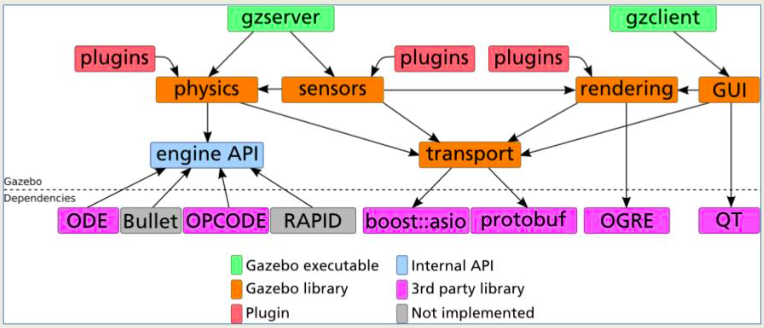

### Installing Gazebo

Gazebo can be installed as a standalone application or an integrated application along with ROS. In
this chapter, we will use Gazebo along with ROS for simulation and to test our written code using the
ROS framework.

Test that you have the right version of Gazebo
To check version of Gazebo run:

```sh
gazebo --version
```

> The complete Gazebo_ros_pkgs can be installed in ROS Noetic using the following command:

```sh
sudo apt-get install ros-noetic-gazebo-ros-pkgs ros-noetic-gazebo-ros-control
```

- To run gazebo server type:

  ```bash
  gzserver
  ```

  > This will start the physics engine with an empty world.

- To run gazebo GUI client type in anther terminal:

  ```bash
  gzclient
  ```

  This will connect t the server and give you a graphical display of the simulation.

  <p align="center">
  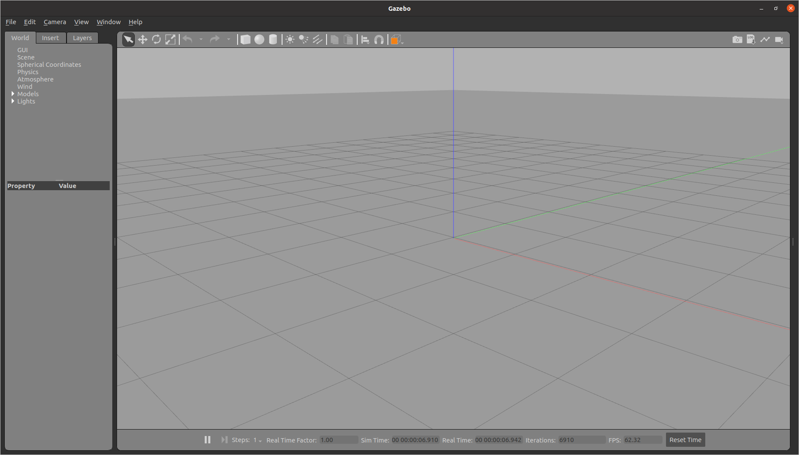

Actually you can launch server and clinet with single command:
Make sure that you have Gazebo installed by typing the following command in
a terminal:

```bash
gazebo
```

### Testing Gazebo with the ROS interface

To get started with testing Gazebo using the ROS interface, follow these steps:

1. Launch the ROS core:

   ```sh
   roscore
   ```

2. In another terminal, run Gazebo with the ROS plugin:
   ```bash
   rosrun gazebo_ros gazebo
   ```

After starting **Gazebo**, we will see the following **topics** generated. Using the rostopic command, we will find the following list of topics:

```sh
rostopic list
```

> The preceding command line prints the following information

```sh
/gazebo/link_states
/gazebo/model_states
/gazebo/parameter_descriptions
/gazebo/parameter_updates
/gazebo/performance_metrics
/gazebo/set_link_state
/gazebo/set_model_state
```

### Gazebo User Interface

- **`World` :**
  This tab displays the lights and models currently in the scene.
  you can view or edit its basic parameters like position and
  orientation. In addition, you can also change the physics of the
  scene like gravity and magnetic field via the Physics option.
- **`Insert` :**
  you will find objects (models) to add to the simulation scene.
- **`Select mode` :**
  Select mode is the most commonly used cursor mode. It allows you to navigate the scene
- **`Translate mode`:**
  change an object's position is to select the object in the world tab on the side panel and
  then change its pose via properties.
- **`Rotate mode` :**
  Similar to translation mode, this mode allows you to change the orientation of any given model.
- **`Scale mode` :**
  Scale mode allows you to change the scale, and hence, the overall size of any model.
- **`Undo/Redo `:**
  the undo tool helps us revert our mistakes. the redo tool used if you didn’t make something
  that you need.
- **`Simple shapes` :**
  You can insert basic 3D models like Boxs, spheres, or cylinders into the scene.
- **`Lights` :**
  Add different light sources like a spotlight, point light, or directional light to the scene.
- **`Copy/Paste` :**
  These tools let you copy/paste models in the scene. Or, you can simply press
  Ctrl+C to copy and Ctrl+V to paste any model.
- **`Align` :**
  This tool allows you to align one model with another along with one of the three principal axes.
- **`Change view` :**
The change view tool lets you view the scene from different
perspectives like top view, side view, front view, bottom view.
  <p align="center">
  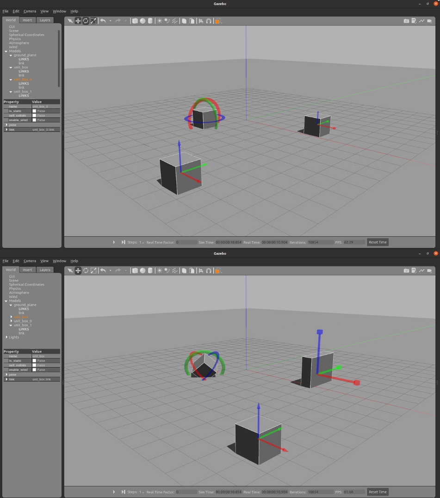

## Robot models in Gazebo

Before we dive into robot models , it's essential to clarify that there are two distinct scenarios

1. **Building a robot model**
2. **Downloading a pre-built model**
## 1. Building robot models in Gazebo

click on Edit and select model editor

- Create the robot chassis:

  - Select from simple shapes “Box”.
  - Double click on a Box shape.
  - Click on visual and go geometry.
  - Change x = 1m, y = 0.8m , z = 0.2m.
  - Click on collision and go geometry.
  - Change x = 1m, y = 0.8m , z = 0.2m.
  <p align="center">
  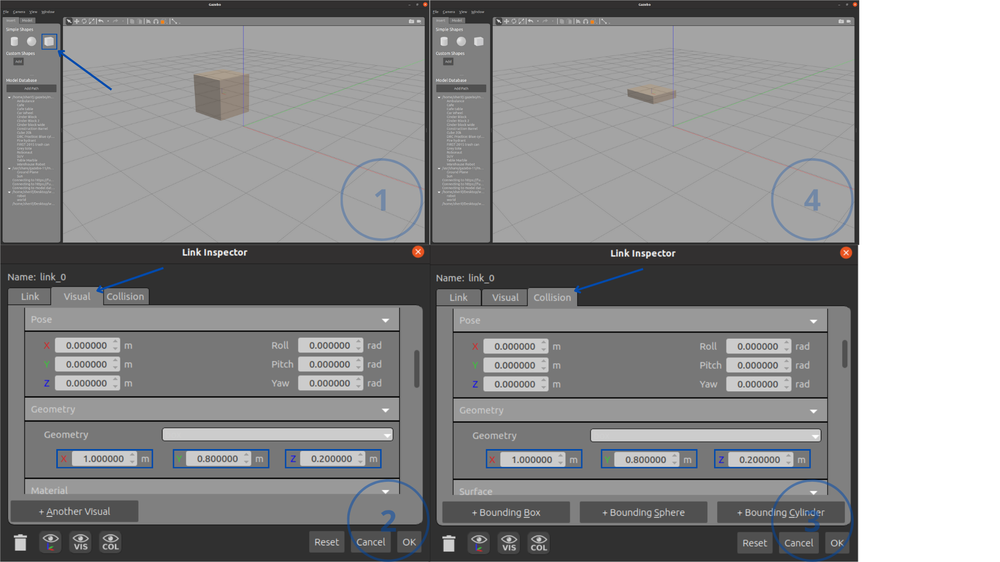

- Create robot wheels:

  - Select from simple shapes “cylinder”.
  - Double click on the cylinder shape.
  - Click on visual and go geometry.
  - Change radius = 0.2m , length = 0.1m.
  - go pose and change roll Rotate the wheel to 90 degree = 1.570700 rad.
  - Click on collision and go geometry.
  - Change radius = 0.2m , length = 0.1m.
  - go pose and change roll Rotate the wheel to 90 degree = 1.570700 rad.
  <p align="center">
  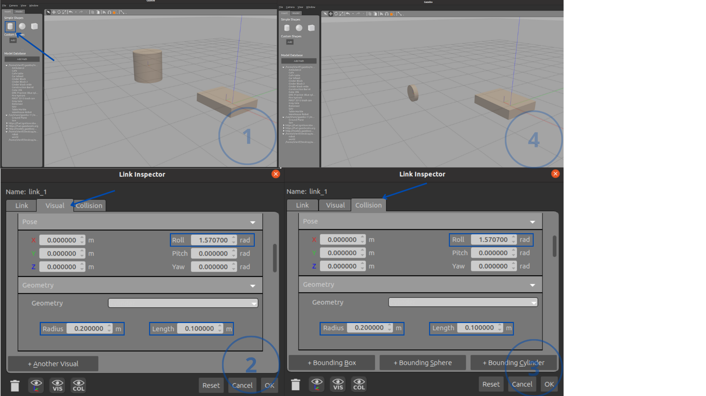

- Connect wheels to the chassis via joints:

  - Select Joint from the toolbar.
  - Chage joint type to “Revolute”.
  - Choose parent as robot chassis and child as a wheel.
  - Align links x, y, z, And choose a suitable rotate axis.
  <p align="center">
  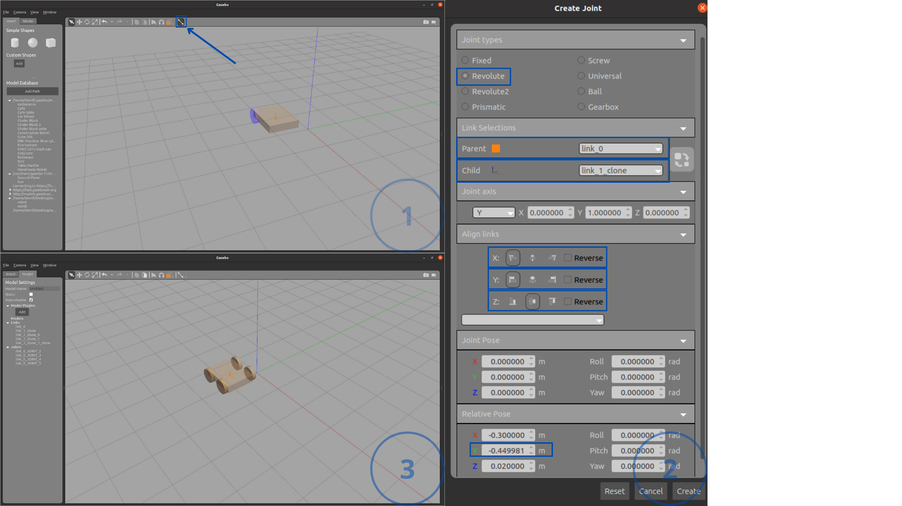

- Adding Camera:

  - Select from simple shapes “Box”.
  - Double click on a Box shape.
  - Click on visual and go geometry.
  - Change x = 0.1, y = 0.1 , z = 0.1.
  - Click on collision and go geometry.
  - Change x = 0.1, y = 0.1 , z = 0.1.
  <p align="center">
  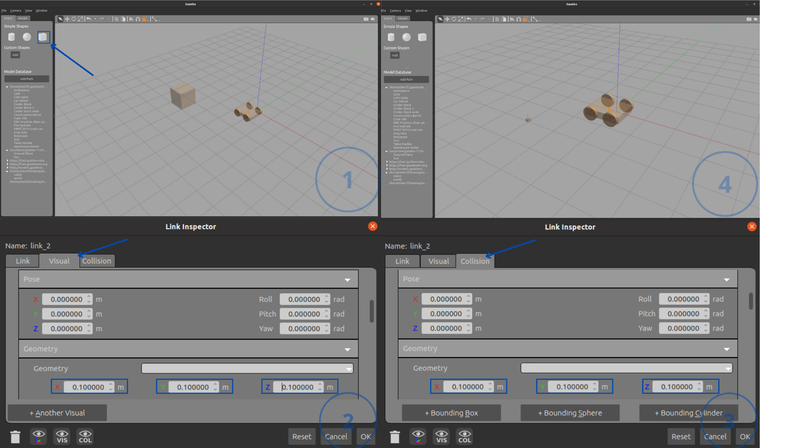

- Connect Camera to the chassis via joints:

  - Select Joint from the toolbar.
  - Chage joint type to “fixed”.
  - Choose parent as robot chassis and child as a Camera.
  - Align links x, y, z, And choose a suitable rotate axis.
  <p align="center">
  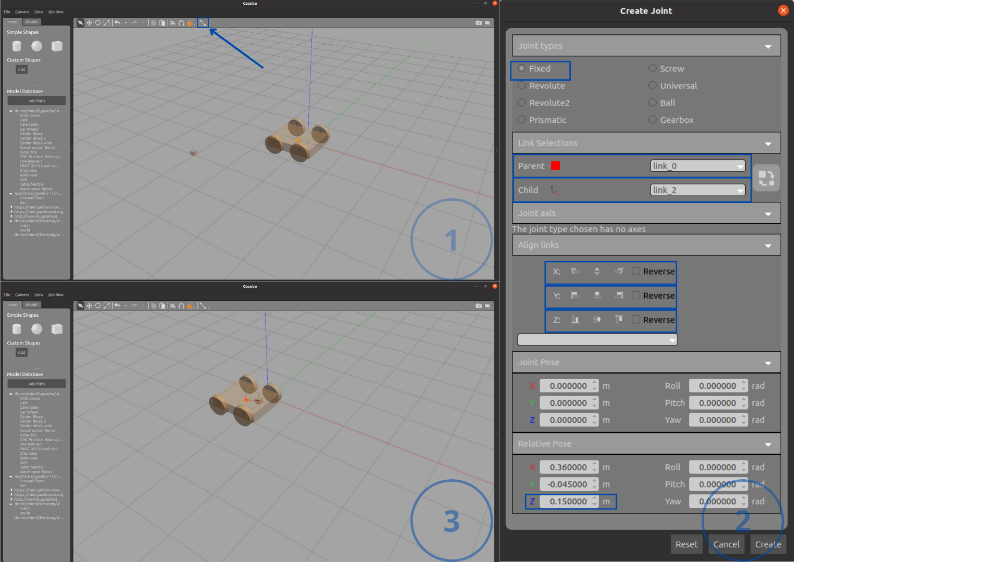

- Save the model file

  - Model: Save it as a robot in <your_pkg_ws/model>
  - Exit the Model Editor

  <p align="center">
  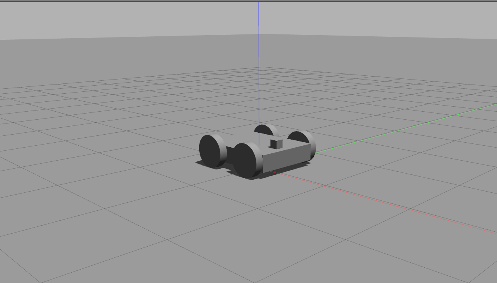

## Controlling Your Robot

you can control the movement this robot follow this steps

1. open your [robot model.sdf](/gazebo_pkg/model/robot/model.sdf)
2. before close <model> you can add this plugin to control the robot
   ```bash
   <plugin name="skid_steer_drive_controller" filename="libgazebo_ros_skid_steer_drive.so">
       <updateRate>100.0</updateRate>
       <robotNamespace>/</robotNamespace>
       <leftFrontJoint>front_left_wheel_joint</leftFrontJoint>
       <rightFrontJoint>front_right_wheel_joint</rightFrontJoint>
       <leftRearJoint>back_left_wheel_joint</leftRearJoint>
       <rightRearJoint>back_right_wheel_joint</rightRearJoint>
       <wheelSeparation>0.4</wheelSeparation>
       <wheelDiameter>0.4</wheelDiameter>
       <robotBaseFrame>base_link</robotBaseFrame>
       <torque>20</torque>
       <topicName>cmd_vel</topicName>
       <broadcastTF>false</broadcastTF>
       <odometryTopic>odom</odometryTopic>
       <odometryFrame>odom</odometryFrame>
       <covariance_x>0.001000</covariance_x>
       <covariance_y>0.001000</covariance_y>
       <covariance_yaw>0.100000</covariance_yaw>
     </plugin>
   ```
3. save the model and open it in gazebo

> you can control with two way

- Open your terminal and start the ROS core:
  ```sh
  roscore
  ```
- In another terminal, run your model in Gazebo:

  ```sh
  rosrun gazebo_ros gazebo
  ```

- Choose the model from your device

## 1. Constant velocity

- if you write in another terminal
  ```sh
  rostopic list
  ```
  > The preceding command line prints the following information
  ```sh
  /clock
  /cmd_vel
  /gazebo/link_states
  /gazebo/model_states
  /gazebo/parameter_descriptions
  /gazebo/parameter_updates
  /gazebo/performance_metrics
  /gazebo/set_link_state
  /gazebo/set_model_state
  /odom
  /rosout
  /rosout_agg
  /tf
  ```
- Now, you can publish to the /cmd_vel topic:
  ```sh
  rostopic pub /cmd_vel geometry_msgs/Twist "linear:
    x: 2.0
    y: 1.0
    z: 0.0
  angular:
    x: 0.0
    y: 0.0
    z: 2.0"
  ```
  <p align="center">
  
  
## 2. Teleop_twist_keyboard

- Installing
  ```sh
  sudo apt-get install ros-noetic-teleop-twist-keyboard
  ```
- Running
  ```sh
  rosrun teleop_twist_keyboard teleop_twist_keyboard.py
  ```
- Controls

  ```sh
  Reading from the keyboard  and Publishing to Twist!
  ---------------------------
  Moving around:
    u    i    o
    j    k    l
    m    ,    .

  For Holonomic mode (strafing), hold down the shift key:
  ---------------------------
    U    I    O
    J    K    L
    M    <    >

  t : up (+z)
  b : down (-z)

  anything else : stop

  q/z : increase/decrease max speeds by 10%
  w/x : increase/decrease only linear speed by 10%
  e/c : increase/decrease only angular speed by 10%

  CTRL-C to quit
  ```
  <p align="center">
   


To initiate movement of the robot, simply double-click on the robot and select "Apply Force and Torque."

<p align="center">


## Building world models in Gazebo

The Building Editor allows you to create modeBls of multi-level builings without write any code.

Builings can contin doorways, windows and stairs.

To access the Building Editor, go to the Edit menu and select Building Editor.

<p align="center">


> Final custom model

<p align="center">
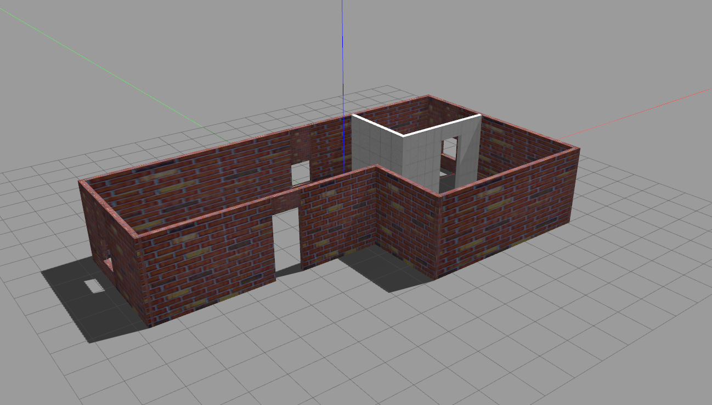

### include custom models for the world

Click on the toolbar, select `Insert` and then choose `Robot` and `World` to create them as per your requirements.
then save this world such as [`my_world.world`](/gazebo_pkg/world/my_world.world)

you can open this file using this line

```
rosrun gazebo_ros gazebo path/to/your/world/my_world.world>
```

<p align="center">
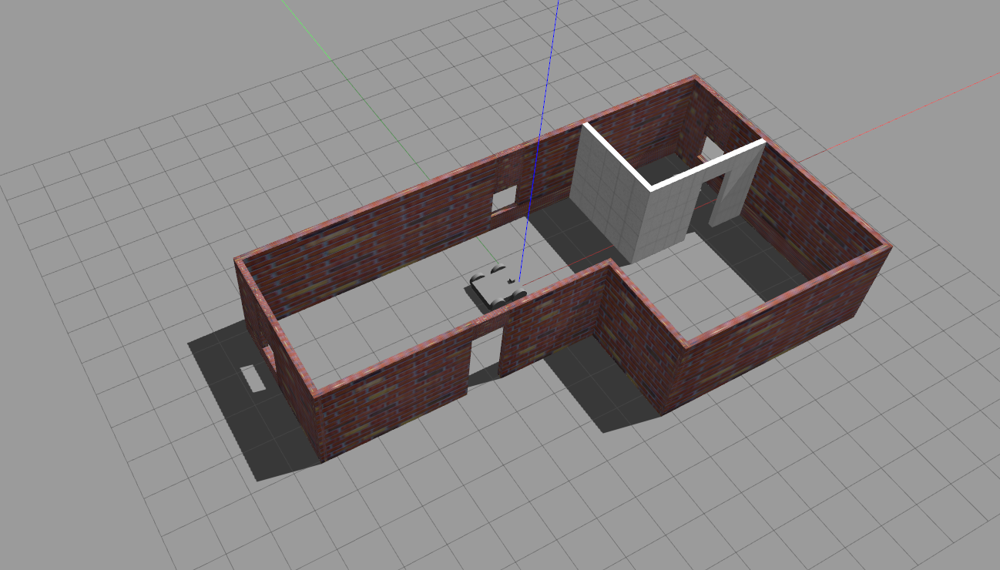

---

> Note: If you can't run Gazebo again after closing it, use the following command to terminate all Gazebo processes:

```sh
sudo killall -9 gazebo gzserver gzclient
```

### 2.Downloading a pre-built model

gazebo models saved in **~/.gazebo/models**

so we need to get a model and saved it in this directory

1. get the robot model you want online , you could find many in this repository :
   * [robot models repository ](https://github.com/osrf/gazebo_models) or you could download the full repository
2. download and locate the model directory in the gazebo model path **~/.gazebo/model** or download it in any other path

```
asphalt_plane
├── materials
|   └── scripts
|   |   └── asphalt.material
│   └── textures
|	└── tarmac.png
├── model-1_4.sdf
├── model.config
└── model.sdf
```

each directory have :

* materials :Contains textures and scripts for defining material properties.
* meshes folder: Stores 3D models in formats like COLLADA (.dae) or STL.
* model.sdf or model.urdf:Describes the model's physical and visual properties.
* model.config:Provides metadata about the model.

3. run it locally
   * in gazebo Click on the toolbar, select `Insert`
   * if installed in ./gazebo/models you will find the name of the directory
   * if downloaded in another path click on add path and select the folder name

<p align= "center" >
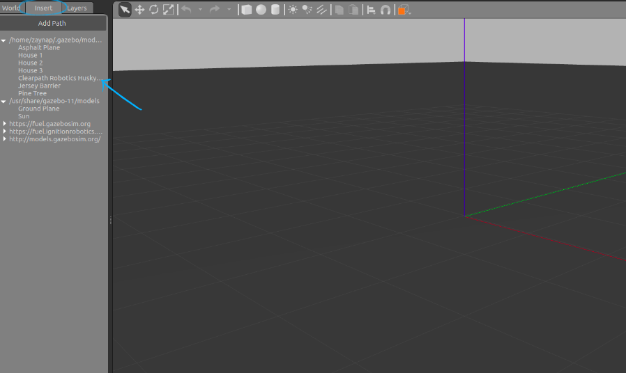

<p align= "center" >
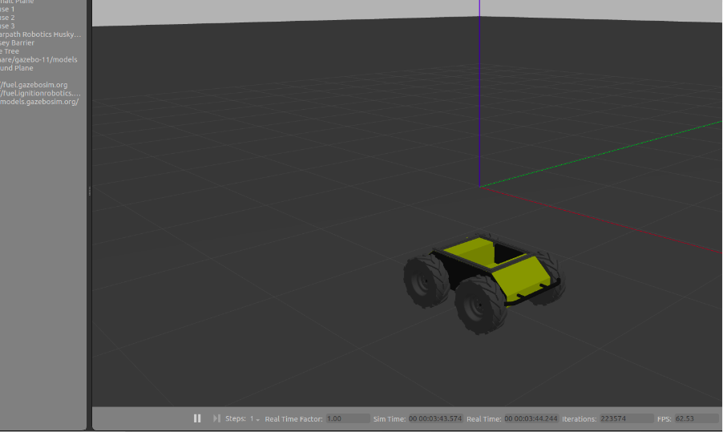


---


# [Next Topic Link](< >)

### [&lt;-Back to main](../README.md)
