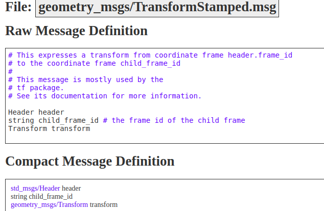

# Transformations

any robot consist of frames linked together and **TF** consist of two main parts **Static** and **Dynamic** transformation Transformaiton, Here we will talk about **Static Transformation**


## Static Transformation 

static transformation it is about componants or sensors at **certain distance** relative to **base link**


#### in this case `laser link` is fixed (static) frame becouse laser link cann't move with respect to `base link`

## Static Broadcaster:
 
In this example, we create a static broadcaster node that publishes two frames with a static transform between them.

## Steps And Code Explination
1. Import the necessary classes:
   - **StaticTransformBroadcaster**: This class publishes coordinate frame transform information.
   - **TransformStamped**: This message type is used in static transforms.


```python
#!/usr/bin/env python3

import rospy

from tf2_ros import StaticTransformBroadcaster
# massage that used in tf static 
from geometry_msgs.msg import TransformStamped
```

2. need to make object from StaticTransformBroadcaster and create msg from TransformStamped

```python
 # instance from static transform broadcaster class 
        # need this object to publish static transform in TF static topic
        self.static_broadcaster = StaticTransformBroadcaster()
        
        # create a static transform message
        self.static_transform_stamped = TransformStamped()
```
### 3. Setting Information in TransformStamped Message


To define the information in a `TransformStamped` message for the static transform between two frames, follow these steps:

1. **header.stamp**: This indicates the time when the static transform was generated.

2. **header.frame_id**: This specifies the parent frame.

3. **child_frame_id**: This specifies the child frame.

4. **transform.translation**: These values represent the distance between the parent frame and the child frame in meters along the x, y, and z axes.

5. **transform.rotation**: This specifies the rotation in quaternion format (x, y, z, w).
[Quaternion Explanation Video](https://www.youtube.com/watch?v=zjMuIxRvygQ)

```python
  # add information about time when this static transform has been generated
        self.static_transform_stamped.header.stamp = rospy.Time.now()
        
        # as we learn that tf connect two frames together
        # let's define the parent frame and the child frame 
        
        # parent frame
        self.static_transform_stamped.header.frame_id = "base_link"
        # child frame any frame like laser of camera or any other frame
        # important to note that the child frame should be static frame
        self.static_transform_stamped.child_frame_id = "laser" 
        
        # we know that child frame is connected to parent frame by translation and rotation vectors
        # let's define translation vectors
        self.static_transform_stamped.transform.translation.x = 0.0
        self.static_transform_stamped.transform.translation.y = 0.0
        # in z axes 10 cm above the base_link frame
        self.static_transform_stamped.transform.translation.z = 0.1
        
        # let's define rotation vectors 
        self.static_transform_stamped.transform.rotation.x = 0.0
        self.static_transform_stamped.transform.rotation.y = 0.0
        self.static_transform_stamped.transform.rotation.z = 0.0
        self.static_transform_stamped.transform.rotation.w = 1.0
```


4- last thing puplish this transform and print in terminal if you want 

```python
   self.static_broadcaster.sendTransform(self.static_transform_stamped)
        rospy.loginfo("TF static has been published between %s and %s frames" % (self.static_transform_stamped.header.frame_id, self.static_transform_stamped.child_frame_id))
        
```
### for full code :
[Full Code](../static_dynamic_pkg/scripts/tf_static.py)

### recap to run this node :


#### output:


# Robot State Publisher

ROS gives you a tool called robot state publisher. In essence, it takes a file describing URDF file as input, and it automatically publishes the TF for you. Sounds pretty nice, right?


### Purpose and Functionality:
* The robot_state_publisher allows you to broadcast the state of a robot to the tf transform library.
* It internally maintains a kinematic model of the robot, which includes information about its links, joints, and transformations.
* Given the joint positions of the robot (obtained from the joint_states topic), the robot_state_publisher computes and broadcasts the 3D pose of each link in the robot.


### How It Works:

- To understad what i mean:

let's load urdf in **robot_description** and run **robot state publisher**
```xml
<launch>

    <arg name="model" default="$(find robot_description_pkg)/urdf/arabian_robot.urdf"/>
    <param name="robot_description" textfile="$(arg model)" />
    <node name="robot_state_publisher" pkg="robot_state_publisher" type="robot_state_publisher" respawn="false" output="screen"/>
</launch>
```
To run this
```bash
roslaunch robot_description_pkg arabian_robot_states.launch 

```
Open `rqt_tf_tree`


As you can see in the tf_tree, there are some links not here `front_right_wheel`, `front_left_wheel`! Why does this happen?

#### If you noticed:

**these links connected with non fixed joint**

This is because non-fixed joints, like this ***front_left_wheel_joint***, can be in any configuration, his TF  depends on the value of the joint, joints like encoder or other actuators.

**to solve this problem we need to publish encoder reading to change joint state for example if encoder increase by 5 ticks this map with 0.01 rad we need to change transformation by this degree**

#### And here is where the `joint_state_publisher` comes in.


# Joint_State_Publisher

The joint_state_publishera valuable tool for managing joint states For Non fixed joint in the robot.

### Overview:
* The joint_state_publisher is a ROS package that publishes `sensor_msgs/JointState`messages for a robot described on topic `/joint_states`


### to understeand joint state publisher :

frist we need to understand `joint_State` massage
Massage consist of:

* `Header`: Contains the timestamp of the message.
* `name`: List of joint names.
* `position`: List of joint positions.
* `velocity`: List of joint velocities.
* `effort`: List of efforts applied to the joints.

1. let's run this code :
```xml
<launch>

    <arg name="model" default="$(find robot_description_pkg)/urdf/arabian_robot.urdf"/>
    <param name="robot_description" textfile="$(arg model)" />
    <node name="robot_state_publisher" pkg="robot_state_publisher" type="robot_state_publisher" respawn="false" output="screen"/>
    
    <node name="joint_state_publisher_gui" pkg="joint_state_publisher_gui" type="joint_state_publisher_gui"/>

    <node name="rviz" pkg="rviz" type="rviz" args="-d $(find robot_description_pkg)/rviz/rviz_fake.rviz"/>

</launch>
```
Here we publish fake joint state with `joint_state_publisher_gui` to make non fixed joint movable 

**robot state publisher will accept this joint state and as we see here the transformation with `front_right_wheel`, `front_left_wheel` appear**


**and you can make non fixed joint move like here**


### As you can see we make change in joint state by our hand, the question is How this done in Real world or in simulation?


#### in `Gazebo simulation`
 we use the **controller_manager** ROS package. It allows you to simulate different types of PID control, like Position Control or Effort Control.


### How It Works:
* The package reads the robot_description parameter from the parameter server.
* It identifies all non-fixed joints in the robot model.
* For each of these joints, it constructs a JointState message containing the joint’s position, velocity, and effort (if available).
* These messages are then published to the /joint_states topic.


### Data Input Sources:
 The joint_state_publisher can obtain joint state values from various sources:
* GUI: The GUI functionality (now in a separate package called joint_state_publisher_gui) allows manual input of joint positions via sliders.
* Subscribed JointState Messages: It subscribes to JointState messages from other nodes.
* Default Values: If no other sources provide a value, it falls back to default values.
### Usage Scenarios:
* Visualization: When combined with the robot_state_publisher, it helps visualize the robot’s pose accurately in tools like RViz.
* Simulation and Testing: Useful for simulating robot behavior or testing controllers without actual hardware.
* Multiple Publishers: When you have multiple publishers of JointState messages, the joint_state_publisher ensures a coherent view across all joint state topics 12.

# Acnolegment 
1. http://wiki.ros.org/tf/Overview/Transformations
2. The ROS Transform System (TF): https://www.youtube.com/watch?v=QyvHhY4Y_Y8