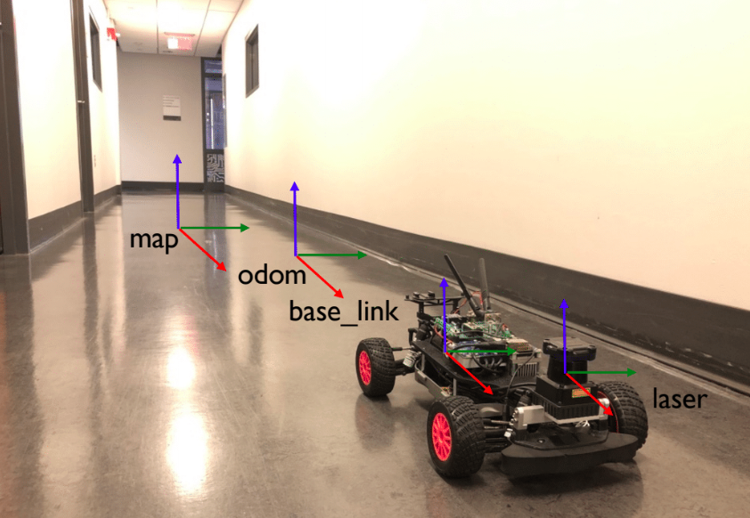
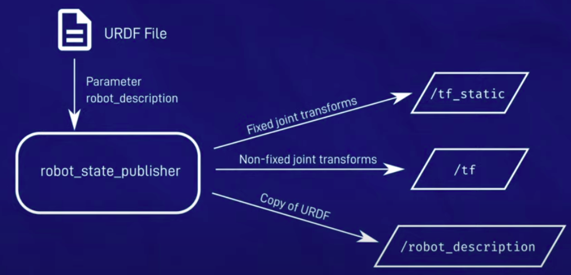

# Transformation_And_Frames(TF)

## 1. Coordinate frame and transformation

#### 1.1. coordinate frame

- A coordinate frame is a reference system that defines how spatial locations are measured. It consists of a set of axes (e.g., x, y, z) that intersect at an origin point.
- Each frame has its own origin and orientation.
- In the robot ,its different parts, sensors, and environments can have their own coordinate frames.

#### 1.2. Transoformation

- A transformation is a mathematical operation that converts coordinates from one frame to another. Transformations include translations (moving along axes), rotations (rotating around axes), and sometimes scaling. In robotics, transformations are used to relate the positions and orientations of different frames to one another.

- Example :
  - To Transform object's location from camera frame to the world frame

## 2. Why do needed frame transformation in AMR

There are multiple reasons for example :

- To etermine the robot's position within a global map
- To assign the relations between static robot components in terms of translation and rotation
- To transform objects' poses from camera to the world
- To transform enviroment points from lidar prespective into the world
- ..

### Multiple Frames in robot

as mentioned  there are multiple frames in the robot and the environment and they are common and important :

#### **Reference Frames**

**1. Map:**
it's  fixed frame representing the global map of the environment.

**2. World :**

Similar to the map frame but may include more global context.

#### **Other Common Frames in the robot**

**1. Base Link**

- The frame attached to the robot's base. It serves as the primary reference for the robot's body
- it moves with the robot sure

**2. Laser(Lidar)**

- it's attached to the laser sensor, used to convert laser readings is taken into it relevant frames

**3. camer frame**

- Attached to the camera sensor, used to convert image data to the robot's base frame or other relevant frames.

**4. Odom**

- frame that represents the robot's position based on its wheel encoders or other motion sensors.
- Fixed relative to the map, origin is wherethe robot starte

## 3. Rigid Body Transformation in 2D

- Rigid body transformation in 2D involves changing the position and orientation of a shape or object while preserving its size and shape. This typically includes translation (shifting position) and rotation (changing orientation).

- Rotation and Transformation Matrix
- Transform A point Example

### 3.1. Transformation in 3D

- Simple Rotation Example for frame in 3d

## 4. TF in ROS

- concept

- package nodes

### 4.1. TF tools in ROS

1. echo
2. View Frames
3. publish static tf on terminal

# Robot State Publisher

The Robot State Publisher in ROS 1 is a crucial component that plays a significant role in robot modeling and visualization.

### Purpose and Functionality:

* The robot_state_publisher allows you to broadcast the state of a robot to the tf transform library.
* It internally maintains a kinematic model of the robot, which includes information about its links, joints, and transformations.
* Given the joint positions of the robot (obtained from the joint_states topic), the robot_state_publisher computes and broadcasts the 3D pose of each link in the robot.

### How It Works:

* At startup, the robot_state_publisher is provided with a URDF (Unified Robot Description Format) model of the robot. This URDF describes the robot’s structure, including its links, joints, and transformations.
* It subscribes to the joint_states topic (of type sensor_msgs/JointState) to receive information about the robot’s joint positions.
* Using the joint positions, it calculates the forward kinematics of the robot, determining the 3D poses of each link.
* These calculated poses are then published via the tf system, making them available to other components in the ROS system.

### Key Features and Usage:

* The robot_state_publisher can be used both as a library (for custom applications) and as a ROS node.
* It’s commonly employed for visualization in tools like RViz, where it helps display the robot’s pose accurately.
* The package is well-tested and considered stable, with no major changes planned in the near future.

### Parameters and Topics:

* `robot_description`: Specifies the URDF XML robot description.
* `tf_prefix`: Sets the tf prefix for namespace-aware publishing of transforms.
* `publish_frequency`: Controls the frequency of state publishing (default: 50Hz).
* `ignore_timestamp`: If true, ignores the publish frequency and timestamp of joint_states, publishing a tf for each received joint_states (default: “false”).
* `use_tf_static`: Determines whether to use tf_static (used for static transforms).

*Note:All fixed transforms are future-dated by 0.5 seconds to ensure consistency.*

# Joint_State_Publisher

The joint_state_publisher in ROS 1 is a valuable tool for managing joint states within a robot model.

### Overview:

* The joint_state_publisher is a ROS package that publishes sensor_msgs/JointState messages for a robot described using the URDF (Unified Robot Description Format).
* Its primary responsibility is to continually publish values for all movable joints in the URDF to the /joint_states topic.

### How It Works:

* The package reads the robot_description parameter from the parameter server.
* It identifies all non-fixed joints in the robot model.
* For each of these joints, it constructs a JointState message containing the joint’s position, velocity, and effort (if available).
* These messages are then published to the /joint_states topic.

### Data Input Sources:

 The joint_state_publisher can obtain joint state values from various sources:

* GUI: The GUI functionality (now in a separate package called joint_state_publisher_gui) allows manual input of joint positions via sliders.
* Subscribed JointState Messages: It subscribes to JointState messages from other nodes.
* Default Values: If no other sources provide a value, it falls back to default values.

### Usage Scenarios:

* Visualization: When combined with the robot_state_publisher, it helps visualize the robot’s pose accurately in tools like RViz.
* Simulation and Testing: Useful for simulating robot behavior or testing controllers without actual hardware.
* Multiple Publishers: When you have multiple publishers of JointState messages, the joint_state_publisher ensures a coherent view across all joint state topics 12.

# Acnolegment

1. http://wiki.ros.org/tf/Overview/Transformations
2. The ROS Transform System (TF): https://www.youtube.com/watch?v=QyvHhY4Y_Y8
