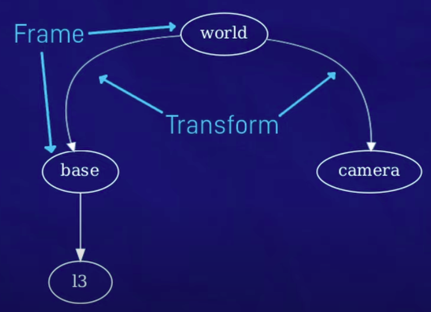
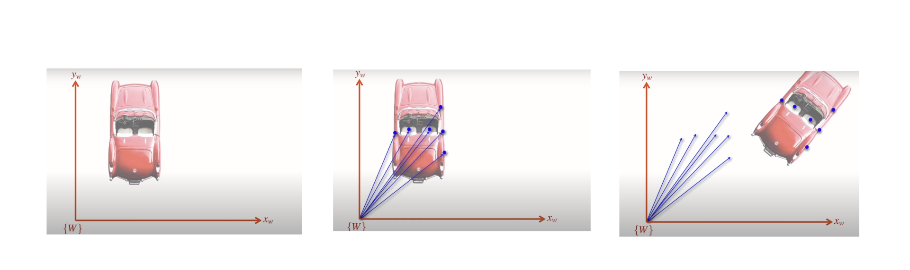

# Transformation_And_Frames(TF)

## 1. Coordinate frame and transformation

#### 1.1. coordinate frame

- A coordinate frame is a reference system that defines how spatial locations are measured. It consists of a set of axes (e.g., x, y, z) that intersect at an origin point.
- Each frame has its own origin and orientation.
- In the robot ,its different parts, sensors, and environments can have their own coordinate frames.

#### 1.2. Transoformation

- A transformation is a mathematical operation that converts coordinates from one frame to another. Transformations include translations (moving along axes), rotations (rotating around axes), and sometimes scaling. In robotics, transformations are used to relate the positions and orientations of different frames to one another.

- Example :
  - To Transform object's location from camera frame to the world frame

## 2. Why do needed frame transformation in AMR

There are multiple reasons for example :

- To etermine the robot's position within a global map
- To assign the relations between static robot components in terms of translation and rotation
- To transform objects' poses from camera to the world
- To transform enviroment points from lidar prespective into the world
- ..

### Multiple Frames in robot

as mentioned  there are multiple frames in the robot and the environment and they are common and important :

#### **Reference Frames**

**1. Map:**
it's  fixed frame representing the global map of the environment.

**2. World :**

Similar to the map frame but may include more global context.

#### **Other Common Frames in the robot**

**1. Base Link**

- The frame attached to the robot's base. It serves as the primary reference for the robot's body
- it moves with the robot sure

**2. Laser(Lidar)**

- it's attached to the laser sensor, used to convert laser readings is taken into it relevant frames

**3. camer frame**

- Attached to the camera sensor, used to convert image data to the robot's base frame or other relevant frames.

**4. Odom**

- frame that represents the robot's position based on its wheel encoders or other motion sensors.
- Fixed relative to the map, origin is wherethe robot starte

## 3. Rigid Body Transformation in 2D

- Rigid body transformation in 2D involves changing the position and orientation of a shape or object while preserving its size and shape. This typically includes translation (shifting position) and rotation (changing orientation).

### 3.1. Translation

Just shifting with the same orientation , if the robot origin was in posion A and move to position B

so the robot new position with respect to the world will be it's tf from position A WRT World plus the shift between old and new position

### 3.2. Rotation:

if we have a point in a frame A so it's position WRT frame A will be as following

**What if frame A rotated with angle theta ?**
Let's Calculate this step by step :

1. We agreed that tf of the point in B will equal it's projection in B frame in x and y --> (1)

2. let's expand the vector(projection ) X^B and Y^B

3. so by comensation in (1) we will get the tf of the point in the frame B

### 3.3. Transformation ( Rotation and Translation ):

- the frame B is both translated and oriented

Let's Calculate this step by step :

1. Make the rotation calculation at first , let's say we have a frame V that represents the orientation of B to be parallel to A

2. So the tf of the point p in the frame A will be represented by the vector Ap which is the summition of Atv + Vp

3. Let's Expand and compenste

 So this is the final Transformation matrix to transform a point from a frame into another

### 3.4. Practical Example:

Let’s look at the the reference frames 1 and 0 shown in the above figure, where point {p} = (2,2) in reference frame 1.

And reference frame 1 is rotated 45 degrees from and located at (3, 2) in reference frame 0. 

To Calculate for this translation and rotation a new matrix will be created that includes both rotation and translation

This solusion says he coordinates of {p} in reference frame 0 is represented by the first two elements of the resulting vector {p} = (3, 4.8285).

## 4. TF in ROS

- concept
- package nodes

### 4.1. TF tools in ROS

1. echo
2. View Frames
3. publish static tf on terminal

# Acnolegment

1. http://wiki.ros.org/tf/Overview/Transformations
2. The ROS Transform System (TF): https://www.youtube.com/watch?v=QyvHhY4Y_Y8
3. https://robotacademy.net.au/masterclass/2d-geometry/
4. https://studywolf.wordpress.com/2013/08/21/robot-control-forward-transformation-matrices/
