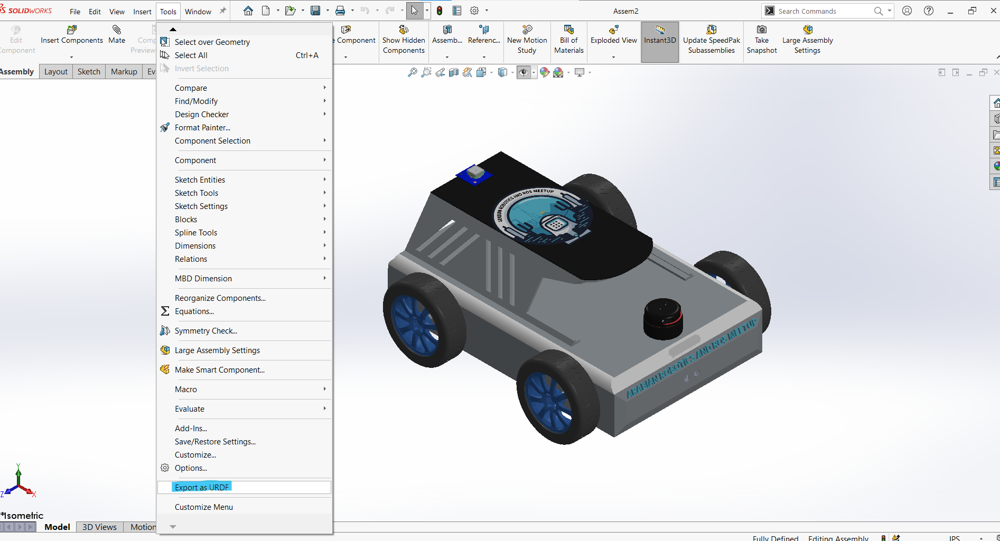

# **Guide: Exporting SolidWorks Design as URDF for ROS**

## **Step 1: Install the SolidWorks to URDF Exporter Plugin**

To export your SolidWorks model as a URDF file for use in ROS, you need to install the appropriate URDF Exporter Plugin. Follow these steps to install the correct plugin based on your version of SolidWorks.

#### **Identify Your SolidWorks Version:**

* Check your version of SolidWorks (2019, 2020, 2021, or later). The URDF Exporter has different releases based on your version, so it's important to select the correct one.

#### **Download the Correct URDF Exporter Plugin:**

* **For SolidWorks 2021 and Higher Versions (2022 and later):**
  * Download version [1.6.1 of the URDF Exporter](https://github.com/ros/solidworks_urdf_exporter/releases/tag/1.6.1).
  * This version is compatible with **SolidWorks 2021** and can be used with higher versions of SolidWorks as well (e.g., 2022).
* **For SolidWorks 2020:**
  * Download version [1.6.0 of the URDF Exporter](https://github.com/ros/solidworks_urdf_exporter/releases/tag/1.6.0).
* **For SolidWorks 2019 (on 2018 SP 5):**
  * Download version [1.5.1 of the URDF Exporter](https://github.com/ros/solidworks_urdf_exporter/releases/tag/1.5.1).

#### **Run the Installer:**

* After downloading the correct version, extract the files and locate the `setup.exe` installer.
* Right-click on the installer and select  **Run as administrator** .
* Follow the on-screen prompts to complete the installation

#### **Enable the Plugin in SolidWorks:**

* Launch  **SolidWorks** .
* Navigate to **Tools** >  **Add-ins** .
* In the Add-ins menu, find the **URDF Exporter Plugin** and enable it by checking both **Active Add-ins** and  **Start-Up** .

#### **Verify Installation:**

* Once activated, you should see a new tab labeled **URDF Exporter** in the SolidWorks toolbar.
* If the tab is visible, the plugin is installed and ready for us

## **Step 2: Create Coordinate Systems for URDF Export**

Creating accurate coordinate systems for each part of your robot is critical for proper URDF export. The coordinate systems should follow the **standard ROS and Gazebo conventions** to ensure correct transformations and behavior in simulation environments. Below, we outline how to create coordinate systems with correct alignment for use in Gazebo and ROS.

---

### **How Coordinate Systems Should Be Aligned for Gazebo and ROS:**

In ROS and Gazebo, the standard convention for coordinate systems is as follows:

* **X-axis** : Points **forward** (the robot's forward direction, or "front").
* **Y-axis** : Points **to the left** of the robot.
* **Z-axis** : Points **upward** (towards the sky).

### **Steps to Create and Align Coordinate Systems:**

#### **Base Link Coordinate System (Center of Mass):**

* **Location** : The base link’s coordinate system should be placed at the **center of mass (CoM)** of the robot.
* **Axis Alignment** :
* **X-axis** : Forward direction of the robot.
* **Y-axis** : Right side of the robot.
* **Z-axis** : Upward (pointing to the top of the robot).
* **How to Create in SolidWorks** :

1. Open the base link part and use the **Mass Properties** tool in the **Evaluate** tab to locate the CoM.

    

    2. Go to**Reference Geometry** >  **Coordinate System**		

  

3. Select the CoM as the origin.

   

   Ensure the axes are aligned as described above (X-forward, Z-up,Y-Left).

#### **Steps to Create the Wheel's Coordinate System**

**1. Create a Point at the Wheel’s Center:**

* Open the **wheel part** in SolidWorks.
* Navigate to the**Reference Geometry** > **Poin**t tab to create a reference **point** at the wheel’s center. This point will serve as the origin for the wheel’s coordinate system.

**2. Create the Coordinate System Using the Center Point:**

Once the point is defined, you can create the coordinate system aligned with the wheel’s intended motion.

* Go to the **Reference Geometry** tab and select  **Coordinate System** .
* Set the origin of the coordinate system to the **center point** you just created.

#### **Define Rotation Axes for Components**

1. **Wheel Rotation Axis**

   * **Importance** : Ensures proper wheel rotation.
   * **Steps** :

   1. **Hide the Wheel Part** :
      * To better visualize the rotation axis, temporarily hide the wheel part.
   2. **Create Reference Axis** :
      * Go to **Reference Geometry** >  **Axis** .
      * Choose the option to create an axis through the center of the wheel’s shaft.
      * Ensure this axis is aligned with the wheel’s rotational axis.
   3. **Align the Axis with the Y-Axis** :
      * Verify that the newly created reference axis is aligned with the **Y-axis** of the coordinate system.
      * Ensure that the axis runs along the wheels axle, so the wheel rotates correctly around this axis.

   

   

    

#### **Steps to Create Coordinate Systems for Sensors**

Sensors are essential components of a robot for perception and navigation, and it’s crucial to properly define their coordinate systems. Proper sensor alignment ensures that sensor data (such as camera or LiDAR scans) is correctly oriented in ROS and Gazebo simulations. In this step, you’ll learn how to create coordinate systems for sensors, such as cameras or LiDAR, ensuring they follow the correct conventions.

##### **Why Sensor Coordinate Systems Are Important:**

* Sensors provide data to the robot, and the accuracy of this data depends on the correct orientation of the sensor in the robot's frame.
* The sensor’s coordinate system defines where the sensor is mounted and how its data (e.g., camera images or laser scans) will be interpreted by ROS.
* Properly aligned coordinate systems are crucial for tasks like mapping, localization, and object detection.

#### **Create the LiDARs Coordinate System** :

1. **Create a Point at the LiDAR’s Aperture** :

* The **aperture** is where the LiDAR beam originates. You will need to create a **reference point** at this location, which will serve as the origin for the LiDAR’s coordinate system.

  **Steps** :

  1. Use the **Reference Geometry** > **Poin**t tab to create a reference **point** at the LiDAR’s aperture (typically the center of the scanning plane or the origin of the emitted beams).
  2. Make sure the point is placed at the exact center of the LiDAR’s scanning area, as this will be the reference for the LiDAR’s coordinate system.

  

 **Create the Coordinate System Using the LiDAR's Aperture** :

* After creating the point, you can now define the coordinate system using the aperture as the origin.Go to **Reference Geometry** >  **Coordinate System** .

  then ,Set the **origin** to the point you just created at the LiDAR's aperture

  

  

### **Step 3: Export the Design to URDF**

After setting up all coordinate systems and rotation axes, follow these steps to export your SolidWorks model as a URDF file for integration with ROS and Gazebo

#####  **Open the URDF Exporter** :

* In SolidWorks, go to the **tools** tab.
* Locate the **URDF Exporter** extension

##### **Starting with Base Link**

* **Choose the Coordinate System** : Start by selecting the coordinate system you created for the base link.
* **Set Up the Base Link**
* **Add Child Links**

##### **Add Wheel Links**

* For each wheel, choose the coordinate system you created at the wheel’s axle.
* Add the wheels as child links to the base link.
* Ensure each wheel is properly positioned and oriented according to its coordinate system and rotation axis

##### **Add Sensor Links**

* **Choose the Coordinate System**
* **Specify Joint Type** :Use a fixed joint for the sensor links.

### **Export the Complete URDF**

**Preview and Export** 

Click the **Preview and Export** button in the URDF Exporter to review the generated URDF file.

* Ensure everything appears as expected in the preview.
* If satisfied, click the **Export** button to generate the final URDF file.

####   **Save Your Files** :

 Choose a location to save your exported URDF file, along with any associated files (e.g., meshes, textures).

The export process will create a folder containing the URDF file, meshes, and any launch files.
