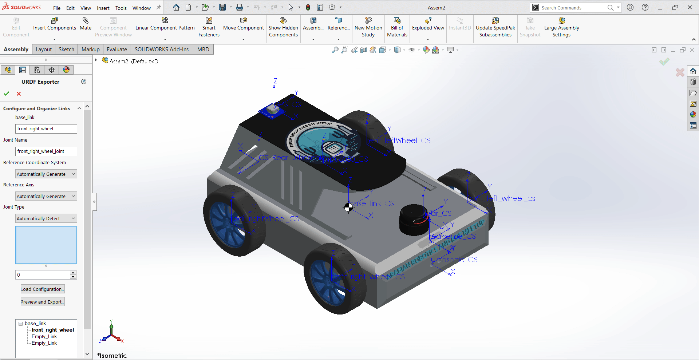

# **Guide: Exporting SolidWorks Design as URDF for ROS**

## **Step 1: Install the SolidWorks to URDF Exporter Plugin**

To export your SolidWorks model as a URDF file for use in ROS, you need to install the appropriate URDF Exporter Plugin. Follow these steps to install the correct plugin based on your version of SolidWorks.

#### **Identify Your SolidWorks Version:**

* Check your version of SolidWorks (2019, 2020, 2021, or later). The URDF Exporter has different releases based on your version, so it's important to select the correct one.

#### **Download the Correct URDF Exporter Plugin:**

* **For SolidWorks 2021 and Higher Versions (2022 and later):**
  * Download version [1.6.1 of the URDF Exporter](https://github.com/ros/solidworks_urdf_exporter/releases/tag/1.6.1).
  * This version is compatible with **SolidWorks 2021** and can be used with higher versions of SolidWorks as well (e.g., 2022).
* **For SolidWorks 2020:**
  * Download version [1.6.0 of the URDF Exporter](https://github.com/ros/solidworks_urdf_exporter/releases/tag/1.6.0).
* **For SolidWorks 2019 (on 2018 SP 5):**
  * Download version [1.5.1 of the URDF Exporter](https://github.com/ros/solidworks_urdf_exporter/releases/tag/1.5.1).

#### **Run the Installer:**

* After downloading the correct version, extract the files and locate the `setup.exe` installer.
* Right-click on the installer and select  **Run as administrator** .
* Follow the on-screen prompts to complete the installation

#### **Enable the Plugin in SolidWorks:**

* Launch  **SolidWorks** .
* Navigate to **Tools** >  **Add-ins** .
* In the Add-ins menu, find the **URDF Exporter Plugin** and enable it by checking both **Active Add-ins** and  **Start-Up** .

#### **Verify Installation:**

* Once activated, you should see a new tab labeled **URDF Exporter** in the SolidWorks toolbar.
* If the tab is visible, the plugin is installed and ready for us

## **Step 2: Create Coordinate Systems for URDF Export**

Creating accurate coordinate systems for each part of your robot is critical for proper URDF export. The coordinate systems should follow the **standard ROS conventions** as defined in  **REP 103** , ensuring correct transformations and behavior in simulation environments like RViz and Gazebo.

### **REP 103: Standard Units and Coordinate Conventions**

According to  [REP 103](https://www.ros.org/reps/rep-0103.html)**:** Standard Units of Measure and Coordinate Conventions, the standard coordinate frame conventions in ROS are:

* **Define the origin** : Establish a reference point at the center of the part.
* **Align axes per REP 103** :

  * **X-axis** : Points **forward** (the robot's forward direction, or "front").
  * **Y-axis** : Points **to the right** of the robot.
  * **Z-axis** : Points **upward** (towards the sky).
* **Test in simulation** : Load your URDF model in RViz or Gazebo to verify that the transformations and orientations are correct according to REP 103.

### **Steps to Create and Align Coordinate Systems:**

### **To Create Base Link Coordinate System (Center of Mass)**

#### 1. Open **Reference Geometry** > **Center of Mass** to locate the CoM.

* Start by selecting the **Center of Mass (COM)** of the base link as the origin point for the coordinate system. This ensures that the coordinate system is centered at the most balanced point of the robot base.

### **2- Create **Coordinate System****

Navigate to the **Reference Geometry** tool and select  **Coordinate System** . This tool will allow us to define a new coordinate system at the base link.

#### **Set Axis Alignment** :

Now, we need to ensure that the axes of the coordinate system follow the  **ROS conventions** . For this:

* **Z-axis** should point  **upwards** . Click on the upper surface of the base link or any part of the robot that faces upward to ensure that the **Z-axis** points in the correct direction.
* **X-axis** should point  **forward** . Click on the front surface of the base link to align the **X-axis** in the forward direction (robot’s forward movement direction).
* **Y-axis** should point  **to the left** . The Y-axis should automatically adjust to be perpendicular to the X and Z axes, pointing left.

#### **Verify the Coordinate System** :

After assigning the axes, make sure to **review the coordinate system** visually. You should see:

* The **Z-axis** pointing **upwards** (toward the sky or top of the robot).
* The **X-axis** pointing **forward** (robot’s movement direction).
* The **Y-axis** pointing  **to the left** .

### **Steps to Create the Wheel's Coordinate System**

#### **1. Create a Point at the Wheel’s Center:**

* Navigate to the **Reference Geometry** > **Point** tab to create a reference **point** at the wheel’s center. This point will serve as the origin for the wheel’s coordinate system.

#### **2. Create the Coordinate System Using the Center Point:**

Once the point is defined, you can create the coordinate system aligned with the wheel’s intended motion.

* Go to the **Reference Geometry** tab and select  **Coordinate System** .
* Set the origin of the coordinate system to the **center point** you just created.

#### **Set Axis Alignment** :

Now, we need to ensure that the axes of the coordinate system follow the  **ROS conventions** . For this:

* **Z-axis** should point  **upwards** . Click on the upper surface of the base link or any part of the robot that faces upward to ensure that the **Z-axis** points in the correct direction.
* **X-axis** should point  **forward** . Click on the front surface of the base link to align the **X-axis** in the forward direction (robot’s forward movement direction).
* **Y-axis** should point  **to the left** . This axis is critical because it serves as the **axis of rotation** for the robot’s yaw. The Y-axis will automatically adjust to be perpendicular to the X and Z axes, ensuring that it points to the left of the robot and supports proper rotational behavior in simulation.

## **Setting the Axis of Rotation for Wheels**

In this step, we will create the **axis of rotation** for the robot. The Y-axis in ROS conventions represents the axis about which yaw (rotation around the vertical axis) occurs. Here’s how you can set the axis of rotation:

### **Steps to Create the Axis of Rotation**

#### **1-Hide Wheel Components** :

* Start by **hiding the wheels** of the robot in the CAD model to allow better visibility of the base link and the coordinate system. This will make it easier to define the rotation axis without interference from other parts.

#### **2-Use Reference Geometry** :

* Navigate to the **Reference Geometry** tool and choose  **Axis** . This tool allows you to define an axis for rotation based on the geometry of your robot's base link.

#### **3-Select the Axle of the Wheel for Rotation:**

In this step, rather than selecting just the Y-axis of the robot's base link, you will **select the axle of the wheel** to define the **axis of rotation** for the wheel. This axle serves as the axis around which the wheel will rotate.

* select the cylindrical surface of the axle or the circular edge of the wheel’s mounting point. This ensures that the  axis of rotation aligns correctly with the actual wheel's movement .
* The axis should point along the Y-axis of the wheel as this is the direction the wheel will rotate around.

### **Steps to Create Coordinate Systems for Sensors**

Sensors are essential components of a robot for perception and navigation, and it’s crucial to properly define their coordinate systems. Proper sensor alignment ensures that sensor data (such as camera or LiDAR scans) is correctly oriented in ROS and Gazebo simulations. In this step, you’ll learn how to create coordinate systems for sensors, such as cameras or LiDAR, ensuring they follow the correct conventions.

##### **Why Sensor Coordinate Systems Are Important:**

* Sensors provide data to the robot, and the accuracy of this data depends on the correct orientation of the sensor in the robot's frame.
* The sensor’s coordinate system defines where the sensor is mounted and how its data (e.g., camera images or laser scans) will be interpreted by ROS.
* Properly aligned coordinate systems are crucial for tasks like mapping, localization, and object detection.

#### **Create the LiDARs Coordinate System** :

##### **Create a Point at the LiDAR’s Aperture** :

The **aperture** is where the LiDAR beam originates. You will need to create a **reference point** at this location, which will serve as the origin for the LiDAR’s coordinate system.

#### **Steps** :

* Use the **Reference Geometry** > **Poin**t tab to create a reference **point** at the LiDAR’s aperture (typically the center of the scanning plane or the origin of the emitted beams).
* Make sure the point is placed at the exact center of the LiDAR’s scanning area, as this will be the reference for the LiDAR’s coordinate system.

#### **Create the Coordinate System Using the LiDAR's Aperture** :

After creating the point, you can now define the coordinate system using the aperture as the origin.Go to **Reference Geometry** >  **Coordinate System** .

then ,Set the **origin** to the point you just created at the LiDAR's aperture

### **Step 3: Export the Design to URDF**

After setting up all coordinate systems and rotation axes, follow these steps to export your SolidWorks model as a URDF file for integration with ROS and Gazebo

##### **Open the URDF Exporter** :

* In SolidWorks, go to the **tools** tab.
* Locate the **URDF Exporter** extension

##### **Starting with Base Link**

* **Choose the Coordinate System** : Start by selecting the coordinate system you created for the base link.
* **Set Up the Base Link**
* **Add Child Links**

##### **Add Wheel Links**

* For each wheel, choose the coordinate system you created at the wheel’s axle.
* Add the wheels as child links to the base link.
* Ensure each wheel is properly positioned and oriented according to its coordinate system and rotation axis

##### **Add Sensor Links**

* **Choose the Coordinate System**
* **Specify Joint Type** :Use a fixed joint for the sensor links.

### **Export the Complete URDF**

**Preview and Export**

Click the **Preview and Export** button in the URDF Exporter to review the generated URDF file.

* Ensure everything appears as expected in the preview.
* If satisfied, click the **Preview and** **Export** button to generate the final URDF file.

#### **Save Your Files** :

 Choose a location to save your exported URDF file, along with any associated files (e.g., meshes, textures).

The export process will create a folder containing the URDF file, meshes, and any launch files.
