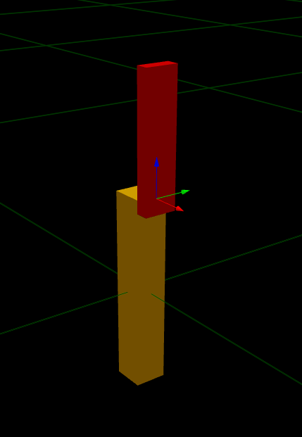
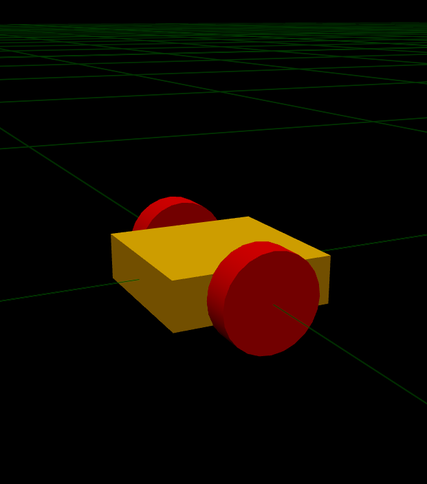
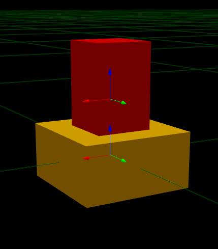

## Joints

Joints serve to connect two links in a robot and describes the kinematics and dynamics of them. The first link is designated as the `<parent>`, and the second link becomes the `<child>`. There are four types of joints:  **Fixed** ,  **Revolute** ,  **Continuous** , and  **Prismatic** . Each type defines how the `<parent>` link is related to the `<child>` link. in URDF file the joint can be writen as shown:

```xml

<joint name="joint_name" type="joint_type">
    <origin xyz="0.0 0.0 0.0" rpy="0.0 0.0 0.0"/>
    <parent link="parent_link"/>
    <child link="child_link"/>
    <axis xyz="0.0 0.0 0.0"/>
    <limit lower="0.0" upper="0.0" effort="0.0" velocity="0.0"/>
</joint>
```

### Fixed

This is not really a joint because it cannot move. All degrees of freedom are locked.

```xml
<joint name="joint_name" type="fixed">
    <origin xyz="0.0 0.0 0.0" rpy="0.0 0.0 0.0"/>
    <parent link="parent_link"/>
    <child link="child_link"/>
    <axis xyz="0.0 0.0 0.0"/>
</joint>
```

**Example:**

If a robot base link is a parent link and a child link for a box which can represent a camera a fixed joint is needed to fix the box on the robot base and lock its movement. So, we can take the base link code and the camera link from the links example above and add a joint as shown in the below code.

```xml
<?xml version="1.0"?>
<robot name="my_robot">
  <!-- Base link (box) -->
  <link name="base_link">
    <visual>
      <geometry>
        <box size="0.2 0.2 0.06"/>
      </geometry>
      <material name="">
        <color rgba="1.0 0.70 0.0 1.0"/>
        <texture filename=""/>
      </material>
    </visual>
    <collision>
      <geometry>
        <box size="0.2 0.2 0.06"/>
      </geometry>
    </collision>
    <inertial>
      <mass value="1.0"/>
      <origin xyz="0 0 0" rpy="0 0 0"/>
      <inertia ixx="0.01" ixy="0" ixz="0" iyy="0.01" iyz="0" izz="0.01"/>
    </inertial>
  </link>

  <link name="camera_link">
    <visual>
      <geometry>
        <box size="0.02 0.05 0.02"/>
      </geometry>
      <material name="">
        <color rgba="1.0 0.0 0.0 1.0"/>
        <texture filename=""/>
      </material>
    </visual>
    <collision>
      <geometry>
        <box size="0.02 0.05 0.02"/>
      </geometry>
    </collision>
    <inertial>
      <mass value="0.02"/>
      <origin xyz="0 0 0" rpy="0 0 0"/>
      <inertia ixx="1.67e-6" ixy="0" ixz="0" iyy="1.67e-6" iyz="0" izz="1.67e-6"/>
    </inertial>
  </link>

  <joint name="camera_joint" type="fixed">
    <parent link="base_link"/>
    <child link="camera_link"/>
    <origin xyz="0.11 0.0 0.0" rpy="0.0 0.0 0.0"/>
  </joint>


</robot>

```


### Revolute

It is a hinge joint that rotates along the axis and has a limited range specified by the upper and lower limits.

```xml
<joint name="joint_name" type="revolute">
    <origin xyz="0.0 0.0 0.0" rpy="0.0 0.0 0.0"/>
    <parent link="parent_link"/>
    <child link="child_link"/>
    <axis xyz="0.0 0.0 0.0"/>
    <limit lower="0.0" upper="0.0" effort="0.0" velocity="0.0"/>
</joint>

```

**Example:**

If a robot base link is the parent link and a robot arm is the child link in which the robot arm wanted to revolute around an axis with limits. So, as shown in the below figure the joint between the base link and the revoluting link is revolute joint in which the link revoluting link is needed to revolute around an axis with limits in angles and velocity.

```xml
<?xml version="1.0"?>
<robot name="my_robot">
  <!-- Base link (box) -->
  <link name="base_link">
    <visual>
      <origin xyz="0.0 0.0 0.0" rpy="0.0 0.0 0.0"/>
      <geometry>
        <box size="0.05 0.05 0.3"/>
      </geometry>
      <material name="">
        <color rgba="1.0 0.70 0.0 1.0"/>
        <texture filename=""/>
      </material>
    </visual>
    <collision>
      <origin xyz="0.0 0.0 0.0" rpy="0.0 0.0 0.0"/>
      <geometry>
        <box size="0.05 0.05 0.3"/>
      </geometry>
    </collision>
    <inertial>
      <mass value="1.0"/>
      <origin xyz="0 0 0" rpy="0 0 0"/>
      <inertia ixx="0.0079167" ixy="0" ixz="0" iyy="0.0079167" iyz="0" izz="0.0004167"/>
    </inertial>
  </link>

  <link name="child_link">
    <visual>
      <origin xyz="0.0 0.0 0.08" rpy="0.0 0.0 0.0"/>
      <geometry>
        <box size="0.02 0.05 0.2"/>
      </geometry>
      <material name="">
        <color rgba="1.0 0.0 0.0 1.0"/>
        <texture filename=""/>
      </material>
    </visual>
    <collision>
      <origin xyz="0.0 0.0 0.08" rpy="0.0 0.0 0.0"/>
      <geometry>
        <box size="0.02 0.05 0.2"/>
      </geometry>
    </collision>
    <inertial>
      <mass value="0.02"/>
      <origin xyz="0.0 0.0 0.08" rpy="0 0 0"/>
      <inertia ixx="5.6333e-5" ixy="0" ixz="0" iyy="6.8000e-5" iyz="0" izz="3.3333e-6"/>
    </inertial>
  </link>

  <joint name="camera_joint" type="revolute">
    <parent link="base_link"/>
    <child link="child_link"/>
    <origin xyz="0.035 0.0 0.15" rpy="0.0 0.0 0.0"/>
    <axis xyz="1 0.0 0.0"/>
    <limit lower="-0.523599" upper="0.523599" effort="0.0" velocity="0.0"/>  
  </joint>

  
</robot>
```



### Continous

This is a continuous hinge joint that rotates around the axis and has no upper and lower limits.

```xml
<joint name="joint_name" type="continous">
    <origin xyz="0.0 0.0 0.0" rpy="0.0 0.0 0.0"/>
    <parent link="parent_link"/>
    <child link="child_link"/>
    <axis xyz="0.0 0.0 0.0"/>
</joint>
```

**Example:**

If a robot base link is the parent link and a wheel is the child link in which the wheel wanted to revolute around an axis continuous without any limits. So, as shown in the below figure the joint between the base link and the continuous revoluting link is continuous joint.

```xml
<?xml version="1.0"?>
<robot name="my_robot">
  <!-- Base link (box) -->
  <link name="base_link">
    <visual>
      <geometry>
        <box size="0.2 0.2 0.06"/>
      </geometry>
      <material name="">
        <color rgba="1.0 0.70 0.0 1.0"/>
        <texture filename=""/>
      </material>
    </visual>
    <collision>
      <geometry>
        <box size="0.2 0.2 0.06"/>
      </geometry>
    </collision>
    <inertial>
      <mass value="1.0"/>
      <origin xyz="0 0 0" rpy="0 0 0"/>
      <inertia ixx="0.01" ixy="0" ixz="0" iyy="0.01" iyz="0" izz="0.01"/>
    </inertial>
  </link>

  <!-- Wheel link (cylinder) -->

  <link name="wheel_link">
    <visual>
      <origin xyz="0.0 0.0 0.0" rpy="0.0 0.0 0.0"/>
      <geometry>
        <cylinder radius="0.06" length="0.04"/>
      </geometry>
      <material name="">
        <color rgba="1.0 0.0 0.0 1.0"/>
        <texture filename=""/>
      </material>
    </visual>
    <collision>
      <origin xyz="0.0 0.0 0.0" rpy="0.0 0.0 0.0"/>
      <geometry>   
        <box size="0.02 0.05 0.02"/>
      </geometry>
    </collision>
    <inertial>
      <mass value="0.02"/>
      <origin xyz="0 0 0" rpy="0 0 0"/>
      <inertia ixx="3.7333e-5" ixy="0" ixz="0" iyy="3.7333e-5" iyz="0" izz="3.6000e-5"/>
    </inertial>
  </link>

  <joint name="wheel_joint" type="continuous">
    <origin xyz="0.0 0.12 0.0" rpy="-1.5708 0.0 0.0"/> 
    <parent link="base_link"/>
    <child link="wheel_link"/>
    <axis xyz="0.0 0.0 1"/>
  </joint>
</robot>
```



### Prismatic

This is a sliding joint that slides along the axis, and has a limited range specified by the upper and lower limits.

```xml
<joint name="joint_name" type="prismatic">
    <origin xyz="0.0 0.0 0.0" rpy="0.0 0.0 0.0"/>
    <parent link="parent_link"/>
    <child link="child_link"/>
    <axis xyz="0.0 0.0 0.0"/>
    <limit lower="0.0" upper="0.0" effort="0.0" velocity="0.0"/>
</joint>
```

**Example:**

If a robot base link is the parent link and a linear actuator or sliding mechanism is the child link, a prismatic joint can be used to model their connection. This joint allows for linear movement of the child link along a specified axis relative to the parent link without any rotational constraints.

```xml
<?xml version="1.0"?>
<robot name="my_robot">
  <!-- Base link (box) -->
  <link name="base_link">
    <visual>
      <origin xyz="0.0 0.0 0.0" rpy="0.0 0.0 0.0"/>
      <geometry>
        <box size="0.2 0.2 0.1"/>
      </geometry>
      <material name="">
        <color rgba="1.0 0.70 0.0 1.0"/>
        <texture filename=""/>
      </material>
    </visual>
    <collision>
      <origin xyz="0.0 0.0 0.0" rpy="0.0 0.0 0.0"/>
      <geometry>
        <box size="0.2 0.2 0.1"/>
      </geometry>
    </collision>
    <inertial>
      <mass value="1.0"/>
      <origin xyz="0 0 0" rpy="0 0 0"/>
      <inertia ixx="0.005833" ixy="0" ixz="0" iyy="0.005833" iyz="0" izz="0.006667"/>
    </inertial>
  </link>

  <link name="moving_link">
    <visual>
      <origin xyz="0.0 0.0 0.0" rpy="0.0 0.0 0.0"/>
      <geometry>
        <box size="0.1 0.1 0.2"/>
      </geometry>
      <material name="">
        <color rgba="1.0 0.0 0.0 1.0"/>
        <texture filename=""/>
      </material>
    </visual>
    <collision>
      <origin xyz="0.0 0.0 0.0" rpy="0.0 0.0 0.0"/>
      <geometry>
        <box size="0.1 0.1 0.2"/>
      </geometry>
    </collision>
    <inertial>
      <mass value="0.02"/>
      <origin xyz="0 0 0" rpy="0 0 0"/>
      <inertia ixx="7.333e-5" ixy="0" ixz="0" iyy="7.333e-5" iyz="0" izz="3.333e-5"/>
    </inertial>
  </link>

  <joint name="prismatic_joint" type="prismatic">
    <parent link="base_link"/>
    <child link="moving_link"/>
    <origin xyz="0 0 0.1" rpy="0 0 0"/>
    <axis xyz="0 0 1"/>
    <limit lower="-0.2" upper="0.1" effort="0.0" velocity="0.0"/>
  </joint>
</robot>
```


