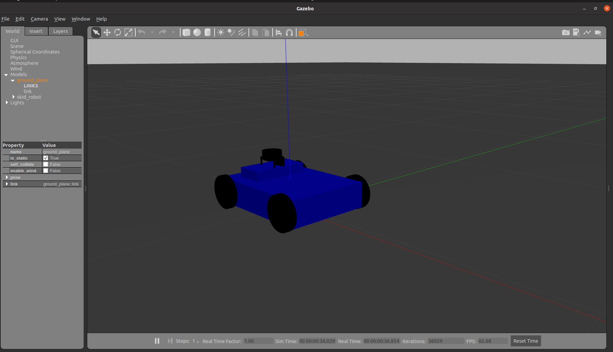
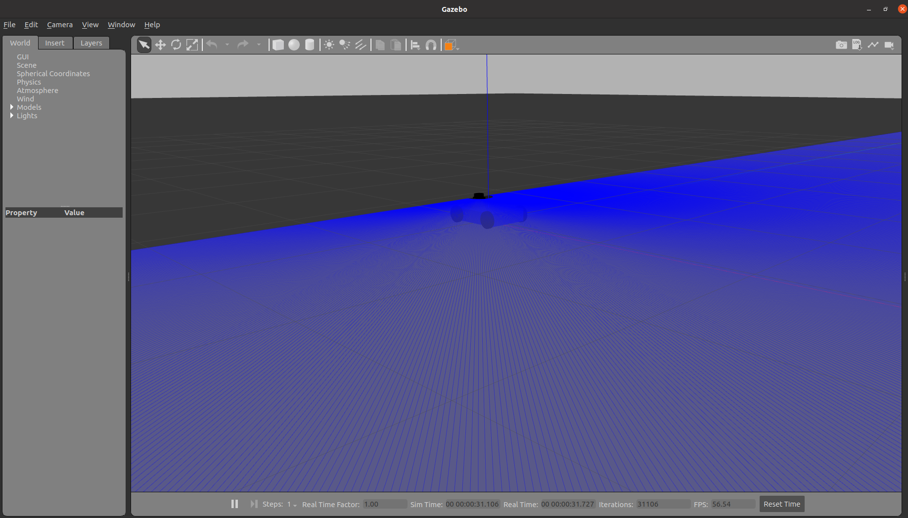
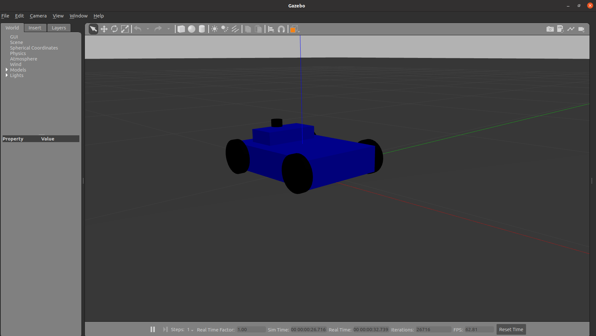
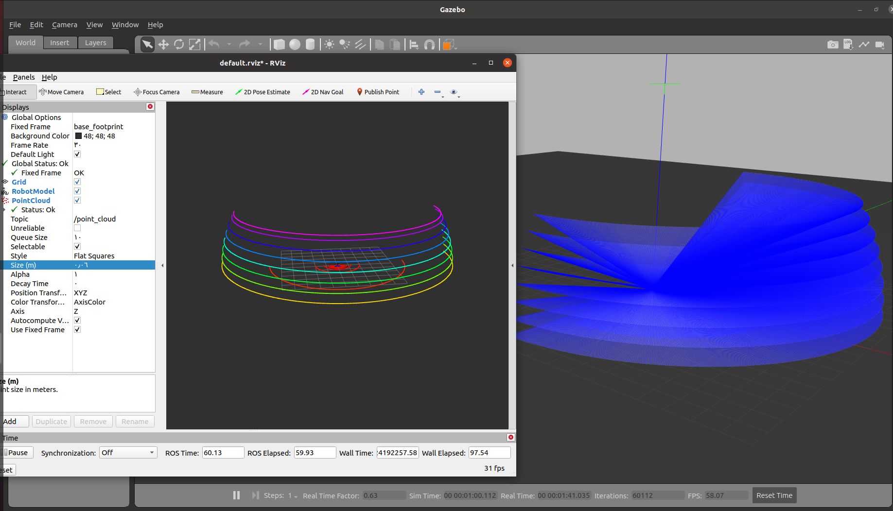
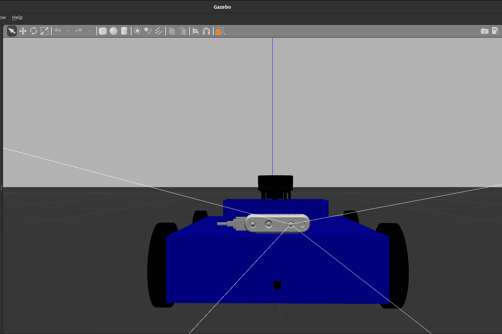
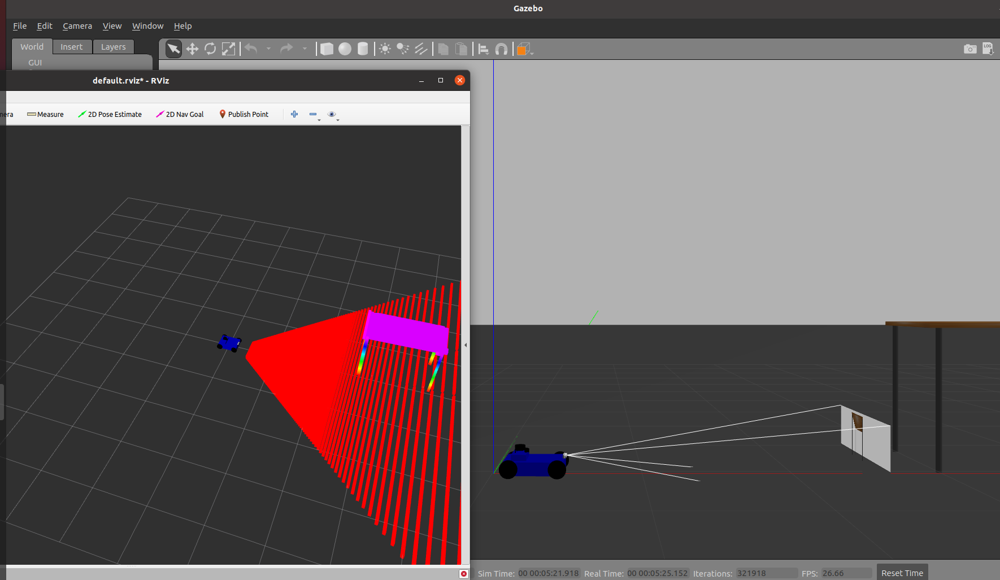
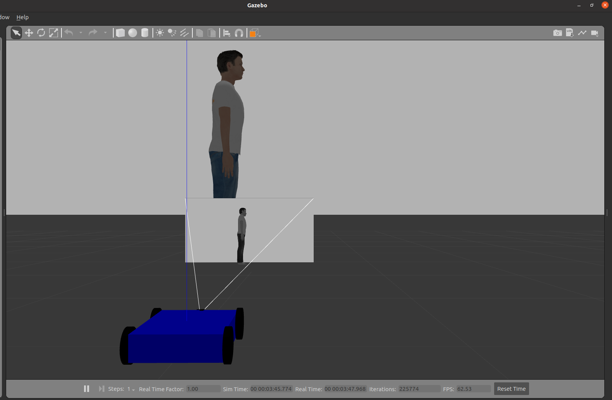
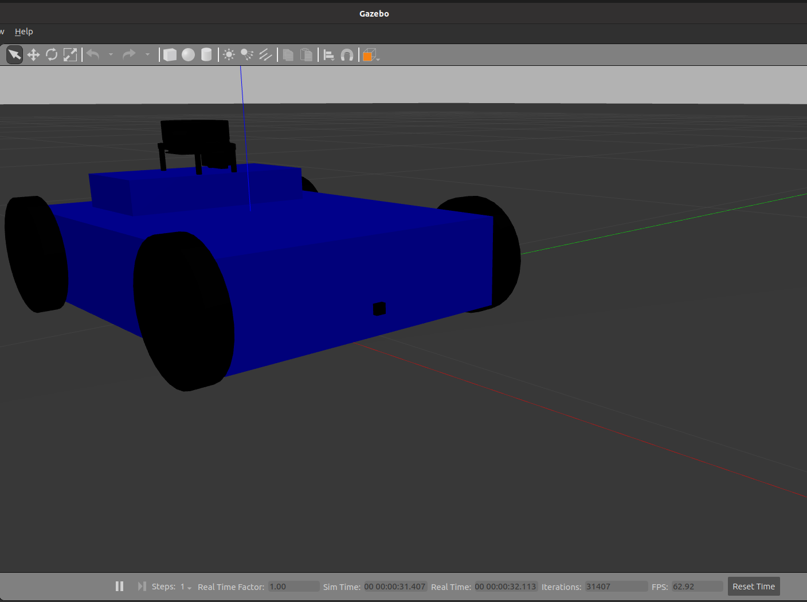
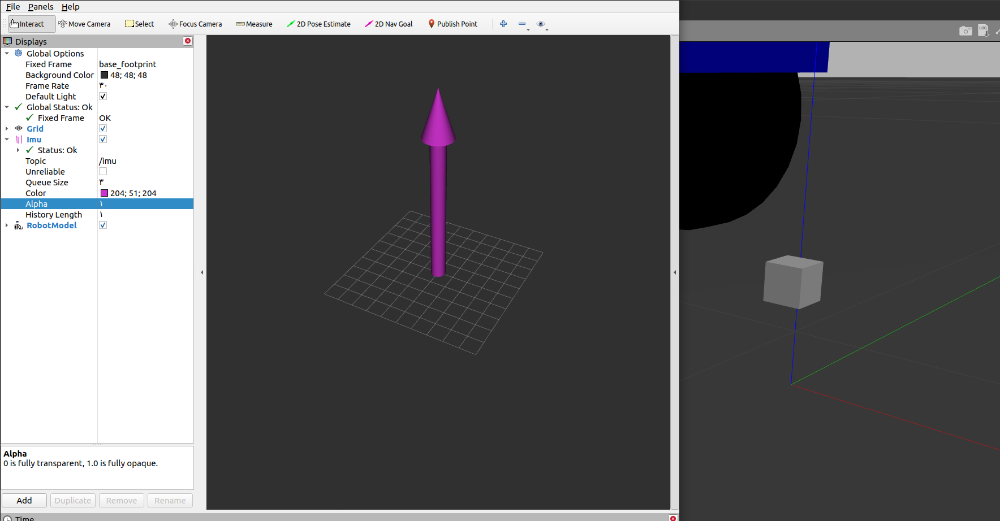

# [&lt;-- Back to main](../urdf.md)

# [&lt;-- 1- Joints ](../joints/joints.md)

###### Author: Toqa Essam

###### Review:

# Integrating Sensors and Plugins into URDF for Gazebo Simulation

# Introduction

This guide explains how to incorporate sensors and Gazebo plugins into a URDF (Unified Robot Description Format) file for use with ROS (Robot Operating System). It details the steps for adding and configuring a range of sensors—such as LIDAR, depth cameras, ultrasonic sensors, and IMUs—ensuring they work effectively within Gazebo simulations.

#### So What are Plugins?

**plugins** are software components or modules that extend the functionality of a system by adding new features or capabilities without modifying the core software. Plugins are typically designed to be easily integrated and interchangeable, allowing developers to customize or enhance specific functionalities.

**Gazebo plugins** are used to add custom behaviors, sensors, and controllers to robots in simulation. They allow users to simulate real-world scenarios, sensor data, and actuation within the Gazebo environment.

---

### Adding a LIDAR Sensor Link

we have two types of LiDAR: **2D LiDAR** and  **3D LiDAR** .

* **2D LiDAR** : This type of LiDAR scans in a single plane, either horizontal or vertical, and outputs data in the form of **LaserScan** messages. These messages represent a 2D point cloud.
* **3D LiDAR** : This LiDAR scans in multiple planes or provides full 3D coverage, generating data in **PointCloud** messages.

**In Gazebo, there are two sensor types related to ray-based sensors:**

#### **`ray` Sensor:**

* **CPU-Based:** The `ray` sensor type primarily relies on the CPU for data generation and processing. This involves calculating distances, handling scans, and simulating sensor noise.

#### **`gpu_ray` Sensor:**

* **GPU-Based:** The `gpu_ray` sensor type leverages the GPU to perform ray calculations and data generation. It efficiently handles large numbers of rays and complex computations, offering better performance than the CPU.

#### 1. 2D Lidar Link

##### URDF

```xml
     <link name="lidar_link">
      <inertial>
          <origin xyz="0.0 0.0 0.0" rpy="0.0 0.0 0.0"/>
          <mass value="0.0"/>
          <inertia ixx="1.0" ixy="0.0" ixz="0.0" iyy="1.0" iyz="0.0" izz="1.0"/>
      </inertial>
      <visual>
          <origin xyz="0.0 0.0 0.0" rpy="0.0 0.0 0"/>
          <geometry>
         <mesh filename="package://skid_steer_robot/meshes/2d_lidar.STL"/>   
            </geometry>
          <material name="">
              <color rgba="1.0 1.0 1.0 1.0"/>
              <texture filename=""/>
          </material>
      </visual>
      <collision>
          <origin xyz="0.0 0.0 0.0" rpy="0.0 0.0 0.0"/>
          <geometry>
         <mesh filename="package://skid_steer_robot/meshes/2d_lidar.STL"/>   
          </geometry>
      </collision>
  </link>

joint name="lidar_joint" type="fixed">
    <axis xyz="0 1 0" />
    <origin xyz="0 0 0.06" rpy="0 0 0"/>
    <parent link="lidar_base_link"/>
    <child link="lidar_link"/>
  </joint>

```

> `<mesh filename="package://skid_steer_robot/meshes/2d_lidar.STL"/>`: Uses a mesh file (2d_lidar.STL) from the specified package to visually represent the LIDAR. click [here](example/skid_steer_robot/meshes/2d_lidar.STL) to get the mesh file



#### Gazebo Plugin of 2D Lidar

**2D LIDAR** : Uses `sensor_msgs/LaserScan` to provide a 2D array of distances and optionally intensities.

```xml
<!-- LIDAR Sensor -->
  <gazebo reference="lidar_link">
    <!-- Define a sensor of type "ray" (commonly used for LiDAR sensors) -->
    <sensor type="ray" name="lidar_sensor">
        <!-- Set the pose of the sensor relative to the link it's attached to (x, y, z, roll, pitch, yaw) -->
        <pose>0 0 0 0 0 0</pose>
  
        <!-- Enable or disable visualization of the sensor in Gazebo -->
        <visualize>true</visualize>
  
        <!-- Set the update rate for the sensor in Hz (how often it produces data) -->
        <update_rate>40</update_rate>
  
        <!-- Define the ray properties of the sensor (LiDAR emits rays to measure distances) -->
        <ray>
            <scan>
                <horizontal>
                    <!-- Number of samples (rays) per scan -->
                    <samples>720</samples>
  
                    <!-- Resolution of the scan (typically 1 means 1 ray per angle unit) -->
                    <resolution>1</resolution>
  
                    <!-- Minimum angle of the scan (in radians, -π/2 for a 180-degree scan) -->
                    <min_angle>-1.570796</min_angle>
  
                    <!-- Maximum angle of the scan (in radians, π/2 for a 180-degree scan) -->
                    <max_angle>1.570796</max_angle>
                </horizontal>
            </scan>
  
            <range>
                <!-- Minimum range (distance) the sensor can detect -->
                <min>0.10</min>
  
                <!-- Maximum range (distance) the sensor can detect -->
                <max>30.0</max>
  
                <!-- Resolution of the distance measurements (smallest measurable distance change) -->
                <resolution>0.01</resolution>
            </range>
  
            <!-- Define noise characteristics for the sensor -->
            <noise>
                <!-- Type of noise (Gaussian noise is commonly used for sensors) -->
                <type>gaussian</type>
  
                <!-- Mean value of the noise (0.0 means no bias) -->
                <mean>0.0</mean>
  
                <!-- Standard deviation of the noise (how much variation there is) -->
                <stddev>0.01</stddev>
            </noise>
        </ray> 
        <!-- Attach a Gazebo plugin to simulate the LiDAR sensor in ROS -->
        <plugin name="gazebo_ros_head_hokuyo_controller" filename="libgazebo_ros_laser.so">
            <!-- Define the ROS topic name where the LiDAR data will be published -->
            <topicName>/scan</topicName>
  
            <!-- Specify the frame name associated with the LiDAR link (used for transformations) -->
            <frameName>lidar_link</frameName>
        </plugin>
    </sensor>
</gazebo>
```



#### 2. 3D Lidar Link

**3D LIDAR** : Uses `sensor_msgs/PointCloud` to provide a collection of 3D points .

##### URDF

```xml
 <link name="3d_lidar_link">
        <visual>
          <geometry>
            <cylinder length="0.03" radius="0.02"/>
          </geometry>
          <material name="">
            <color rgba="0.0 0.0 0.0 1.0"/> 
          </material>
        </visual>
        <collision>
          <geometry>
            <cylinder length="0.03" radius="0.01"/>
          </geometry>
        </collision>
      </link>
        <!-- Joint to connect the sensor to the robot -->
  <joint name="3d_lidar_joint" type="fixed">
    <parent link="base_link"/>
    <child link="3d_lidar_link"/>
    <origin xyz="-0.04 0 0.2" rpy="0 0 0"/>
  </joint>
```



#### Gazebo Plugin of 3D Lidar

```xml


<gazebo reference="3d_lidar_link">
    <!-- Define a sensor of type "gpu_ray" (GPU-accelerated LiDAR sensor) -->
    <sensor type="gpu_ray" name="3d_lidar_sensor">
        <!-- Set the pose of the sensor relative to the link it's attached to (x, y, z, roll, pitch, yaw) -->
        <pose>0 0 0 0 0 0</pose>
  
        <!-- Enable or disable visualization of the sensor in Gazebo -->
        <visualize>true</visualize>
  
        <update_rate>10</update_rate>

        <ray>
            <scan>
                <horizontal>
                    <!-- Number of horizontal rays per scan -->
                    <samples>720</samples>
  
                    <!-- Resolution of the scan (1 means 1 ray per angle unit) -->
                    <resolution>1</resolution>
  
                    <!-- Minimum angle of the scan (in radians, -π/2 for a 180-degree scan) -->
                    <min_angle>-1.5708</min_angle>
  
                    <!-- Maximum angle of the scan (in radians, π/2 for a 180-degree scan) -->
                    <max_angle>1.5708</max_angle>
                </horizontal>
                <vertical>
                    <!-- Number of vertical layers per scan -->
                    <samples>16</samples>
  
                    <!-- Resolution of the vertical scan (1 means 1 layer per angle unit) -->
                    <resolution>1</resolution>
  
                    <!-- Minimum angle of the vertical scan (in radians, -π/6 for a 30-degree scan) -->
                    <min_angle>-0.5236</min_angle>
  
                    <!-- Maximum angle of the vertical scan (in radians, π/6 for a 30-degree scan) -->
                    <max_angle>0.5236</max_angle>
                </vertical>
            </scan>
            <range>
                <!-- Minimum distance the sensor can detect -->
                <min>0.1</min>
  
                <!-- Maximum distance the sensor can detect -->
                <max>90.0</max>
  
                <!-- Resolution of the distance measurements (smallest detectable distance change) -->
                <resolution>0.01</resolution>
            </range>
            <noise>
                <!-- Type of noise added to the sensor data -->
                <type>gaussian</type>
  
                <!-- Mean value of the noise -->
                <mean>0.0</mean>
  
                <!-- Standard deviation of the noise (indicates the amount of variation) -->
                <stddev>0.01</stddev>
            </noise>
        </ray>
  
        <!-- Attach a Gazebo plugin to interface with the LiDAR sensor and ROS -->
        <plugin name="gazebo_ros_laser" filename="libgazebo_ros_block_laser.so">
            <!-- Define the ROS topic name where the sensor data will be published -->
            <topicName>/point_cloud</topicName>
  
            <!-- Specify the frame name associated with the sensor link (used for transformations) -->
            <frameName>3d_lidar_link</frameName>
        </plugin>
    </sensor>
</gazebo>
```



---

#### The RealSense ROS Package

First, clone the `realsense-ros` repository from GitHub. Ensure that you're working with the `ros1-legacy`

```bash
git clone https://github.com/IntelRealSense/realsense-ros.git
```

This package contains everything you need to set up and use the RealSense camera in ROS, including URDF

Add the D435 URDF

```xml
<?xml version="1.0"?>

<!--
License: Apache 2.0. See LICENSE file in root directory.
Copyright(c) 2017 Intel Corporation. All Rights Reserved

This is the URDF model for the Intel RealSense 430 camera, in its
aluminum peripherial evaluation case.
-->

<robot name="sensor_d435" xmlns:xacro="http://ros.org/wiki/xacro">
  <!-- Includes -->
  <xacro:include filename="$(find skid_steer_robot)/urdf/_materials.urdf.xacro" />
  <xacro:include filename="$(find skid_steer_robot)/urdf/_usb_plug.urdf.xacro" />


  <xacro:macro name="sensor_d435" params="parent *origin name:=camera use_nominal_extrinsics:=false add_plug:=false use_mesh:=true">
    <xacro:property name="M_PI" value="3.1415926535897931" />

    <!-- The following values are approximate, and the camera node
     publishing TF values with actual calibrated camera extrinsic values -->
    <xacro:property name="d435_cam_depth_to_infra1_offset" value="0.0"/>
    <xacro:property name="d435_cam_depth_to_infra2_offset" value="-0.050"/>
    <xacro:property name="d435_cam_depth_to_color_offset" value="0.015"/>

    <!-- The following values model the aluminum peripherial case for the
  	D435 camera, with the camera joint represented by the actual
  	peripherial camera tripod mount -->
    <xacro:property name="d435_cam_width" value="0.090"/>
    <xacro:property name="d435_cam_height" value="0.025"/>
    <xacro:property name="d435_cam_depth" value="0.02505"/>
    <xacro:property name="d435_cam_mount_from_center_offset" value="0.0149"/>
    <!-- glass cover is 0.1 mm inwards from front aluminium plate -->
    <xacro:property name="d435_glass_to_front" value="0.1e-3"/>
    <!-- see datasheet Revision 007, Fig. 4-4 page 65 -->
    <xacro:property name="d435_zero_depth_to_glass" value="4.2e-3"/>
    <!-- convenience precomputation to avoid clutter-->
    <xacro:property name="d435_mesh_x_offset" value="${d435_cam_mount_from_center_offset-d435_glass_to_front-d435_zero_depth_to_glass}"/>

    <!-- The following offset is relative the the physical D435 camera peripherial
  	camera tripod mount -->
    <xacro:property name="d435_cam_depth_px" value="${d435_cam_mount_from_center_offset}"/>
    <xacro:property name="d435_cam_depth_py" value="0.0175"/>
    <xacro:property name="d435_cam_depth_pz" value="${d435_cam_height/2}"/>

    <!-- camera body, with origin at bottom screw mount -->
    <joint name="${name}_joint" type="fixed">
      <xacro:insert_block name="origin" />
      <parent link="${parent}"/>
      <child link="${name}_bottom_screw_frame" />
    </joint>
    <link name="${name}_bottom_screw_frame"/>

    <joint name="${name}_link_joint" type="fixed">
      <origin xyz="${d435_mesh_x_offset} ${d435_cam_depth_py} ${d435_cam_depth_pz}" rpy="0 0 0"/>
      <parent link="${name}_bottom_screw_frame"/>
      <child link="${name}_link" />
    </joint>

    <link name="${name}_link">
      <visual>
        <xacro:if value="${use_mesh}">
          <!-- the mesh origin is at front plate in between the two infrared camera axes -->
          <origin xyz="${d435_zero_depth_to_glass + d435_glass_to_front} ${-d435_cam_depth_py} 0" rpy="${M_PI/2} 0 ${M_PI/2}"/>
          <geometry>
            <mesh filename="package://skid_steer_robot/meshes/realsenseD435.dae" />
          </geometry>
        </xacro:if>
        <xacro:unless value="${use_mesh}">
          <origin xyz="0 ${-d435_cam_depth_py} 0" rpy="0 0 0"/>
          <geometry>
            <box size="${d435_cam_depth} ${d435_cam_width} ${d435_cam_height}"/>
          </geometry>
          <material name="aluminum"/>
        </xacro:unless>   
      </visual>
      <collision>
        <origin xyz="0 ${-d435_cam_depth_py} 0" rpy="0 0 0"/>
        <geometry>
          <box size="${d435_cam_depth} ${d435_cam_width} ${d435_cam_height}"/>
        </geometry>
      </collision>
      <inertial>
        <!-- The following are not reliable values, and should not be used for modeling -->
        <mass value="0.072" />
        <origin xyz="0 0 0" />
        <inertia ixx="0.003881243" ixy="0.0" ixz="0.0" iyy="0.000498940" iyz="0.0" izz="0.003879257" />
      </inertial>
    </link>

    <!-- Use the nominal extrinsics between camera frames if the calibrated extrinsics aren't being published. e.g. running the device in simulation  -->
    <xacro:if value="${use_nominal_extrinsics}">
      <!-- camera depth joints and links -->
      <joint name="${name}_depth_joint" type="fixed">
        <origin xyz="0 0 0" rpy="0 0 0"/>
        <parent link="${name}_link"/>
        <child link="${name}_depth_frame" />
      </joint>
      <link name="${name}_depth_frame"/>

      <joint name="${name}_depth_optical_joint" type="fixed">
        <origin xyz="0 0 0" rpy="${-M_PI/2} 0 ${-M_PI/2}" />
        <parent link="${name}_depth_frame" />
        <child link="${name}_depth_optical_frame" />
      </joint>
      <link name="${name}_depth_optical_frame"/>

      <!-- camera left IR joints and links -->
      <joint name="${name}_infra1_joint" type="fixed">
        <origin xyz="0 ${d435_cam_depth_to_infra1_offset} 0" rpy="0 0 0" />
        <parent link="${name}_link" />
        <child link="${name}_infra1_frame" />
      </joint>
      <link name="${name}_infra1_frame"/>

      <joint name="${name}_infra1_optical_joint" type="fixed">
        <origin xyz="0 0 0" rpy="${-M_PI/2} 0 ${-M_PI/2}" />
        <parent link="${name}_infra1_frame" />
        <child link="${name}_infra1_optical_frame" />
      </joint>
      <link name="${name}_infra1_optical_frame"/>

      <!-- camera right IR joints and links -->
      <joint name="${name}_infra2_joint" type="fixed">
        <origin xyz="0 ${d435_cam_depth_to_infra2_offset} 0" rpy="0 0 0" />
        <parent link="${name}_link" />
        <child link="${name}_infra2_frame" />
      </joint>
      <link name="${name}_infra2_frame"/>

      <joint name="${name}_infra2_optical_joint" type="fixed">
        <origin xyz="0 0 0" rpy="${-M_PI/2} 0 ${-M_PI/2}" />
        <parent link="${name}_infra2_frame" />
        <child link="${name}_infra2_optical_frame" />
      </joint>
      <link name="${name}_infra2_optical_frame"/>

      <!-- camera color joints and links -->
      <joint name="${name}_color_joint" type="fixed">
        <origin xyz="0 ${d435_cam_depth_to_color_offset} 0" rpy="0 0 0" />
        <parent link="${name}_link" />
        <child link="${name}_color_frame" />
      </joint>
      <link name="${name}_color_frame"/>

      <joint name="${name}_color_optical_joint" type="fixed">
        <origin xyz="0 0 0" rpy="${-M_PI/2} 0 ${-M_PI/2}" />
        <parent link="${name}_color_frame" />
        <child link="${name}_color_optical_frame" />
      </joint>
      <link name="${name}_color_optical_frame"/>
    </xacro:if>

  
    <!-- <xacro:if value="${add_plug}"> -->
      <xacro:usb_plug parent="${name}_link" name="${name}_usb_plug">
        <origin xyz="${d435_cam_mount_from_center_offset - 0.02095} ${-d435_cam_depth_py - 0.0353} 0" rpy="0 0 0"/>
      </xacro:usb_plug>
    <!-- </xacro:if> -->
    <xacro:gazebo_d435 camera_name="${name}" reference_link="${name}_link" topics_ns="camera" depth_optical_frame="${name}_depth_optical_frame" color_optical_frame="${name}_color_optical_frame" infrared1_optical_frame="${name}_left_ir_optical_frame" infrared2_optical_frame="${name}_right_ir_optical_frame" publish_pointcloud="true"/>
  </xacro:macro>

</robot>

```

Then  Include the `d435.urdf.xacro` file in your robot’s URDF configuration. This file provides the necessary configuration for the D435 camera.

```xml
<xacro:include filename="$(find skid_steer_robot)/urdf/_d435.urdf.xacro"/>
```

#### Add Gazebo Plugin

To integrate the RealSense D435 with Gazebo.

```xml
<?xml version="1.0"?>

<!--
License: Apache 2.0. See LICENSE file in root directory.
Copyright(c) 2017 PAL Robotics, S.L. All Rights Reserved

This is the Gazebo URDF model for the Intel RealSense D435 camera
-->
  
<robot xmlns:xacro="http://ros.org/wiki/xacro">
  
  <xacro:macro name="gazebo_d435" params="camera_name reference_link topics_ns depth_optical_frame color_optical_frame infrared1_optical_frame infrared2_optical_frame publish_pointcloud:=true" >

    <!-- Load parameters to model's main link-->
    <xacro:property name="deg_to_rad" value="0.01745329251994329577" />
    <gazebo reference="${reference_link}">
      <self_collide>0</self_collide>
      <enable_wind>0</enable_wind>
      <kinematic>0</kinematic>
      <gravity>1</gravity>
      <!--<mu>1</mu>-->
      <mu2>1</mu2>
      <fdir1>0 0 0</fdir1>
      <!--<slip1>0</slip1>
      <slip2>0</slip2>-->
      <kp>1e+13</kp>
      <kd>1</kd>
      <!--<max_vel>0.01</max_vel>
      <min_depth>0</min_depth>-->
      <sensor name="${camera_name}color" type="camera">
        <camera name="${camera_name}">
          <horizontal_fov>${69.4*deg_to_rad}</horizontal_fov>
          <image>
            <width>1280</width>
            <height>720</height>
            <format>RGB_INT8</format>
          </image>
          <clip>
            <near>0.1</near>
            <far>100</far>
          </clip>
          <noise>
            <type>gaussian</type>
            <mean>0.0</mean>
            <stddev>0.007</stddev>
          </noise>
        </camera>
        <always_on>1</always_on>
        <update_rate>100</update_rate>
        <visualize>1</visualize>
      </sensor>
      <sensor name="${camera_name}ired1" type="camera">
        <camera name="${camera_name}">
          <horizontal_fov>${85.2*deg_to_rad}</horizontal_fov>
          <image>
            <width>1280</width>
            <height>720</height>
            <format>L_INT8</format>
          </image>
          <clip>
            <near>0.1</near>
            <far>100</far>
          </clip>
          <noise>
            <type>gaussian</type>
            <mean>0.0</mean>
            <stddev>0.05</stddev>
          </noise>
        </camera>
        <always_on>1</always_on>
        <update_rate>100</update_rate>
        <visualize>0</visualize>
      </sensor>
      <sensor name="${camera_name}ired2" type="camera">
        <camera name="${camera_name}">
          <horizontal_fov>${85.2*deg_to_rad}</horizontal_fov>
          <image>
            <width>1280</width>
            <height>720</height>
            <format>L_INT8</format>
          </image>
          <clip>
            <near>0.1</near>
            <far>100</far>
          </clip>
          <noise>
            <type>gaussian</type>
            <mean>0.0</mean>
            <stddev>0.05</stddev>
          </noise>
        </camera>
        <always_on>1</always_on>
        <update_rate>100</update_rate>
        <visualize>0</visualize>
      </sensor>
      <sensor name="${camera_name}depth" type="depth">
        <camera name="${camera_name}">
          <horizontal_fov>${85.2*deg_to_rad}</horizontal_fov>
          <image>
            <width>1280</width>
            <height>720</height>
          </image>
          <clip>
            <near>0.1</near>
            <far>100</far>
          </clip>
          <noise>
            <type>gaussian</type>
            <mean>0.0</mean>
            <stddev>0.100</stddev>
          </noise>
        </camera>
        <always_on>1</always_on>
        <update_rate>100</update_rate>
        <visualize>0</visualize>
      </sensor>
    </gazebo>

    <gazebo>
      <plugin name="${topics_ns}" filename="librealsense_gazebo_plugin.so">
        <prefix>${camera_name}</prefix>
        <depthUpdateRate>100.0</depthUpdateRate>
        <colorUpdateRate>100.0</colorUpdateRate>
        <infraredUpdateRate>100.0</infraredUpdateRate>
        <depthTopicName>depth/image_raw</depthTopicName>
        <depthCameraInfoTopicName>depth/camera_info</depthCameraInfoTopicName>
        <colorTopicName>color/image_raw</colorTopicName>
        <colorCameraInfoTopicName>color/camera_info</colorCameraInfoTopicName>
        <infrared1TopicName>infra1/image_raw</infrared1TopicName>
        <infrared1CameraInfoTopicName>infra1/camera_info</infrared1CameraInfoTopicName>
        <infrared2TopicName>infra2/image_raw</infrared2TopicName>
        <infrared2CameraInfoTopicName>infra2/camera_info</infrared2CameraInfoTopicName>
        <colorOpticalframeName>${color_optical_frame}</colorOpticalframeName>
        <depthOpticalframeName>${depth_optical_frame}</depthOpticalframeName>
        <infrared1OpticalframeName>${infrared1_optical_frame}</infrared1OpticalframeName>
        <infrared2OpticalframeName>${infrared2_optical_frame}</infrared2OpticalframeName>
        <rangeMinDepth>0.2</rangeMinDepth>
        <rangeMaxDepth>10.0</rangeMaxDepth>
        <pointCloud>${publish_pointcloud}</pointCloud>
        <pointCloudTopicName>depth/color/points</pointCloudTopicName>
        <pointCloudCutoff>0.25</pointCloudCutoff>
        <pointCloudCutoffMax>9.0</pointCloudCutoffMax>
      </plugin>
    </gazebo>

  </xacro:macro>
</robot>
```

Include the `d435.gazebo.xacro` file. This file contains the Gazebo plugin configuration for the D435 camera.

```xml
  <xacro:include filename="$(find skid_steer_robot)/urdf/_d435.gazebo.xacro" />
```

#### Instantiate the RealSense D435 Macro

Next, instantiate the `sensor_d435` macro to add the camera to your robot model. You'll need to specify the parent link (to which the camera will be attached).

```xml
<xacro:sensor_d435 parent="base_link" use_nominal_extrinsics="true">
  <origin xyz="0 0 0.09" rpy="0 0 0"/>
</xacro:sensor_d435>
```

After integrating the D435 camera into your URDF, you can test it in the Gazebo simulation environment to ensure it’s working as expected.





---

### Adding Mono Camera Link

```xml
<link name="mono_camera_link">
    <visual>
      <geometry>
        <box size="0.03 0.03 0.03"/>
      </geometry>
      <material name=""/>
    </visual>
    <collision>
      <geometry>
        <box size="0.03 0.03 0.03"/>
      </geometry>
    </collision>
  </link>

  <joint name="mono_camera_joint" type="fixed">
    <origin xyz="0.2 0.0 0.06" rpy="1.57 0 0"/>
    <parent link="base_link"/>
    <child link="mono_camera_link"/>
    <axis xyz="0.0 0.0 0.0"/>
  </joint>
```


### Gazebo Plugin for Mono Camera

```xml
<gazebo reference="mono_camera_link">
    <!-- Defines the sensor type and name. The sensor is attached to the camera_link_optical reference -->
    <sensor type="camera" name="camera">
  
      <!-- The pose of the camera relative to the reference frame. It includes position (x, y, z) and orientation (roll, pitch, yaw) -->
      <pose>0 0 0 -1.57 0 0</pose> 

      <!-- The update rate in Hz for how often the camera captures images -->
      <update_rate>30.0</update_rate>

      <!-- Whether to visualize the camera sensor in the Gazebo GUI -->
      <visualize>true</visualize>

      <!-- Camera-specific parameters -->
      <camera name="head">

        <!-- The horizontal field of view (in radians) of the camera -->
        <horizontal_fov>1.3962634</horizontal_fov>

        <!-- Image properties -->
        <image>
          <!-- Width of the captured image in pixels -->
          <width>800</width>

          <!-- Height of the captured image in pixels -->
          <height>800</height>

          <!-- Format of the image. 'L8' means an 8-bit grayscale image (mono format) -->
          <format>L8</format>
        </image>

        <!-- Clipping planes define the near and far boundaries for rendering objects in the camera's view -->
        <clip>
          <!-- Minimum distance at which objects are rendered -->
          <near>0.02</near>

          <!-- Maximum distance at which objects are rendered -->
          <far>300</far>
        </clip>

        <!-- Noise settings for simulating realistic sensor noise -->
        <noise>
          <!-- Type of noise to apply, in this case, Gaussian noise -->
          <type>gaussian</type>

          <!-- The mean value of the noise (center of the Gaussian distribution) -->
          <mean>0.0</mean>

          <!-- The standard deviation of the noise (spread of the Gaussian distribution) -->
          <stddev>0.007</stddev>
        </noise>
      </camera>

      <!-- Plugin to interface the camera with ROS -->
      <plugin name="camera_controller" filename="libgazebo_ros_camera.so">
        <!-- Whether the camera is always on -->
        <alwaysOn>true</alwaysOn>

        <!-- The update rate for the plugin. '0.0' means it updates as fast as possible -->
        <updateRate>0.0</updateRate>

        <!-- The ROS topic name for the camera images -->
        <cameraName>/mybot/camera</cameraName>

        <!-- The ROS topic name for the image data (mono format) -->
        <imageTopicName>image_mono</imageTopicName>

        <!-- The ROS topic name for the camera info (camera parameters) -->
        <cameraInfoTopicName>camera_info_mono</cameraInfoTopicName>

        <!-- The name of the reference frame associated with the camera -->
        <frameName>mono_camera_link</frameName>

        <!-- The baseline distance for stereo cameras, irrelevant for mono but sometimes required for plugin configuration -->
        <hackBaseline>0.07</hackBaseline>
        <!-- Distortion parameters for camera lens distortion correction (all set to 0.0, indicating no distortion) -->
        <distortionK1>0.0</distortionK1>
        <distortionK2>0.0</distortionK2>
        <distortionK3>0.0</distortionK3>
        <distortionT1>0.0</distortionT1>
        <distortionT2>0.0</distortionT2>
      </plugin>
    </sensor>
</gazebo>

```



---

### Adding an Ultrasonic link

```xml
<link name="ultrasonic_link">
    <visual>
      <geometry>
        <box size="0.01 0.01 0.01"/> 
      </geometry>
      <material name=""/>
    </visual>
    <collision>
        <origin xyz="0.0 0.0 0.0" rpy="0.0 0.0 0.0"/>
      <geometry>
        <box size="0.01 0.01 0.01"/>

        </geometry>
    </collision>
  </link>

  <joint name="ultrasonic_joint" type="fixed">
    <parent link="base_link"/> 
    <child link="ultrasonic_link"/>
    <origin xyz="0.2 0 0.03"/> 
  </joint>
```



#### Gazebo Plugin for Ultrasonic sensor

```xml
<gazebo reference="ultrasonic_link">
    <!-- Define a sensor of type "ray" with the name "sonar" -->
    <sensor type="ray" name="sonar">
  
        <!-- Set the position and orientation of the sensor relative to the reference link (x, y, z, roll, pitch, yaw) -->
        <pose>0 0 0 0 0 0</pose>
  
        <!-- Enable or disable visualization of the sensor in the Gazebo simulation -->
        <visualize>true</visualize>
  
        <!-- Set the update rate for the sensor in Hz (how often it updates) -->
        <update_rate>5</update_rate>
  
        <!-- Define the ray properties of the sensor -->
        <ray>
            <!-- Define the scan parameters for the sensor -->
            <scan>
                <horizontal>
                    <!-- Number of horizontal samples (rays) per scan -->
                    <samples>5</samples>
  
                    <!-- Resolution of the scan (how fine the angular increments are) -->
                    <resolution>1.0</resolution>
  
                    <!-- Minimum angle for the horizontal scan in radians -->
                    <min_angle>-0.18</min_angle>
  
                    <!-- Maximum angle for the horizontal scan in radians -->
                    <max_angle>0.18</max_angle>
                </horizontal>
  
                <vertical>
                    <!-- Number of vertical samples (rays) per scan -->
                    <samples>5</samples>
  
                    <!-- Resolution of the vertical scan -->
                    <resolution>1</resolution>
  
                    <!-- Minimum angle for the vertical scan in radians -->
                    <min_angle>-0.035</min_angle>
  
                    <!-- Maximum angle for the vertical scan in radians -->
                    <max_angle>0.035</max_angle>
                </vertical>
            </scan>
  
            <!-- Define the range properties of the sensor -->
            <range>
                <!-- Minimum distance the sensor can measure -->
                <min>0.01</min>
  
                <!-- Maximum distance the sensor can measure -->
                <max>4</max>
  
                <!-- Resolution of the distance measurements -->
                <resolution>0.01</resolution>
            </range>
        </ray>
  
        <!-- Attach a Gazebo plugin for interfacing with ROS -->
        <plugin filename="libgazebo_ros_range.so" name="gazebo_ros_range">
            <!-- Gaussian noise added to the sensor readings -->
            <gaussianNoise>0.005</gaussianNoise>
  
            <!-- Always keep the sensor active -->
            <alwaysOn>true</alwaysOn>
  
            <!-- Update rate for the sensor in Hz -->
            <updateRate>5</updateRate>
  
            <!-- ROS topic name where the sensor data will be published -->
            <topicName>/genius/sonar</topicName>
  
            <!-- Frame name for the sensor, used for transformations -->
            <frameName>ultrasonic_link</frameName>
  
            <!-- Field of view of the sensor in radians -->
            <fov>0.5</fov>
  
            <!-- Type of radiation emitted by the sensor (here, 'ultrasound' for an ultrasonic sensor) -->
            <radiation>ultrasound</radiation>
        </plugin>
    </sensor>
</gazebo>
```


---

### Adding an IMU Sensor

```xml
 <link name="imu_link">
    <inertial>
        <origin xyz="0.0 0.0 0.0" rpy="0.0 0.0 0.0"/>
        <mass value="0.0"/>
        <inertia ixx="0.0" ixy="0.0" ixz="0.0" iyy="0.0" iyz="0.0" izz="0.0"/>
    </inertial>
    <visual name="">
        <origin xyz="0.0 0.0 0.0" rpy="0.0 0.0 0.0"/>
        <geometry>
            <box size="0.01 0.01 0.01"/>

        </geometry>
        <material name="">
            <color rgba="1.0 0.0 0.0 1.0"/>
            <texture filename=""/>
        </material>
    </visual>
    <collision>
        <origin xyz="0.0 0.0 0.0" rpy="0.0 0.0 0.0"/>
      <geometry>
        <box size="0.01 0.01 0.01"/>

        </geometry>
    </collision>
</link>
<joint name="imu_joint" type="fixed">
    <origin xyz="0.0 0.0 0.02" rpy="0.0 0.0 0.0"/>
    <parent link="base_link"/>
    <child link="imu_link"/>
</joint
```

### Gazebo Plugin

```xml
  <gazebo reference="imu_link">  <!--the name of the link-->
    <gravity>true</gravity>
    <sensor name="imu_sensor" type="imu">
      <always_on>true</always_on>
      <update_rate>100</update_rate>
      <visualize>true</visualize>
      <topic>__default_topic__</topic>
      <plugin filename="libgazebo_ros_imu_sensor.so" name="imu_plugin">
        <topicName>imu</topicName>
        <bodyName>imu_link</bodyName>
        <updateRateHZ>100.0</updateRateHZ>
        <gaussianNoise>0.0</gaussianNoise>
        <xyzOffset>0 0 0</xyzOffset>
        <rpyOffset>0 0 0</rpyOffset>
        <frameName>imu_link</frameName>
      </plugin>
      <pose>0 0 0 0 0 0</pose>
    </sensor>
  </gazebo>
```



## **robot drive systems**

#### **Differential Drive**

Uses two independently driven wheels on either side of the robot.

##### Gazebo plugin

```xml
<gazebo>
  <plugin name="differential_drive_controller" filename="libgazebo_ros_diff_drive.so">

    <!-- Plugin update rate in Hz -->
    <updateRate>${update_rate}</updateRate>

    <!-- Name of left joint, defaults to `left_joint` -->
    <leftJoint>base_link_left_wheel_joint</leftJoint>

    <!-- Name of right joint, defaults to `right_joint` -->
    <rightJoint>base_link_right_wheel_joint</rightJoint>

    <!-- The distance from the center of one wheel to the other, in meters, defaults to 0.34 m -->
    <wheelSeparation>0.5380</wheelSeparation>

    <!-- Diameter of the wheels, in meters, defaults to 0.15 m -->
    <wheelDiameter>0.2410</wheelDiameter>

    <!-- Wheel acceleration, in rad/s^2, defaults to 0.0 rad/s^2 -->
    <wheelAcceleration>1.0</wheelAcceleration>

    <!-- Maximum torque which the wheels can produce, in Nm, defaults to 5 Nm -->
    <wheelTorque>20</wheelTorque>

    <!-- Topic to receive geometry_msgs/Twist message commands, defaults to `cmd_vel` -->
    <commandTopic>cmd_vel</commandTopic>

    <!-- Topic to publish nav_msgs/Odometry messages, defaults to `odom` -->
    <odometryTopic>odom</odometryTopic>

    <!-- Odometry frame, defaults to `odom` -->
    <odometryFrame>odom</odometryFrame>

    <!-- Robot frame to calculate odometry from, defaults to `base_footprint` -->
    <robotBaseFrame>base_footprint</robotBaseFrame>

    <!-- Odometry source, 0 for ENCODER, 1 for WORLD, defaults to WORLD -->
    <odometrySource>1</odometrySource>

    <!-- Set to true to publish transforms for the wheel links, defaults to false -->
    <publishWheelTF>true</publishWheelTF>

    <!-- Set to true to publish transforms for the odometry, defaults to true -->
    <publishOdom>true</publishOdom>

    <!-- Set to true to publish sensor_msgs/JointState on /joint_states for the wheel joints, defaults to false -->
    <publishWheelJointState>true</publishWheelJointState>

    <!-- Set to true to swap right and left wheels, defaults to true -->
    <legacyMode>false</legacyMode>
  </plugin>
</gazebo>
```

## Skid Steering Drive

```xml
<gazebo>
  <plugin name="skid_steer_drive_controller" filename="libgazebo_ros_skid_steer_drive.so">
    <!-- Update rate of the plugin in Hz -->
    <updateRate>100.0</updateRate>
  
    <!-- Namespace for the robot in ROS -->
    <robotNamespace>/</robotNamespace>
  
    <!-- Names of the joints controlling each wheel -->
    <leftFrontJoint>front_left_wheel_joint</leftFrontJoint>
    <rightFrontJoint>front_right_wheel_joint</rightFrontJoint>
    <leftRearJoint>rear_left_wheel_joint</leftRearJoint>
    <rightRearJoint>rear_right_wheel_joint</rightRearJoint>
  
    <!-- Distance between the front and rear wheels -->
    <wheelSeparation>0.34</wheelSeparation>
  
    <!-- Diameter of the wheels -->
    <wheelDiameter>0.12</wheelDiameter>
  
    <!-- Frame of reference for the robot's base -->
    <robotBaseFrame>base_footprint</robotBaseFrame>
  
    <!-- Maximum torque applied to the wheels -->
    <torque>20</torque>
  
    <!-- ROS topic for receiving velocity commands -->
    <topicName>cmd_vel</topicName>
  
    <!-- Whether to broadcast the transform from the base frame to the wheels -->
    <broadcastTF>false</broadcastTF>

    <commandTopic>cmd_vel</commandTopic>

    <odometryTopic>odom</odometryTopic>
    <odometryFrame>odom</odometryFrame>
    <covariance_x>0.000100</covariance_x>
    <covariance_y>0.000100</covariance_y>
    <covariance_yaw>0.010000</covariance_yaw>
  </plugin>
</gazebo>

```

# [Step-by-Step Tutorial for Building a Skid-Steer Robot --&gt;](../example/skid_steer_robot_example.md)


# [Step-by-Step Tutorial for Building a Differential drive Robot --&gt;](../example/differential_drive_robot_example.md)

# [&lt;-- Back to main](../urdf.md)
