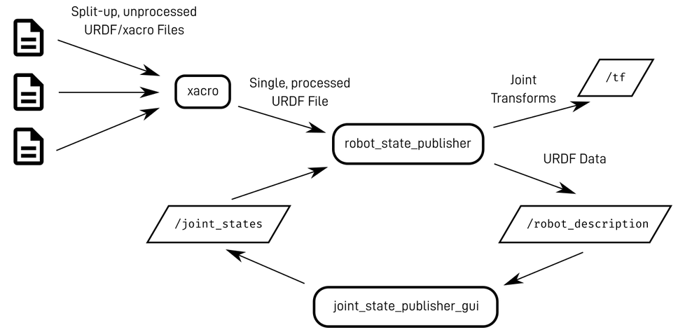
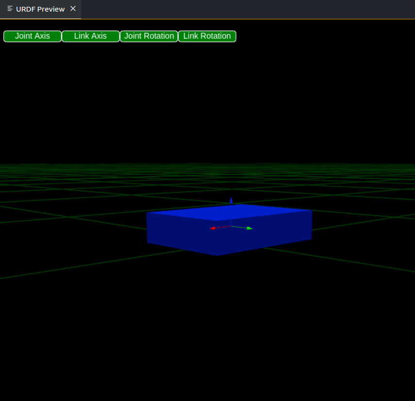
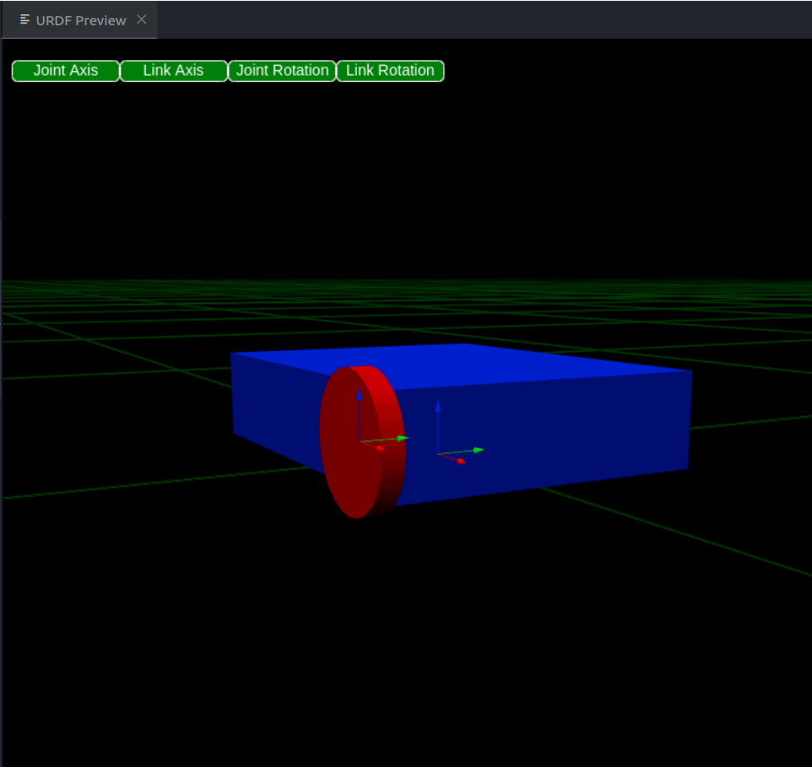
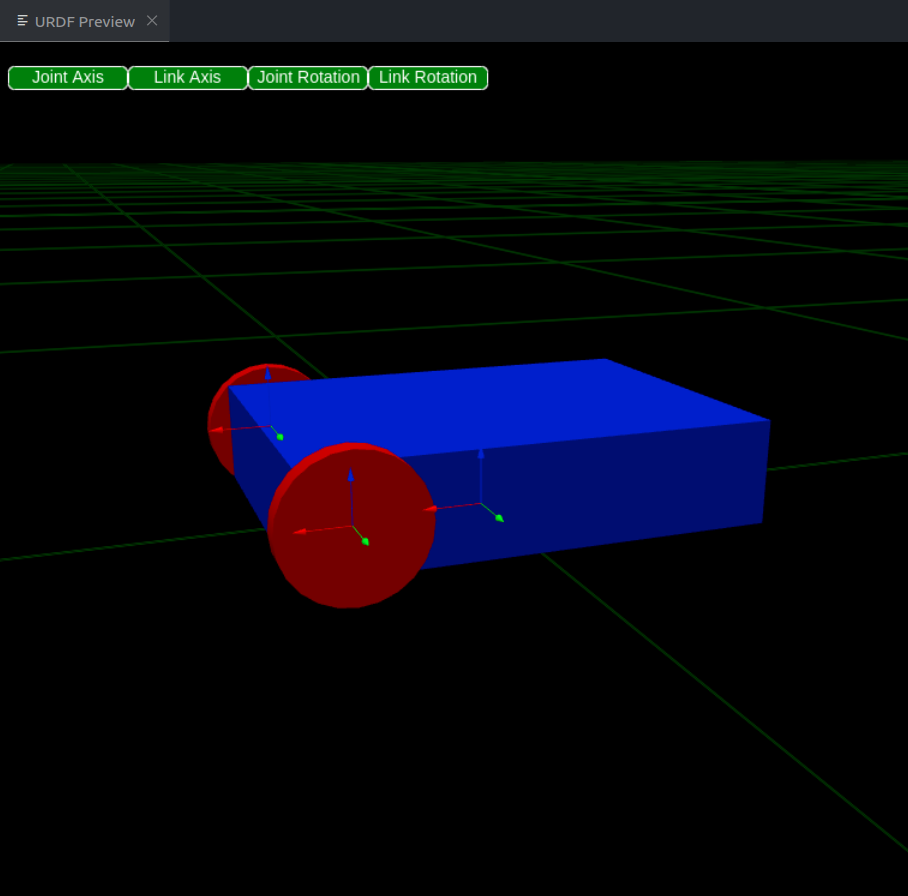
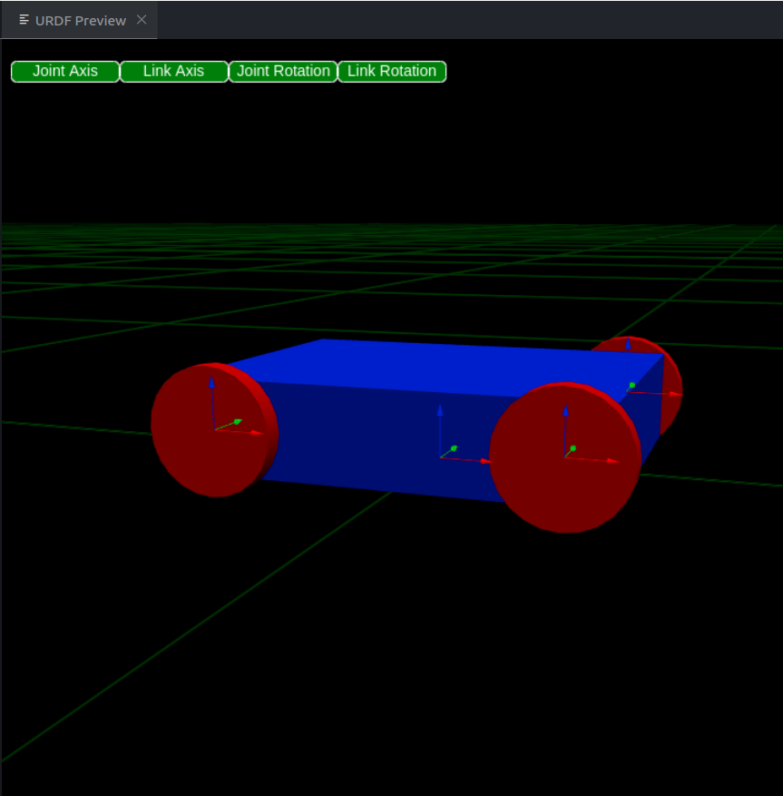
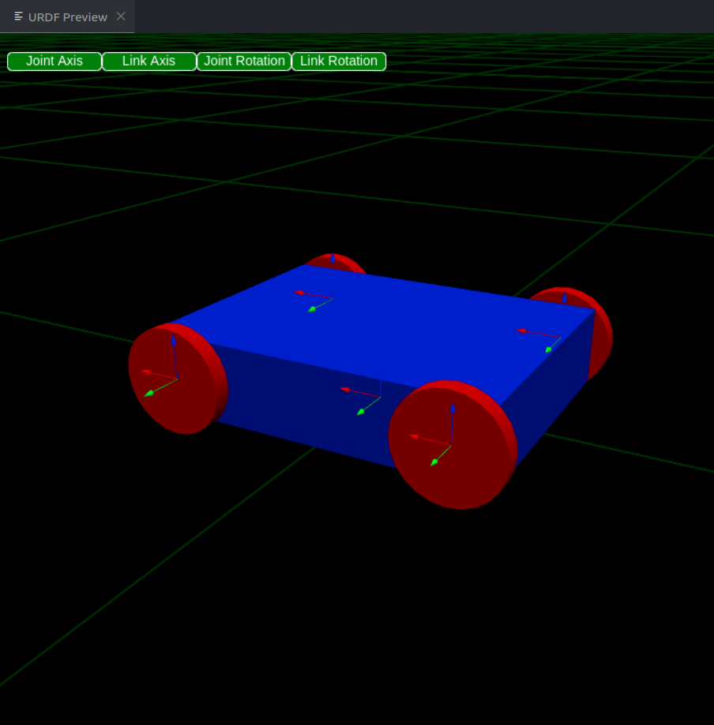
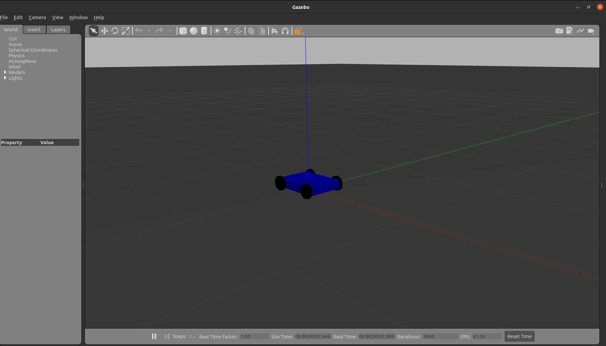
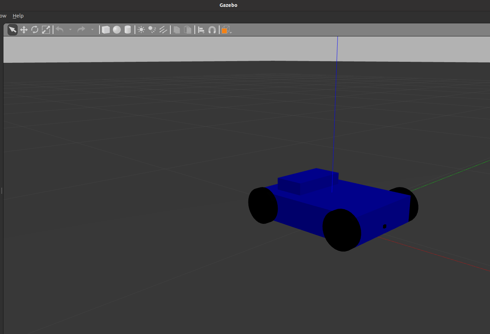
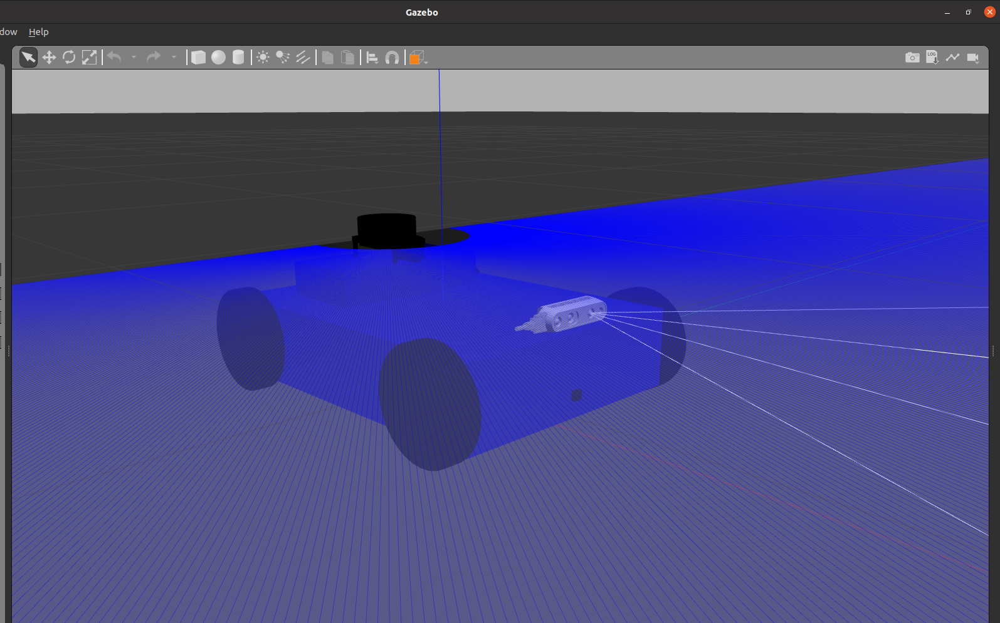

# [&lt;-- Back to main](../urdf.md)

# [&lt;-- 3- Plugins](../Plugins/plugins.md)

# Skid-Steering Robot Tutorial

Welcome to the comprehensive tutorial on building a skid-steering robot! In this guide, we will take you through the entire process of constructing a robot with a skid-steer drive system, a popular choice for many autonomous robots due to its simplicity and effectiveness in navigating various terrains.This tutorial is designed for those who are new to robotics as well as those who want to refine their skills in building and configuring skid-steer robots.

### Publishing a Robot Description Using URDFs

To publish a robot description in ROS, we start with a collection of URDF files that detail the robot's structure and properties. These files are processed by `xacro`, which combines them into a complete URDF.

This URDF is then used by the `robot_state_publisher` node to publish the robot description on the `/robot_description` topic and broadcast the transforms between robot links.

For robots with movable joints, `robot_state_publisher` Computes and publishes the transforms between robot links based on joint states and the robot's URDF. It uses data from /joint_states to broadcast the position of all links. The `joint_state_publisher` Publishes the current state (position, velocity) of each joint on the `/joint_states` topic.



## Step-by-Step Instructions

### **First we need to Create a New Catkin Package**

Navigate to the `src` directory and create a new Catkin package

```bash
cd ~/catkin_ws/src
catkin_create_pkg skid_steer_robot 
```

**Create URDF Directory**

 Navigate into your package and create a directory for URDF files

```bash
cd ~/catkin_ws/src/skid_steer_robot
mkdir urdf
```

**Add URDF File**

 Create a new URDF file inside the `urdf` directory

```bash
touch urdf/skid_robot.urdf.xacro
```

**Visualize URDF File** : Open your `skid_robot.urdf.xacro` file in VSCode. The URDF Preview extension will allow you to view and interact with your robot model directly within the editor.

**Install URDF Preview Extension** : Go to the Extensions view by clicking on the Extensions icon in the Activity Bar on the side of the window or by pressing `Ctrl+Shift+X`. Search for “URDF Preview” and install it.

### Robot Discreption

#### **1. Base Link**

The `base_link` serves as the primary reference frame for the robot. It’s essentially the central part of the robot to which other components (like wheels and sensors) are attached. Below is the XML snippet that defines the `base_link`

```xml
<link name="base_link">
    <inertial>
        <origin xyz="0.0 0.0 0.0" rpy="0.0 0.0 0.0"/>
        <mass value="5.0"/>
        <inertia ixx="0.0" ixy="0.0" ixz="0.0" iyy="0.0" iyz="0.0" izz="0.0"/>
    </inertial>
    <visual>
        <geometry>
            <box size="0.4 0.3 0.09"/>
        </geometry>
        <origin xyz="0 0 0.05"/>
        <material name="base_link_material">
            <color rgba="0.0 0.0 1.0 1.0"/> 
        </material>
    </visual>
    <collision>
        <geometry>
            <box size="0.4 0.3 0.09"/>
        </geometry>
        <origin xyz="0 0 0.05"/>
    </collision>
</link>
```



#### 2. Front Right Wheel Link

Next, we'll create the link for the front right wheel. This link represents the physical properties of the wheel, including its visual appearance, collision model, and inertial properties.

```xml
<link name="front_right_wheel">
  <visual>
      <geometry>
          <cylinder radius="0.06" length="0.02"/>
      </geometry>
      <origin rpy="1.5708 0 0"/>
      <material name="">
        <color rgba="0.0 0.0 0.0 1.0"/> 
      </material>
  </visual>
  <collision>
      <geometry>
          <cylinder radius="0.06" length="0.02"/>
      </geometry>
      <origin rpy="1.5708 0 0"/>
  </collision>
  <inertial>
      <mass value="1.0"/>
      <origin rpy="0 0 0"/>
      <inertia ixx="0.001" ixy="0.0" ixz="0.0" iyy="0.001" iyz="0.0" izz="0.001"/>
  </inertial>
</link>
```

**Continuous Joint for Front Right Wheel rotates around the y-axis**

```xml
<joint name="front_right_wheel_joint" type="continuous">
  <parent link="base_link"/>
  <child link="front_right_wheel"/>
  <origin xyz="0.16 -0.16 0.05" rpy="0 0 0"/> 
  <axis xyz="0 1 0"/> 
</joint>
```



#### 3. Front Left Wheel Link

The front left wheel is another critical part of the robot. It is attached to the base link via a continuous joint.

```xml
<link name="front_left_wheel">
    <visual>
        <geometry>
            <cylinder radius="0.06" length="0.02"/>
        </geometry>
        <origin rpy="1.5708 0 0"/>
        <material name="">
          <color rgba="0.0 0.0 0.0 1.0"/> 
        </material>
    </visual>
    <collision>
        <geometry>
            <cylinder radius="0.06" length="0.02"/>
        </geometry>
        <origin rpy="1.5708 0 0"/>
    </collision>
    <inertial>
        <mass value="1.0"/>
        <inertia ixx="0.001" ixy="0.0" ixz="0.0" iyy="0.001" iyz="0.0" izz="0.001"/>
      </inertial>
  </link>
```

**Continuous Joint for Front Left Wheel rotates around the y-axis**

```xml
<joint name="front_left_wheel_joint" type="continuous">
    <parent link="base_link"/>
    <child link="front_left_wheel"/>
    <origin xyz="0.16 0.16 0.05" rpy="0 0 0"/> 
    <axis xyz="0 1 0"/> 
  </joint>
```



#### 4. Rear Right Wheel Link

```xml
<link name="rear_right_wheel">
    <visual>
        <geometry>
            <cylinder radius="0.06" length="0.02"/>
        </geometry>
        <origin rpy="1.5708 0 0"/>
        <material name="">
          <color rgba="0.0 0.0 0.0 1.0"/> 
        </material>
    </visual>
    <collision>
        <geometry>
            <cylinder radius="0.06" length="0.02"/>
        </geometry>
        <origin rpy="1.5708 0 0"/>
    </collision>
    <inertial>
        <mass value="1.0"/>
        <inertia ixx="0.001" ixy="0.0" ixz="0.0" iyy="0.001" iyz="0.0" izz="0.001"/>
      </inertial>
  </link>
```

**Continuous Joint for Rear Right Wheel rotates around the y-axis**

```xml
<joint name="rear_right_wheel_joint" type="continuous">
    <parent link="base_link"/>
    <child link="rear_right_wheel"/>
    <origin xyz="-0.16 -0.16 0.05" rpy="0 0 0"/> 
    <axis xyz="0 1 0"/> 
  </joint>
```



#### 4. Rear Left Wheel Link

```xml
<link name="rear_left_wheel">
    <visual>
        <geometry>
            <cylinder radius="0.06" length="0.02"/>
        </geometry>
        <origin rpy="1.5708 0 0"/>
        <material name="">
          <color rgba="0.0 0.0 0.0 1.0"/> 
        </material>
    </visual>
    <collision>
        <geometry>
            <cylinder radius="0.06" length="0.02"/>
        </geometry>
        <origin rpy="1.5708 0 0"/>
    </collision>
    <inertial>
        <mass value="1.0"/>
        <inertia ixx="0.001" ixy="0.0" ixz="0.0" iyy="0.001" iyz="0.0" izz="0.001"/>
      </inertial>
  </link>
```

**Continuous Joint for Rear Left Wheel rotates around the y-axis**

```xml
<joint name="rear_left_wheel_joint" type="continuous">
    <parent link="base_link"/>
    <child link="rear_left_wheel"/>
    <origin xyz="-0.16 0.16 0.05" rpy="0 0 0"/> 
    <axis xyz="0 1 0"/> 
  </joint>
```



#### 5. Adding A Dummy Link

I will add a dummy link named `base_footprint` to the XACRO file. This link will act as a reference frame for the robot's base and provide a clear point of origin for the robot's coordinate system.By introducing a `base_footprint` link, you can create a more organized hierarchy of transforms. This makes it easier to manage and visualize the robot's pose and movement within the simulation environment.

```xml
<link name="base_footprint">  
</link>

<joint name="base_footprint_joint" type="fixed">
      <origin
        xyz="0.0 0.0 0.0"
        rpy="0 0 0" />
    <parent link ="base_footprint"/>
    <child link ="base_link"/>   
</joint>
```

#### 6. Adding `skid_steer_drive` plugin

modify your XACRO file to include the `skid_steer_drive` plugin

```xml
<gazebo>
  <plugin name="skid_steer_drive_controller" filename="libgazebo_ros_skid_steer_drive.so">
    <!-- Update rate of the plugin in Hz -->
    <updateRate>100.0</updateRate>
  
    <!-- Namespace for the robot in ROS -->
    <robotNamespace>/</robotNamespace>
  
    <!-- Names of the joints controlling each wheel -->
    <leftFrontJoint>front_left_wheel_joint</leftFrontJoint>
    <rightFrontJoint>front_right_wheel_joint</rightFrontJoint>
    <leftRearJoint>rear_left_wheel_joint</leftRearJoint>
    <rightRearJoint>rear_right_wheel_joint</rightRearJoint>
  
    <!-- Distance between the front and rear wheels -->
    <wheelSeparation>0.34</wheelSeparation>
  
    <!-- Diameter of the wheels -->
    <wheelDiameter>0.12</wheelDiameter>
  
    <!-- Frame of reference for the robot's base -->
    <robotBaseFrame>base_footprint</robotBaseFrame>
  
    <!-- Maximum torque applied to the wheels -->
    <torque>20</torque>
  
    <!-- ROS topic for receiving velocity commands -->
    <topicName>cmd_vel</topicName>
  
    <!-- Whether to broadcast the transform from the base frame to the wheels -->
    <broadcastTF>false</broadcastTF>

    <commandTopic>cmd_vel</commandTopic>

    <odometryTopic>odom</odometryTopic>
    <odometryFrame>odom</odometryFrame>
    <covariance_x>0.000100</covariance_x>
    <covariance_y>0.000100</covariance_y>
    <covariance_yaw>0.010000</covariance_yaw>
  </plugin>
</gazebo>

```

---

#### 7. Launching the Robot in Gazebo

**1-Create a Launch File:**

Create a `.launch` file in your `launch` directory

```bash
mkdir launch
touch launch/robot_description.launch
```

```xml
<?xml version="1.0" encoding="UTF-8"?>

<launch>
     <!-- Start Gazebo with an empty world -->
  <include file="$(find gazebo_ros)/launch/empty_world.launch">
    <arg name="paused" value="false"/>
    <arg name="use_sim_time" value="true"/>
    <arg name="debug" value="false"/>
    <arg name="gui" value="true" />
  </include>


    <!-- Load the URDF model into Gazebo -->
    <param name="robot_description" textfile="$(find skid_steer_robot)/urdf/skid_robot.urdf.xacro"/>
  
  <!-- Send robot states to tf -->
  <node name="robot_state_publisher" pkg="robot_state_publisher" type="robot_state_publisher" respawn="false" output="screen"/>

  <!-- Send  joint values-->
  <node name="joint_state_publisher" pkg="joint_state_publisher" type="joint_state_publisher">
    <param name="use_gui" value="true"/>
  </node>
  

  <!-- Spawn My Robot -->
  <node name="urdf_spawner" pkg="gazebo_ros" type="spawn_model" respawn="false" output="screen" 
        args="-urdf -param robot_description -model skid_robot "/>  

</launch>
```

**Launch the Model:**

Run the launch file to start Gazebo and spawn your robot model. Use the following command:

```bash
catkin_make
source devel/setup.bash
roslaunch skid_steer_robot robot_description.launch
```



---

#### **8. Adding Sensors and Plugins**

In this section, we'll add sensors to your robot model and integrate their corresponding plugins to ensure they work properly in the Gazebo simulation environment. We'll start by creating a `base_lidar_link` to mount the LiDAR sensor.

```xml

<link name="lidar_base_link">
    <inertial>
      <origin xyz="0.0 0.0 0.0" rpy="0.0 0.0 0.0"/>
      <mass value="0.5"/> <!-- Adjust mass as needed -->
      <inertia ixx="0.0" ixy="0.0" ixz="0.0" iyy="0.0" iyz="0.0" izz="0.0"/>
    </inertial>
    <visual>
      <geometry>
        <box size="0.1 0.2 0.07"/> 
      </geometry>
      <origin xyz="0 0 0.0"/> 
      <material name="">
        <color rgba="0.0 0.0 1.0 1.0"/> 
      </material>
    </visual>
    <collision>
      <geometry>
        <box size="0.2 0.2 0.07"/> 
      </geometry>
      <origin xyz="0 0 0.3"/> <!-- Adjust position as needed -->
    </collision>
  </link>


  <joint name="lidar_base_joint" type="fixed">
    <parent link="base_link"/>
    <child link="lidar_base_link"/>
    <origin xyz="-0.1 0 0.1" rpy="0 0 0"/> <!-- Adjust height as needed -->
  </joint>
```



**For detailed instructions on adding and configuring sensors, including URDF and plugin setup, [click here](../Plugins/plugins.md).**

### After adding sensors, your robot is now ready!



**To control the robot, use the following command**

```bash
rosrun teleop_twist_keyboard teleop_twist_keyboard.py
```

This will allow you to move the robot using your keyboard in the Gazebo simulation.

##### Check out the GIF below to see the full robot in action with the sensors integrated.


# [Step-by-Step Tutorial for Building a Differential drive Robot --&gt;](../example/differential_drive_robot_example.md)


# [&lt;-- Back to main](../urdf.md)
